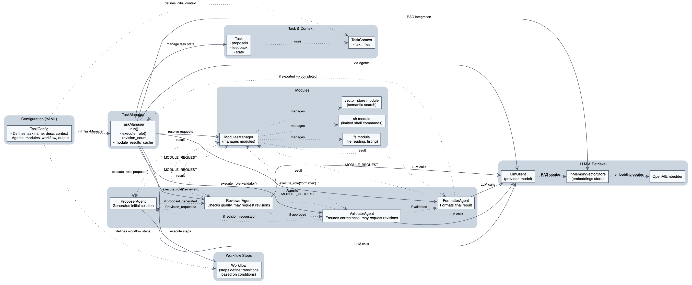

# Kheish

<p align="center">
  
</p>

**Kheish** is an open-source, pluggable multi-agent orchestration platform designed to tackle complex tasks using Large Language Models (LLMs). By leveraging multiple specialized "agents" and a flexible workflow, Kheish coordinates a variety of steps—proposal generation, reviewing, validation, formatting—to produce reliable, high-quality results. It seamlessly integrates external modules such as filesystem access, shell commands, or vector stores to enrich context and handle large codebases or documents with Retrieval-Augmented Generation (RAG).

## Key Features

- **Multi-Agent Workflow:** Kheish defines a sequence of roles—**Proposer**, **Reviewer**, **Validator**, **Formatter**—and executes them in order, as defined by a YAML-based workflow configuration.
  
- **Flexible Modules Integration:** Extend capabilities with modules like `fs` (filesystem), `sh` (shell commands), or `vector_store` (RAG). Agents can request modules to fetch additional data, read files, or perform semantic searches.
  
- **Chat-Style Prompts:** Interactions with LLMs are structured as conversation-like exchanges with `system`, `user`, and `assistant` roles, making it easy to maintain context and clarify instructions.
  
- **Feedback and Revision Loops:** The workflow supports iterative feedback: if the Reviewer or Validator detects issues, it can request revisions until the solution meets the criteria.
  
- **RAG and Embeddings:** Easily integrate a vector store (e.g., `OpenAIEmbedder` + `InMemoryVectorStore`) to handle large documents. The model can fetch relevant snippets without overloading the prompt.
  
- **Modular and Extensible:** Add new modules or agents without breaking the existing structure. The architecture encourages customization and scaling to new tasks or domains.

## Roadmap

- Add support for more LLM providers.
- Introduce more sophisticated caching and compression of conversation history.
- Expand the library of modules (e.g., `git`, `http`).
- Improve UI/CLI for running and monitoring tasks.

## Architecture Overview

Kheish orchestrates a **Task Manager** that:

1. **Loads a Task Configuration (YAML)**: Declares the task name, description, context, agents, modules, workflow steps, and output format.
  
2. **Processes Context**: Reads initial files or text, prepares a `TaskContext`.
  
3. **Runs the Workflow**:  
   - **Proposer** agent generates an initial solution (or performs a subtask).
   - **Reviewer** agent checks the proposal’s quality and requests revisions if needed.
   - **Validator** agent ensures final correctness before finalizing.
   - **Formatter** agent outputs the validated result in the requested format.
   
4. **Integrates Modules on Demand**: Agents can issue `MODULE_REQUEST` calls:
   - `fs`: read/list files
   - `sh`: run allowed shell commands
   - `vector_store`: semantic search
   
   Results are cached to avoid redundant operations.

### Architecture Diagram

<p align="center">
  
</p>

The diagram above illustrates how the **TaskManager** orchestrates agents, modules, and the LLM client. The `Workflow` steps guide the transitions between agents, while `ModulesManager` handles on-demand operations (like file reads or vector store queries). The `LlmClient` integrates with vector stores for RAG, ensuring scalable handling of large contexts.

## Example Task

| Task | Description |
|------|-------------|
| `audit-code` | Performs a comprehensive security audit of a project with vulnerability detection and detailed reporting |
| `audit-code-large` | Security audit optimized for large projects using RAG and memory management |
| `find-in-file` | Searches for a secret string within files in a filesystem using allowed shell commands |
| `hf-secret-finder` | Scans Hugging Face repositories for potential secrets using trufflehog |
| `weather-blog-post` | Retrieves weather data and creates a humorous English blog post about Paris weather |

## Installation & Setup

1. **Clone the Repository:**
   ```bash
   git clone https://github.com/yourusername/kheish.git
   cd kheish
   ```

2. **Install Dependencies:**
   - Rust toolchain: [Install Rust](https://www.rust-lang.org/tools/install)
   - Set `OPENAI_API_KEY` or other provider keys as environment variables.
   
3. **Build:**
   ```bash
   cargo build --release
   ```

4. **Run a Task:**
   ```bash
   ./target/release/kheish --task-config examples/tasks/audit-code.yaml
   ```

## Configuration

- **LLM Provider & Model:**  
  Set `llm_provider` and `llm_model` in the YAML, and corresponding environment variable keys.  
  Example:
  ```yaml
  parameters:
    llm_provider: "openai"
    llm_model: "gpt-4"
  ```
  
- **Modules & Allowed Commands:**  
  Add modules in the YAML:
  ```yaml
  modules:
    - name: "fs"
      version: "1.0"
    - name: "sh"
      version: "1.0"
      config:
        allowed_commands: ["ls","cat"]
  ```

## Recommended Best Practices

- **Use RAG Efficiently:**  
  For large codebases or documents, store chunks and use `vector_store` to retrieve only relevant snippets. Don’t dump entire files into the prompt.
  
- **Summarize Iterations:**  
  If the conversation grows large, periodically summarize the history or rely on the vector store to shorten prompts.
  
- **Module Caching:**  
  Results of module actions are cached. Avoid redundant expensive operations by checking if the result already exists.

## Contributing

Contributions are welcome! Please open issues or submit pull requests on [GitHub](https://github.com/graniet/kheish).

## License

This project is licensed under the Apache License 2.0. See [LICENSE](LICENSE) for details.
