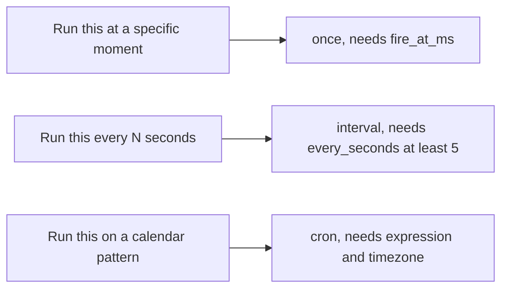
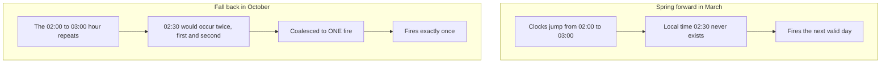
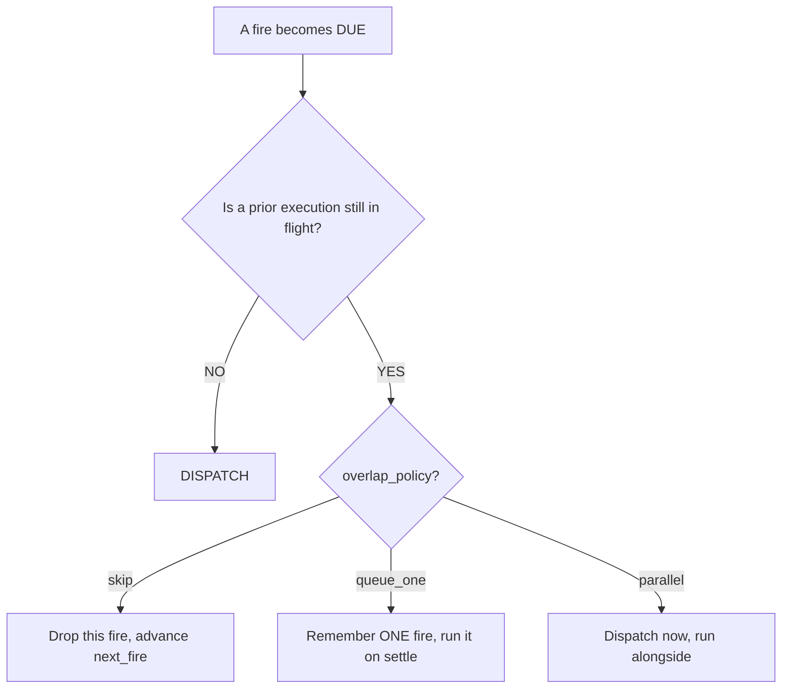
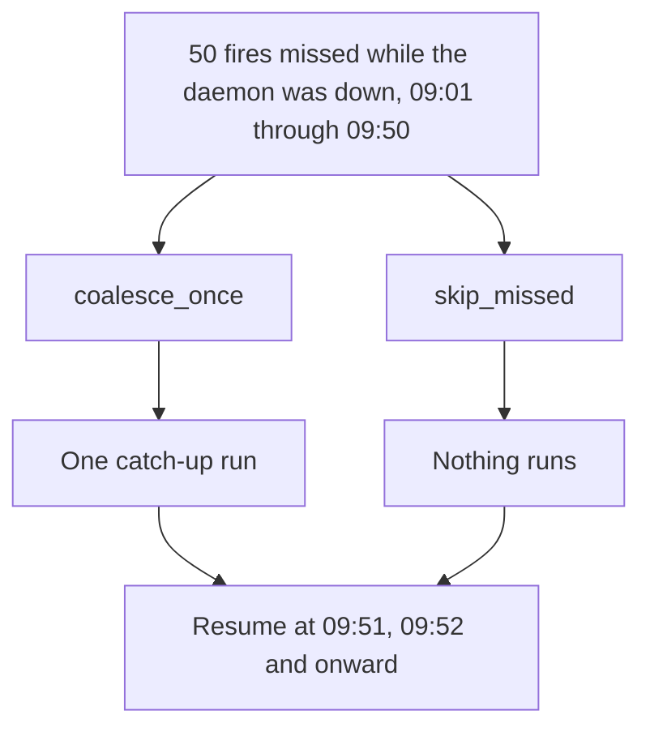
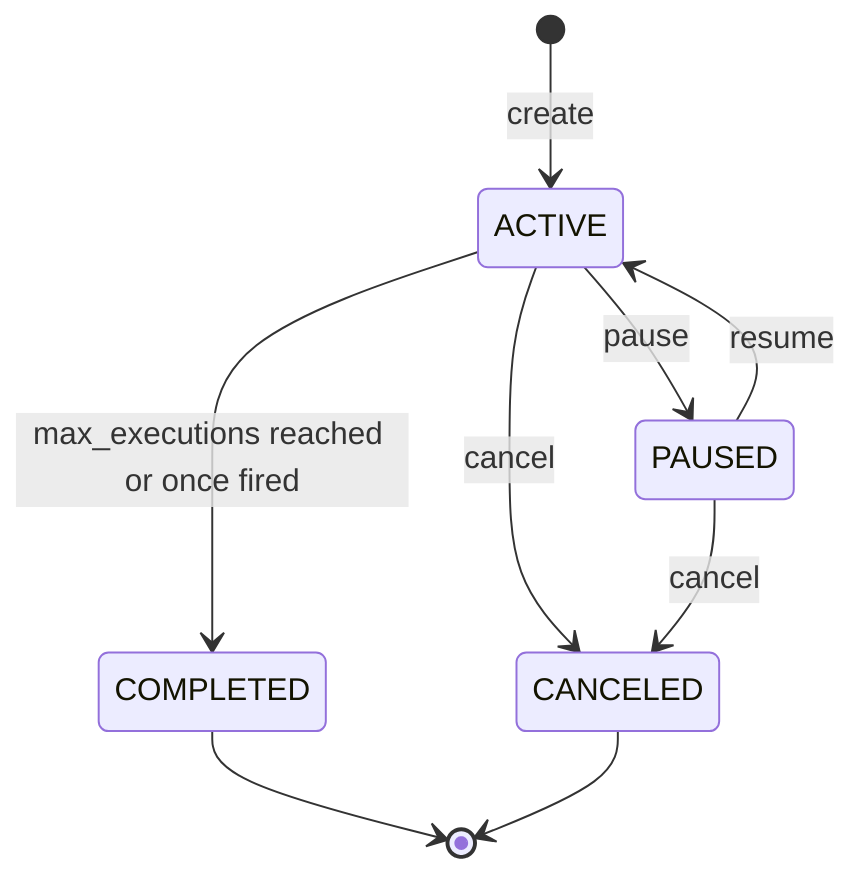
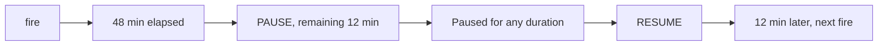
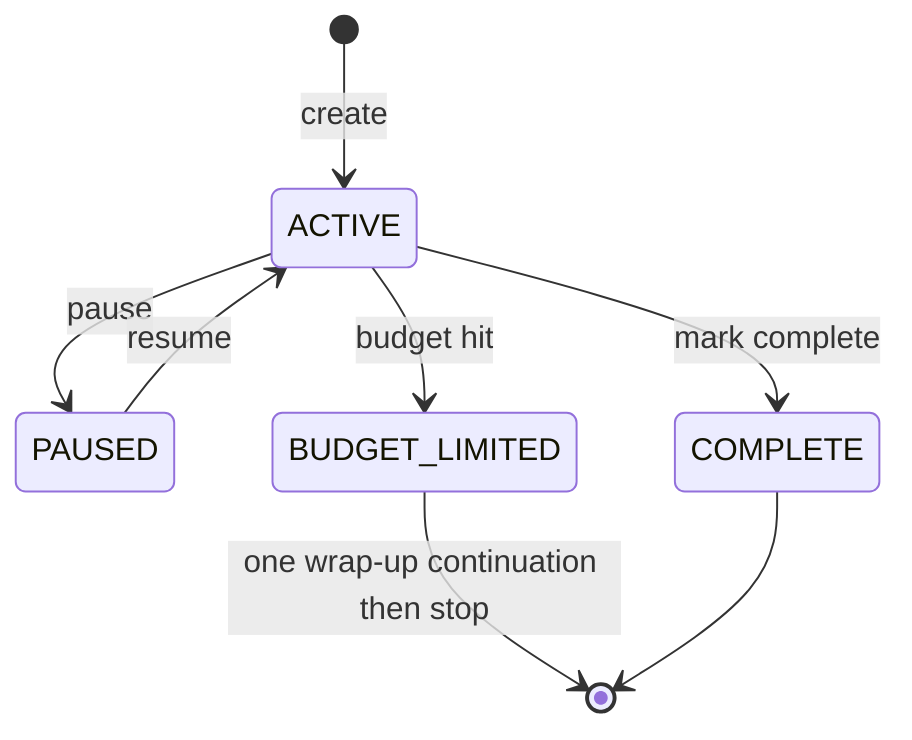

# Schedules, goals, and recurring work

Most agent platforms treat "do this later" as an afterthought: a cron entry on the host, a queue worker somewhere else, a lambda that pokes an API. Kheish takes the opposite stance. The clock lives **inside the daemon**, next to the sessions and runs it acts on. A schedule can target an existing session, carry the same reply routing as a human message, survive a restart, and be paused, resumed, retriggered, or cancelled through the same control plane you already use for everything else.

This page is the practical guide to that machinery. It covers three related but distinct concepts:

- **Schedules** — durable, daemon-owned timers that materialize future runs (one-shot, fixed interval, or cron).
- **Session goals** — standing objectives that the daemon keeps driving whenever a session goes idle, with pause/resume and token budgets.
- **The Kheish Air Schedules calendar** — the console surface that compiles plain-words repeats ("every weekday at 9am") into daemon-native cron, plus the playground bench schedules used to rehearse cadences before they touch production.

If you only remember one thing: a schedule is not "a cron line." It is a persisted record with a lifecycle, an overlap policy, a misfire policy, and an execution history. The cron string is just one of three ways to describe *when*.

For the surrounding model — what a session is, what a run is, and why the daemon serializes work per session — read [Sessions and runs](../concepts/sessions-and-runs). For the big-picture component map, read [Architecture](../concepts/architecture). For the tools an agent uses to create its own schedules from inside a run, read [Tools and MCP](./tools-and-mcp). For the auth and hardening posture around all of this, read [Security](../operations/security).

---

## The three cadences

Every schedule has exactly one **cadence**. The cadence is the answer to "when does this fire?" There are three shapes, and they are mutually exclusive.

### `once` — a single future instant

A one-shot schedule fires exactly once, at an absolute millisecond timestamp, then completes.

```json
{
  "type": "once",
  "fire_at_ms": 1780000000000
}
```

The only validation is that `fire_at_ms` is greater than zero. A `once` schedule with a timestamp already in the past is still valid — it becomes due immediately and fires on the next scheduler pass. That is intentional: it lets you enqueue "do this as soon as the worker gets to it" without special-casing now-versus-later.

### `interval` — a fixed gap between fires

An interval schedule fires, waits a fixed number of seconds, fires again, forever (or until `max_executions` or an explicit stop).

```json
{
  "type": "interval",
  "every_seconds": 900
}
```

The first fire is scheduled for `now + every_seconds`, not immediately. If you want it to run right away and then settle into the interval, create it and call trigger-now once.

The interval floor is **5 seconds** (`DEFAULT_SCHEDULE_MIN_INTERVAL_SECONDS`). Anything smaller is rejected at creation. This is a deliberate guardrail: sub-second polling belongs to a connector or a streaming source, not to a durable schedule that persists a record and computes a plan on every tick.

### `cron` — calendar-aware recurrence

A cron schedule fires on a calendar pattern, evaluated in a named IANA timezone.

```json
{
  "type": "cron",
  "expression": "0 0 9 * * MON-FRI",
  "timezone": "America/New_York"
}
```

The `timezone` field defaults to `"UTC"` when omitted. Cron is the only cadence that understands "9am local, every weekday, and please handle the day the clocks change." It is also the cadence with the most footguns, which is why it gets its own section below.

Cron cadences are validated at creation time by computing the first two fire instants and asserting the gap between them is at least 5 seconds. A cron expression that never fires, fires only once, or fires faster than the floor is rejected before the record is ever stored.



Exactly ONE cadence per schedule. There is no hybrid. If you need "every weekday at 9 AND on the 1st of the month," that is TWO cron schedules, not one clever expression.

---

## The 6/7-field cron anatomy — and the classic trap

Kheish uses the Rust `cron` crate (version `0.15`) for cron parsing and projection. **This is not Unix/Vixie cron.** If you paste a five-field crontab line from your server, it will be rejected or — worse — silently mean something you did not intend once you add the missing field. Read this section carefully; it is where almost every "my schedule fired on the wrong day" ticket comes from.

### Field count: seconds come first

The `cron` crate expects **six or seven** whitespace-separated fields, in this order:

```text
   CRON FIELD ANATOMY (cron crate 0.15)
   ====================================

   ┌───────────── seconds        (0-59)          <-- REQUIRED, and FIRST
   │ ┌─────────── minutes        (0-59)
   │ │ ┌───────── hours          (0-23)
   │ │ │ ┌─────── day-of-month   (1-31)
   │ │ │ │ ┌───── month          (1-12 or JAN-DEC)
   │ │ │ │ │ ┌─── day-of-week    (1-7  or SUN-SAT)
   │ │ │ │ │ │ ┌─ year           (optional, e.g. 2027)
   │ │ │ │ │ │ │
   *  *  *  *  *  *  *

   6 fields  =  sec min hour dom month dow
   7 fields  =  sec min hour dom month dow year

   Standard Unix crontab has FIVE fields (min hour dom
   month dow) and NO seconds. Paste one of those here and
   the parser reads your "minute" as "seconds", your
   "hour" as "minute", and so on. Everything shifts left
   by one and your 9 AM job becomes a 9-second-past job.
```

So the everyday "top of the hour" is `0 0 * * * *` (six fields), not `0 * * * *`. And "every five minutes" is `0 */5 * * * *`, not `*/5 * * * *` — the latter is a valid six-field expression that means *every five seconds*, which will be rejected by the 5-second floor only because it happens to sit exactly at the boundary; `*/2 * * * * *` (every two seconds) is rejected outright.

### The Sunday-is-1 trap

Here is the single most surprising difference from Unix cron. In the `cron` crate:

| Day       | Unix cron number | `cron` crate number | Name accepted |
|-----------|------------------|---------------------|---------------|
| Sunday    | 0 (or 7)         | **1**               | `SUN`, `SUNDAY` |
| Monday    | 1                | **2**               | `MON`, `MONDAY` |
| Tuesday   | 2                | **3**               | `TUE`, `TUES`, `TUESDAY` |
| Wednesday | 3                | **4**               | `WED`, `WEDNESDAY` |
| Thursday  | 4                | **5**               | `THU`, `THURS`, `THURSDAY` |
| Friday    | 5                | **6**               | `FRI`, `FRIDAY` |
| Saturday  | 6                | **7**               | `SAT`, `SATURDAY` |

Read that table twice. In Unix cron, `1` means Monday. In Kheish, `1` means **Sunday**. If you write `0 0 9 * * 1` expecting a Monday 9am job, you will get a **Sunday** 9am job.

Months are less treacherous but still worth stating: they are 1-12 with January = 1, and named forms (`JAN`..`DEC`, `JANUARY`..`DECEMBER`) are accepted.

### The single, unbreakable rule: use names for weekdays

Because the numeric offset is a trap, the strongest operational recommendation in this entire document is:

> **Always write weekdays by name.** `MON-FRI`, `SAT`, `SUN`. Never `1-5`.

Names are unambiguous. `MON-FRI` cannot be misread; `1-5` reads as Sunday-through-Thursday under this crate. Every example in this page uses names, and the Kheish Air Schedules calendar (below) compiles plain-words repeats into named-weekday cron for exactly this reason.

### A gallery of correct expressions

```text
   COMMON PATTERNS (all six-field, names for weekdays)
   ===================================================

   0  0   9   *  *  MON-FRI     Weekdays at 09:00:00
   0  30  8   *  *  MON         Mondays at 08:30
   0  0   *   *  *  *           Every hour, on the hour
   0  */15 *  *  *  *           Every 15 minutes
   0  0   0   1  *  *           Midnight on the 1st
   0  0   12  *  *  SUN         Sundays at noon
   0  0   6   *  *  MON,WED,FRI Mon/Wed/Fri at 06:00
   0  0   0   *  JAN *          Every day in January, midnight
   0  0   9   1  *  *  2027     Jan-1-2027 09:00 (7-field, year-pinned)
   @hourly                      Shorthand: top of every hour
   @daily                       Shorthand: every midnight
   @weekly                      Shorthand: Sunday midnight
   @monthly                     Shorthand: 1st of month midnight
   @yearly                      Shorthand: Jan 1 midnight
```

The `@`-shorthands are supported by the crate and are the safest option when they fit — there is no field to miscount and no weekday number to get wrong.

### Timezones and daylight saving

Cron cadences are evaluated in the IANA timezone you name (`Europe/Paris`, `America/New_York`, `Asia/Tokyo`, …), parsed by `chrono-tz`. An invalid timezone string is rejected at creation. Two DST edge cases are handled deterministically, and both are covered by daemon tests:

- **Spring forward (a wall-clock time that does not exist).** If your expression names 02:30 and the clocks jump from 02:00 to 03:00 on that date, that instant simply does not occur. Kheish skips the non-existent local time and lands on the next valid occurrence.
- **Fall back (a wall-clock time that occurs twice).** When the clocks repeat an hour, a `02:30` daily job could theoretically fire twice. Kheish coalesces the ambiguous hour to a **single** due fire rather than double-firing.

Example: timezone Europe/Paris, cron `0 30 2 * * *`.



If precise wall-clock behavior across DST matters to your workload (billing cutoffs, SLA windows), prefer `UTC` cron or an `interval` cadence, which never negotiate with a timezone at all.

---

## Overlap policy: what happens when the last fire is still running

A schedule's cadence decides *when* a fire becomes due. The **overlap policy** decides what happens when a fire comes due while a previous execution from the same schedule is *still running*. This is where recurring schedules earn their keep or quietly pile up work.

Because Kheish serializes runs within a single session, a slow scheduled run can easily still be executing when the next tick arrives. The overlap policy is your explicit answer to that race. There are three values.

### `skip` (the default)

If an execution is already in flight, drop the new fire on the floor and advance to the next scheduled time. This is the safest default and the right choice for the vast majority of "keep an eye on X" schedules: you never want a backlog, you just want the *latest* check to have run.

### `queue_one`

If an execution is already in flight, remember **one** pending fire. When the current execution settles, the queued fire dispatches. If yet another fire comes due while one is already queued, the newest simply replaces nothing — the queue depth is capped at one. This gives you "don't skip, but don't stampede either": at most one execution running plus at most one waiting.

### `parallel`

Dispatch the new fire immediately regardless of what is already running. Multiple executions from the same schedule can be in flight at once. Use this only when the scheduled work is genuinely independent per fire and your downstream (and your provider budget) can absorb concurrency. Remember that runs in the same *session* still serialize; `parallel` is most meaningful when each fire targets independent work or the session tolerates queued runs stacking up.



max_executions is checked BEFORE dispatch. If the schedule has no remaining execution slots, even a queued fire is skipped with a recorded reason.

The scheduler tracks in-flight state on the schedule record itself (`in_flight_fire_at_ms`, `in_flight_run_id`) and the single pending fire in `queued_fire_at_ms`. Those fields are visible on the schedule view, so an operator can always see "is this thing currently running, and is something waiting behind it?"

A subtle but important guarantee: **trigger-now still respects the overlap policy.** Manually triggering a `skip` schedule while it is already running will not force a second concurrent execution; it queues or drops according to the same rules. Trigger-now is "make it due right now," not "bypass the safety rails."

---

## Misfire policy: what happens after downtime

Overlap is about *concurrency*. Misfire is about *catch-up*. When the daemon was down (or paused, or simply couldn't get to a schedule) and one or more scheduled fires were missed, the misfire policy decides how to reconcile the gap when the scheduler comes back.

### `coalesce_once` (the default)

However many fires were missed during the outage, run the work **once** to represent the whole gap, then resume the normal cadence going forward. This is what you want for idempotent "bring things up to date" work: you do not want fifty catch-up runs after a fifty-minute outage of a per-minute schedule; you want one run that reflects "we're back, do the thing now," and then normal ticking.

### `skip_missed`

Do **not** run anything for the missed window. Just advance the next fire to the correct future time and carry on as if the missed occurrences never existed. This is right for time-sensitive work where a late run is worse than a skipped one — a "good morning summary" at 9am is pointless at 2pm; skip it and wait for tomorrow.



Both converge on the same future schedule. They differ only in whether the gap produces one run or zero runs.

The catch-up scan is bounded. A schedule that has been asleep for months does not attempt to compute every missed cron instant since the dawn of time; the planner computes the *latest* missed fire (for `coalesce_once`) or simply the next future fire (for `skip_missed`) without walking an unbounded history. This keeps a long outage from producing a pathological startup scan.

Overlap and misfire compose. After an outage, `coalesce_once` produces one catch-up fire; if that fire is still running when the next real tick arrives, the overlap policy takes over from there.

---

## The schedule lifecycle

A schedule is a durable record with a status, not a fire-and-forget timer. Its lifecycle is small and explicit.



- **ACTIVE** — the scheduler drives it; fires dispatch runs.
- **PAUSED** — no fires; remaining time is preserved.
- **COMPLETED** — reached max_executions, or a `once` fired. Terminal.
- **CANCELED** — operator or agent stopped it permanently. Terminal.

COMPLETED and CANCELED are terminal. You do not resume them; you create a new schedule.

The daemon exposes five mutations against a schedule:

- **cancel** — move to `canceled`, terminal.
- **pause** — move to `paused`, preserving how much time was left until the next fire.
- **resume** — move back to `active`, recomputing the next fire.
- **trigger** (trigger-now) — make the schedule immediately due, still honoring overlap policy.
- **create** — the constructor, covered in the API section.

### Pause and resume preserve remaining time

Pausing does not throw away where you were in the cadence. When you pause, the daemon records `paused_remaining_ms` — the gap between "now" and the next fire. On resume, the behavior depends on the cadence:

- For `once` and `interval`, the next fire is set to `now + paused_remaining_ms`. If a per-hour interval had 12 minutes left when you paused, it has 12 minutes left when you resume, no matter how long the pause lasted.
- For `cron`, resume recomputes the next fire from the calendar pattern relative to *now*. A cron schedule does not "owe" you a fire for the paused window; it simply rejoins its pattern.



Cron is different: resume rejoins the calendar pattern from "now"; it does not replay the paused window.

This is the difference between "snooze" (interval/once: the clock stops and restarts where it left off) and "rejoin" (cron: catch the next scheduled slot). Choose your cadence accordingly if pause semantics matter to you.

---

## Execution records: the audit trail on every schedule

Each schedule keeps a bounded history of its recent fires — up to 50 records (`DEFAULT_SCHEDULE_RECENT_EXECUTION_LIMIT`) — right on the schedule view. You do not have to correlate against a separate log to answer "did last night's run actually go?"

Each execution record carries:

- `fire_at_ms` — the scheduled instant this record represents.
- `run_id` — the run that was dispatched, when one was.
- `status` — where this fire ended up (see below).
- `attempt` — retry attempt count for scheduler-owned dispatch.
- `from_queued_fire` — whether this fire came out of the `queue_one` buffer.
- `claimed_at_ms`, `dispatched_at_ms`, `settled_at_ms` — lifecycle timestamps.
- `retry_after_ms` — backoff delay when a dispatch is retrying.
- `error` — the failure reason, when there is one.

The execution status values map to the fire's journey:

| Status        | Meaning |
|---------------|---------|
| `claimed`     | The scheduler has taken ownership of this fire and is about to dispatch. |
| `dispatched`  | A run was created for this fire. |
| `retrying`    | Dispatch failed transiently; a backoff retry is scheduled. |
| `skipped`     | The fire was intentionally dropped (overlap `skip`, or `skip_missed`, or no execution slots). |
| `rolled_back` | A claimed fire was unwound (e.g., the dispatch could not complete and the claim was released). |
| `settled`     | The fire reached a terminal, accounted state. |

The top-level schedule view also carries running counters: `execution_count`, `consecutive_failures`, `last_fire_at_ms`, `last_dispatched_run_id`, `last_error`, and scheduler-retry bookkeeping (`last_scheduler_error`, `scheduler_retry_after_ms`, `scheduler_retry_attempt`). When a schedule "goes quiet," these fields are the first place to look.

### Scheduler retry and backoff

Dispatch failures that are the scheduler's own fault (as opposed to a run that ran and failed) are retried with exponential backoff and deterministic jitter. The defaults:

- `retry_base_delay_ms` = 500
- `retry_max_delay_ms` = 30000
- `retry_jitter_ms` = 250
- `retry_max_attempts` = 0 (**unlimited** — the schedule keeps retrying rather than silently dying)

`retry_max_attempts = 0` is a policy choice: a schedule with a transient downstream problem should keep trying, not quietly pause itself after N failures and leave you wondering why nothing fired. If you want a schedule to give up after some number of consecutive dispatch failures, set a non-zero `retry_max_attempts` in the daemon's scheduler policy configuration.

---

## What a schedule actually runs: the three payload types

A schedule does not just "fire" — it materializes a specific kind of work. Exactly **one** of three payloads must be present on a schedule, and this is validated at creation. Sending zero or two payloads is rejected with "schedule request must define exactly one payload."

### 1. `request` — a normal input run

The everyday case. The schedule submits an input to the target session, exactly as if a human or connector had sent it. This is a full `SubmitInputRequest`: content, input items, attachments, generation overrides, completion requirements, reply targets, and metadata.

### 2. `observation_materialization` — turn a captured observation into a run

For the capture/observation subsystem: a schedule can periodically materialize a stored observation into a concrete run. The `target_session_id` on the materialization must match the schedule's `target_session_id`; a mismatch is rejected.

### 3. `flow_start` — kick off a playbook Flow

A schedule can start a durable playbook Flow on each fire. The `session_id` inside the flow-start must match the schedule's target session.

Recurring Flows have a special rule worth calling out. A one-shot (`once`) flow schedule may pin an explicit `flow_id` and `idempotency_key`. A **recurring** flow schedule may **not** — because every fire needs its own unique flow identity. Kheish derives a deterministic per-fire id and idempotency key for recurring flow schedules:

```text
   scheduled-flow-<schedule_id>-<fire_at_ms>          (flow_id)
   scheduled-flow:<schedule_id>:<fire_at_ms>          (idempotency_key)
```

Attempting to hard-code a `flow_id` on a recurring flow schedule is rejected with a clear message: "flow_start.flow_id is only supported for one-shot schedules; recurring scheduled Flows derive a unique flow_id per fire."

### What the daemon stamps onto every scheduled run

No matter which payload type fires, the daemon normalizes provenance so scheduled work is never mistaken for user or connector traffic and cannot be spoofed by the payload:

- `source_plugin` is forced to `"scheduler"`.
- `source_kind` becomes `scheduled_input`, `scheduled_flow_start`, or `scheduled_observation_materialization` depending on the payload.
- `actor_id` is set to the `schedule_id`.
- `metadata` gains `schedule_id` and `scheduled_for_ms` (the intended fire instant).

This is why a downstream agent, a reply-routing rule, or an audit query can always tell "this run came from a schedule, and here is which one and for which planned instant."

---

## Ownership, limits, and the definition digest

Schedules can name an **owner** (`owner_session_id`, `owner_agent_id`) separate from their **target** (`target_session_id`, `target_agent_id`). Owner is "who is responsible for this schedule"; target is "where the work lands." An agent scheduling work for itself has owner and target pointing at the same session; a coordinator scheduling work for a worker session has them differ.

One guardrail rides on ownership: an owner session may hold at most **128** active schedules (`DEFAULT_MAX_OWNER_SCHEDULES`). Creating the 129th active schedule for one owner is rejected. This keeps a runaway agent from carpet-bombing the scheduler with thousands of timers. Paused, completed, and cancelled schedules do not count against the active limit.

Every schedule also carries a **definition digest** — a SHA-256 over the schedule's meaningful definition (name, target, cadence, max executions, overlap and misfire policy, and the canonicalized payload). Volatile provenance fields (`source_plugin`, `source_kind`, `actor_id`) are stripped before hashing so they do not perturb the digest. The digest lets tooling detect "is this the same schedule definition I created, or did something change it?" without diffing the whole record.

---

## The API surface

Schedules are managed through a small, regular REST surface. The base type for the create body is the same `ScheduleCreateRequest` used internally, so what you POST is exactly what gets stored.

| Method & path | Purpose |
|---------------|---------|
| `POST /v1/schedules` | Create a schedule (returns `201` with the schedule view). |
| `GET /v1/schedules` | List schedules, optionally `?session_id=` scoped, paginated. |
| `GET /v1/schedules/{schedule_id}` | Fetch one schedule view. |
| `POST /v1/schedules/{schedule_id}/cancel` | Cancel (terminal). |
| `POST /v1/schedules/{schedule_id}/pause` | Pause, preserving remaining time. |
| `POST /v1/schedules/{schedule_id}/resume` | Resume, recomputing next fire. |
| `POST /v1/schedules/{schedule_id}/trigger` | Trigger now, respecting overlap policy. |

### Create a one-shot reminder

```bash
curl -sS -X POST http://127.0.0.1:8080/v1/schedules \
  -H "content-type: application/json" \
  -d '{
    "name": "quarter-end-checklist",
    "target_session_id": "ops-room",
    "cadence": { "type": "once", "fire_at_ms": 1780000000000 },
    "request": {
      "content": "Run the quarter-end checklist and post the summary."
    }
  }'
```

The response is a `201 Created` carrying the full schedule view, including its generated `schedule_id`, computed `next_fire_at_ms`, and empty execution history.

### Create a weekday-morning cron schedule

```bash
curl -sS -X POST http://127.0.0.1:8080/v1/schedules \
  -H "content-type: application/json" \
  -d '{
    "name": "weekday-standup-brief",
    "target_session_id": "team-standup",
    "cadence": {
      "type": "cron",
      "expression": "0 0 9 * * MON-FRI",
      "timezone": "Europe/Paris"
    },
    "overlap_policy": "skip",
    "misfire_policy": "skip_missed",
    "request": {
      "content": "Draft the standup brief from yesterday'\''s activity."
    }
  }'
```

Note the pairing: a "good morning" brief is a textbook `skip_missed` case (a late brief is useless) with `skip` overlap (never stack briefs). And the weekday is written `MON-FRI`, never `1-5`.

### Create a rate-limited interval poller with a cap

```bash
curl -sS -X POST http://127.0.0.1:8080/v1/schedules \
  -H "content-type: application/json" \
  -d '{
    "name": "hourly-inbox-sweep",
    "target_session_id": "support-desk",
    "cadence": { "type": "interval", "every_seconds": 3600 },
    "overlap_policy": "queue_one",
    "misfire_policy": "coalesce_once",
    "max_executions": 24,
    "request": {
      "content": "Sweep the shared inbox and triage anything unassigned."
    }
  }'
```

`max_executions: 24` makes this a "run hourly for a day, then complete" schedule. `queue_one` means a slow sweep never causes the next one to be silently dropped — it waits. `coalesce_once` means a brief daemon blip produces a single catch-up sweep, not a backlog.

### Manage a schedule

```bash
# Pause it (remaining time is preserved)
curl -sS -X POST http://127.0.0.1:8080/v1/schedules/schedule-42/pause

# Resume it
curl -sS -X POST http://127.0.0.1:8080/v1/schedules/schedule-42/resume

# Force it to run right now (overlap policy still applies)
curl -sS -X POST http://127.0.0.1:8080/v1/schedules/schedule-42/trigger

# List everything targeting one session
curl -sS "http://127.0.0.1:8080/v1/schedules?session_id=support-desk"
```

### The CLI equivalent

The bundled CLI mirrors the API for operators who live in a terminal:

```bash
kheish-daemon schedules list --session-id support-desk
kheish-daemon schedules get schedule-42
kheish-daemon schedules create hourly-sweep support-desk \
  --cron "0 0 * * * *" --overlap-policy skip --misfire-policy coalesce_once \
  "Sweep the shared inbox."
kheish-daemon schedules pause schedule-42
kheish-daemon schedules resume schedule-42
kheish-daemon schedules cancel schedule-42
kheish-daemon schedules trigger-now schedule-42
```

The CLI's `--overlap-policy` accepts `skip`, `queue-one`, `parallel`, and `--misfire-policy` accepts `coalesce-once`, `skip-missed` — the same set as the API and the model-facing tools, just spelled for the argument parser.

---

## Agent-created schedules: the in-run tools

An agent does not need an operator to schedule work — it can schedule from inside a run using control tools. This is how a running agent says "wake me in an hour" or "check this every weekday morning" without leaving the loop.

- **`wake_after`** — fire a follow-up after a relative delay.
- **`wake_at`** — fire a follow-up at an absolute RFC3339 timestamp (a one-shot `once` schedule under the hood).
- **`schedule_create`** — the full constructor: exactly one of `at`, `every_seconds`, or `cron`, plus `overlap_policy`, `misfire_policy`, `max_executions`, and generation overrides.
- **`schedule_list`**, **`schedule_get`** — read schedules owned by the current session.
- **`schedule_cancel`**, **`schedule_pause`**, **`schedule_resume`**, **`schedule_trigger_now`** — manage them.

Agent-created schedules are scoped by a **target**:

- `self` — schedule work back into the current agent's own session (the default).
- `parent` — schedule work into the parent agent's session (for sidechains reporting up).
- `session` — the current session explicitly (may only target the current session).
- `agent` — the current agent or its direct parent.

These constraints are enforced: `target=session` may only name the current session, and `target=agent` may only name the current agent or its parent. An agent cannot schedule work into an arbitrary stranger's session. The provenance stamping described earlier means these agent-initiated schedules are still tagged `source_plugin: "scheduler"` and carry the schedule id as `actor_id`, so they are auditable like any other scheduled work.

A worked example, described in plain terms: an agent finishing a long research task calls `schedule_create` with `cron: "0 0 8 * * MON"`, `target: "self"`, and a message "Re-run the competitive scan and diff against last week." From then on, every Monday at 8am the daemon submits that input back into the same session, the agent picks up its own prior context, and the loop continues with zero human involvement. If the agent later decides the cadence is wrong, it calls `schedule_get` to find the id and `schedule_pause` or `schedule_cancel` to stop it.

---

## Session goals: standing objectives, not one-off fires

Schedules answer "do this at these times." **Session goals** answer a different question: "keep working toward this until it's done." A goal is a durable objective attached to a session that the daemon keeps driving forward whenever the session goes idle — a continuation engine, not a clock.

A session has at most **one** goal at a time. The goal is stored in session metadata and survives restart like everything else.

### Goal anatomy

A `SessionGoal` carries:

- `objective` — the standing instruction, up to **8000 characters**. Empty objectives are rejected.
- `status` — the lifecycle state (see below).
- `token_budget` — an optional token ceiling (must be greater than zero when set).
- `tokens_used`, `time_used_ms` — accumulated, idempotently accounted usage.
- `version` — a monotonic counter bumped on *any* change, including usage accounting.
- `definition_version` — a monotonic counter bumped only on *definitional* changes (objective, status, budget), excluding pure usage accounting.
- `created_by_run_id`, `last_continuation_run_id`, `budget_limited_by_run_id`, `budget_wrapup_run_id`, `completed_by_run_id` — the run-correlation bookkeeping.

The split between `version` and `definition_version` is subtle and important. Every time the daemon accounts tokens against the goal, `version` ticks — but the *definition* has not changed, so `definition_version` holds steady. This lets the daemon bind a continuation run to a specific goal *definition* using compare-and-set semantics, without a background accounting update spuriously invalidating that binding. When you edit the objective, budget, or status, `definition_version` bumps and any in-flight continuation bound to the old definition is safely rejected.

### Goal lifecycle



- **ACTIVE** — daemon drives it when the session is idle.
- **PAUSED** — user or system halted auto-continuation.
- **BUDGET_LIMITED** — hit the token ceiling; allowed ONE wrap-up, then no further auto-continuation.
- **COMPLETE** — explicitly marked achieved.

Only an `active` goal is auto-continued by the daemon. `paused` and `complete` do not auto-continue. `budget_limited` is special: it is a terminal-ish state that still permits exactly **one** wrap-up continuation, so the agent can gracefully summarize and stop rather than being cut off mid-thought.

### Token budgets and how usage is charged

When you set a `token_budget`, the daemon charges non-cached input-plus-output tokens against the goal as runs complete, using an idempotency ledger keyed by run so the same run's usage is never double-counted. When `tokens_used` crosses the budget, the goal moves to `budget_limited`, records which run tripped it (`budget_limited_by_run_id`), and permits a single wrap-up run.

This is a soft governor, not a hard interrupt: a run already in flight is not killed mid-execution when the budget is crossed. The budget is checked at accounting time, so the effect is "stop starting new continuations once we're over budget, but let the current one finish and give it one clean wrap-up." For hard, real-time cost ceilings, pair the goal budget with provider-level or run-level limits.

### Pause, resume, and safe editing

Pausing a goal is a status change to `paused`; the daemon stops driving continuations but leaves the objective intact. Resuming flips it back to `active`. Because goal mutations use compare-and-set on `goal_id` plus `version` (or `definition_version`), concurrent edits are safe: a stale update that expected an older version is rejected rather than clobbering a newer one. If you complete a goal from a run that queued before the objective was edited, the daemon still accepts a completion bound to the correct definition version; a completion bound to a *superseded* definition is rejected.

### When to use a goal versus a schedule

They are complementary, and the distinction is worth internalizing:

| Use a **schedule** when… | Use a **goal** when… |
|--------------------------|----------------------|
| Work should happen at specific times or intervals | Work should continue until an objective is met |
| Each fire is a discrete, bounded run | Progress accumulates across many idle-driven runs |
| You care about "every Monday at 9" | You care about "keep going until the migration is done" |
| Overlap and misfire policy matter | A token budget and completion signal matter |

The two combine well. A schedule can *create or refresh* a goal ("every Monday, set this week's objective"), and a goal drives the in-between idle work. A common pattern: a weekly cron schedule sets a fresh objective as the week's goal; the goal engine grinds through it during idle time; a Friday cron schedule marks it complete and archives the outcome.

---

## Kheish Air: the Schedules calendar

Everything above is expressible as JSON and cron strings. Most humans do not want to hand-write `0 0 9 * * MON-FRI` and reason about Sunday-is-1. The **Kheish Air** console provides a Schedules page built around a familiar month calendar, and it exists precisely to keep you away from the cron footguns.


```text
   KHEISH AIR — SCHEDULES (month grid)
   ===================================

   ┌─────┬─────┬─────┬─────┬─────┬─────┬─────┐
   │ Mon │ Tue │ Wed │ Thu │ Fri │ Sat │ Sun │
   ├─────┼─────┼─────┼─────┼─────┼─────┼─────┤
   │  1  │  2  │  3  │  4  │  5  │  6  │  7  │
   │ 09▪ │ 09▪ │ 09▪ │ 09▪ │ 09▪ │     │     │  ← weekday brief
   ├─────┼─────┼─────┼─────┼─────┼─────┼─────┤
   │  8  │  9  │ 10  │ 11  │ 12  │ 13  │ 14  │
   │ 09▪ │ 09▪ │ 09▪ │ 09▪ │ 09▪ │     │ ●   │  ← ● weekly report
   ├─────┼─────┼─────┼─────┼─────┼─────┼─────┤
   │ ... │ ... │ ... │ ... │ ... │ ... │ ... │
   └─────┴─────┴─────┴─────┴─────┴─────┴─────┘

   ▪ = a projected fire     ● = a different schedule
   Each cell projects the daemon-native cadence onto real
   calendar days, so "MON-FRI at 9" is visibly five marks
   and zero on the weekend — before you ever save it.
```

### Plain-words repeats compile to daemon-native cron

When you create an event on the calendar, you describe the repeat in plain words — "every weekday at 9am," "the first Monday of every month," "every 15 minutes during business hours" — and Air compiles that into a **daemon-native cron expression with named weekdays**. You never type `1-5`; you pick "weekdays," and Air emits `0 0 9 * * MON-FRI` for the actual schedule. The compilation is deliberately one-directional and conservative: it only emits expressions the daemon will accept, and it uses named weekdays so the stored cron reads correctly and survives a round-trip through the API.

This matters because the calendar is a *projection of the real schedule*, not a separate abstraction. The month grid you see is Air asking the same cadence math the daemon uses "when would this fire across this month?" and drawing a mark on each day. What you preview is what will run. If your plain-words repeat would produce a surprising pattern (say, you accidentally asked for "Sundays" thinking it was Mondays), the grid shows it immediately — the marks land on the wrong column and you catch it before saving.

### The month projection as a safety net

The calendar projection is the antidote to the Sunday-is-1 trap for people who never learn the trap exists. Because Air draws where fires *actually* land, a mistake is visible geometrically rather than requiring you to mentally evaluate a cron string. Operators consistently catch "wrong weekday" and "wrong week-of-month" errors just by glancing at the grid. Treat the projection as a required review step: create the event, look at the marks, confirm they fall where you expect, *then* save.

### Playground bench schedules

The Air playground includes **bench schedules** — a rehearsal space for cadences. Before you commit a cron pattern to a production session, you can stand it up against a bench (a throwaway session) and let it fire on an accelerated or observed basis to confirm the timing, the overlap behavior, and the shape of the run it produces. The bench is where you answer "does `queue_one` do what I think when the run is slow?" without risking a real workload. Once the cadence and policies behave, you promote the same definition to the real target session.

The Runtime and Inbox pages of Air complete the picture: Runtime is where connectors and sidecars are configured (covered in [Connectors: where your agents live](./connectors)), and Inbox is where the runs those schedules produce show up for review. A schedule fires, a run lands, and it appears in Inbox with the `scheduled_for_ms` and `schedule_id` metadata intact so you can trace it straight back to the calendar event that caused it.

---

## Operator playbooks

Concrete, end-to-end recipes for the situations operators actually hit.

### Playbook: a reliable daily digest that never spams

**Goal:** one summary at 07:00 local, every day, that skips if the daemon was down and never stacks up.

1. Cadence: `cron`, `0 0 7 * * *`, your local IANA timezone.
2. Overlap: `skip` — you never want two digests at once.
3. Misfire: `skip_missed` — a 10am digest is worse than none.
4. Payload: a `request` whose content instructs the digest.
5. Create it in Air off the calendar (pick "every day at 7am"), confirm the grid shows a mark on every day, and save.

If you later find the 07:00 slot conflicts with a maintenance window, pause the schedule during the window and resume after — because it is cron, resume rejoins the pattern at the next 07:00, it does not try to make up the skipped one.

### Playbook: hourly reconciliation that must not lose a cycle

**Goal:** reconcile an external system every hour, tolerate slow runs, catch up after downtime.

1. Cadence: `interval`, `every_seconds: 3600`.
2. Overlap: `queue_one` — if a reconciliation runs long, the next one waits rather than being dropped.
3. Misfire: `coalesce_once` — after an outage, do exactly one catch-up.
4. Consider `max_executions` only if this is a bounded campaign; otherwise leave it open.

Watch `consecutive_failures` and `last_scheduler_error` on the schedule view. Because `retry_max_attempts` defaults to unlimited, a persistent downstream outage will show up as a climbing failure count and repeated `retrying` execution records, not as a schedule that silently paused itself.

### Playbook: a bounded campaign

**Goal:** run a task every 15 minutes, but only 20 times, then stop cleanly.

1. Cadence: `interval`, `every_seconds: 900`.
2. `max_executions: 20`.
3. Overlap: `skip` (or `queue_one` if each run matters).

After the 20th dispatch, the schedule moves to `completed` on its own. No cleanup cron, no external counter — the daemon owns the count.

### Playbook: standing objective with a cost ceiling

**Goal:** "keep improving the test coverage of module X until it hits 80% or we've spent 2M tokens."

1. Create a session goal on the working session with the objective text and `token_budget: 2000000`.
2. Leave it `active`. The daemon drives continuations during idle time.
3. When coverage hits 80%, mark the goal `complete` (from the agent via its goal tool, or via the control plane).
4. If the budget is hit first, the goal moves to `budget_limited`, gets one wrap-up run to summarize where it landed, and stops.

Pair this with a weekly cron schedule that resets the objective if the work is cyclical.

---

## Failure modes and how they present

| Symptom | Likely cause | Where to look / what to do |
|---------|--------------|----------------------------|
| Schedule fires on the wrong day | Numeric weekday under the Sunday-is-1 rule (`1` = Sunday, not Monday) | Rewrite with named weekdays (`MON-FRI`). Verify on the Air calendar grid. |
| Cron rejected at creation | Five-field Unix expression (missing the seconds field) | Add the leading seconds field: `0 0 9 …`, not `0 9 …`. |
| "cron interval must be at least 5 seconds" | Expression fires faster than the floor (e.g. `*/2 * * * * *`) | Slow it down, or use a connector/stream for sub-5s work. |
| Runs pile up / provider bill spikes | Overlap `parallel` on slow work | Switch to `skip` or `queue_one`. |
| Expected run never happened | Overlap `skip` dropped it because the prior run was still in flight | Check `in_flight_run_id`; the fire is recorded as `skipped`. This is working as designed. |
| Backlog of catch-up runs after an outage | Misfire `coalesce_once` on a fast interval combined with many missed fires | Coalesce should produce ONE catch-up; if you see many, confirm the policy is actually `coalesce_once`, not a per-fire loop elsewhere. |
| Schedule "stuck," not firing | Status is `paused` or terminal (`completed`/`canceled`), or repeated scheduler-retry backoff | Read `status`, `last_scheduler_error`, `scheduler_retry_after_ms` on the view. Resume if paused; recreate if terminal. |
| Goal stopped continuing | Goal hit `budget_limited` or was `paused`/`complete` | Read the goal status and `budget_limited_by_run_id`. Raise the budget and resume, or accept completion. |
| Can't create the 129th schedule | Owner hit the 128 active-schedule cap | Cancel or complete stale schedules for that owner, or spread ownership across sessions. |
| Recurring flow schedule rejected | Explicit `flow_id`/`idempotency_key` on a recurring flow | Remove them; recurring flow schedules derive a unique id per fire automatically. |

---

## Restart and durability

Schedules are stored on disk under the daemon state root, one JSON file per schedule (`schedules/<schedule_id>.json`), written atomically. On boot the daemon reloads every schedule, recomputes due state against the current time, and resumes the scheduler loop. Corrupt schedule files are quarantined (renamed with a `.corrupt-…` suffix) rather than crashing the load, and the id-seed logic still accounts for quarantined files so a new schedule cannot reuse a quarantined id.

This is why "put the clock in the daemon" is more than a convenience. A host cron entry evaporates when the box reboots and knows nothing about whether the work it triggers actually completed. A Kheish schedule is a durable record with an execution history, an overlap policy that understands in-flight runs, and a misfire policy that reconciles downtime — all of it persisted, all of it inspectable, all of it recovered on restart.

For the broader durability and recovery story — how runs, sessions, and delivery survive crashes — read [Architecture](../concepts/architecture) and [Sessions and runs](../concepts/sessions-and-runs).

---

## FAQ

**Can one schedule have two cadences (e.g., "weekdays at 9 AND the 1st of the month")?**
No. A schedule has exactly one cadence. Create two cron schedules. This keeps each schedule's projection, overlap, and misfire behavior unambiguous.

**Why is `1` Sunday? That's not how my server's crontab works.**
Kheish uses the Rust `cron` crate, whose day-of-week is 1-7 with Sunday = 1. Standard Vixie cron uses 0-6 with Sunday = 0. They disagree. Always use names (`MON`, `SUN`) and the disagreement never bites you.

**Do I have to include the seconds field?**
Yes. The `cron` crate is six-field minimum (seconds first), seven with an optional trailing year. "Every hour on the hour" is `0 0 * * * *`.

**What's the smallest interval I can schedule?**
Five seconds, for both `interval` and `cron` cadences. Faster recurrence should come from a connector or a streaming input, not a durable schedule.

**If the daemon is down for an hour, what happens to my per-minute schedule?**
With `coalesce_once` (default), one catch-up run when it comes back, then normal ticking. With `skip_missed`, no catch-up, just resume at the next future tick.

**Does trigger-now bypass the overlap policy?**
No. Trigger-now makes the schedule immediately due; the overlap policy still decides whether it dispatches, queues, or is skipped relative to any in-flight execution.

**How do I tell a scheduled run apart from a human message?**
Its `source_plugin` is `"scheduler"`, its `source_kind` is one of the `scheduled_*` kinds, its `actor_id` is the schedule id, and its metadata carries `schedule_id` and `scheduled_for_ms`. The payload cannot spoof these — the daemon stamps them.

**Can a paused schedule lose its place in the cadence?**
For `once`/`interval`, no — the remaining time is preserved and the clock resumes where it left off. For `cron`, resume rejoins the calendar pattern from now rather than replaying the paused window.

**What's the difference between a schedule and a goal, one more time?**
A schedule fires discrete runs on a clock. A goal is a standing objective the daemon keeps driving during idle time until it's complete, paused, or out of budget. Schedules are about *when*; goals are about *until*.

**Can a schedule create or update a goal?**
Yes — a schedule's `request` payload can instruct the target session to set or refresh its goal. This is the standard pattern for cyclical objectives (a weekly schedule that sets the week's goal).

**Where do scheduled runs show up for review?**
In the Kheish Air Inbox, tagged with the schedule id and intended fire time, so you can trace any run back to the calendar event that produced it.

---

## Related reading

- [Connectors: where your agents live](./connectors) — the transports that deliver the runs your schedules produce.
- [Tools and MCP](./tools-and-mcp) — the in-run tools an agent uses to create and manage its own schedules and goals.
- [Sessions and runs](../concepts/sessions-and-runs) — why runs serialize per session, which is what makes overlap policy meaningful.
- [Architecture](../concepts/architecture) — where the scheduler sits relative to the rest of the daemon.
- [Tasks and schedules](../automation/schedules) — the concept-level view of schedules alongside session and project tasks.
- [Connectors and reply targets](../automation/connectors) — how a scheduled run decides where its output goes.
- [Output routing](../automation/connectors) — the delivery side of scheduled work.
- [Security](../operations/security) — auth and hardening for the control plane that manages all of this.
