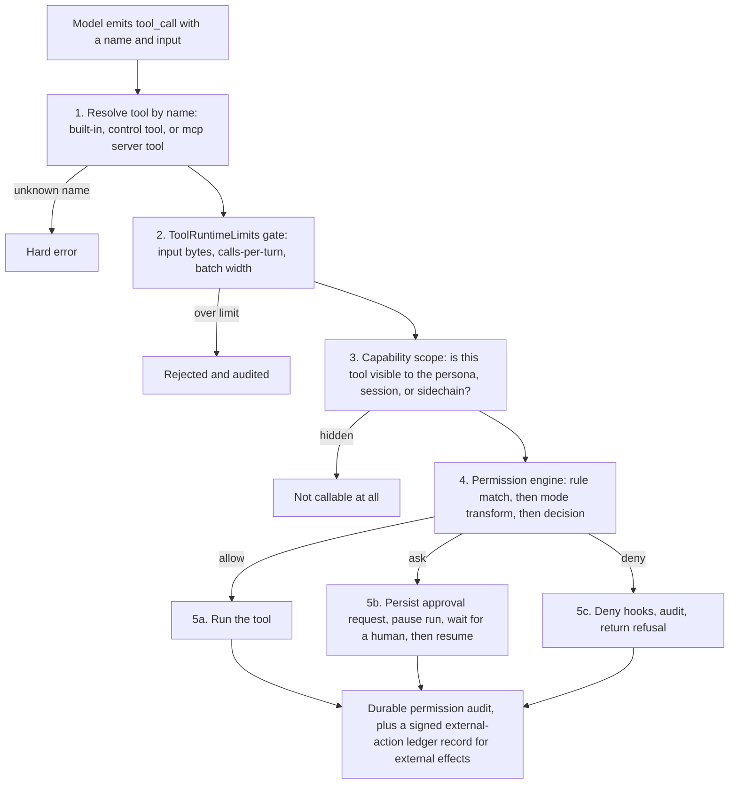
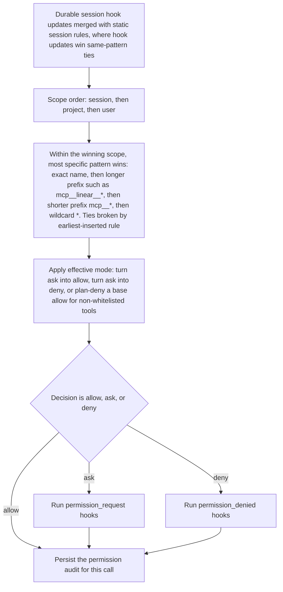
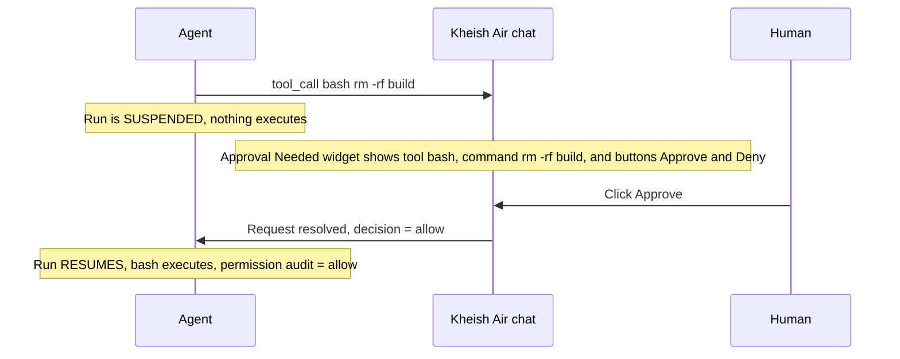
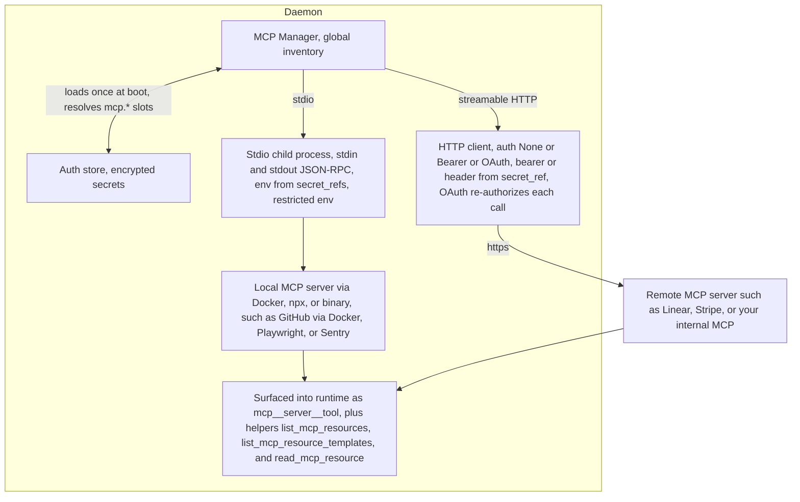
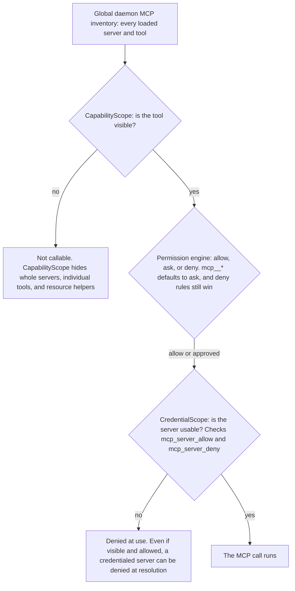
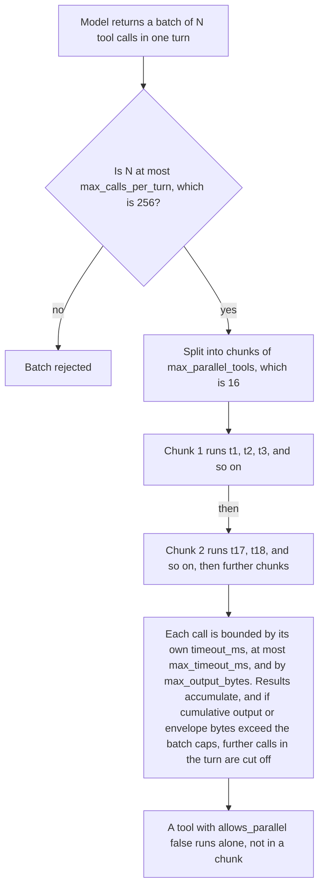

# Tools, MCP, and human approval

Everything an agent actually *does* in Kheish happens through a tool. Reading a
file, running a shell command, generating an image, spawning a background agent,
asking a human a question, scheduling a wake-up, calling a GitHub API through an
MCP server — all of it is a tool call that passes through one runtime, one
permission engine, and one audit trail. There is no side channel. If an agent
can affect the world, it did so through a named tool, and that call left a
record.

This page is the map of that surface. It covers the built-in tool families the
daemon registers for every session, the permission rules and modes that decide
whether a call runs immediately, is denied, or pauses for human approval, and
how Model Context Protocol (MCP) servers extend the surface without escaping the
same gates. It is deliberately concrete: the tool names here are the tool names
the model sees, and the decision tables here are the ones the daemon enforces.

If you want the conceptual framing of who is calling these tools — personas,
sidechains, skills — read [agents, personas, and skills](../concepts/agents-personas-skills).
If you want to know where a tool's *output* goes when it leaves the daemon, read
[connectors](./connectors). This page is about the surface itself.

## The shape of a tool call

Before the families, it helps to see the path a single call travels. When the
model emits a tool call, the runtime does not just run it. It resolves the
tool, checks byte and rate limits, evaluates permissions against the active
rule set and mode, runs hooks, and — only if the decision is `allow` — actually
executes. A decision of `ask` suspends the run until a human resolves it.



Two things are worth internalizing from this diagram. First, **capability scope
is a separate gate from permission mode**. A tool that is hidden by the session's
capability scope is not "denied" — it is simply not part of the surface, so the
model never sees it and can never call it. Second, an `ask` decision is not a
rejection. It is a *suspension*: the run parks, an approval request is persisted,
and the run resumes exactly where it left off once a human (or an approval hook)
resolves the request. That resume-from-suspension behavior is what makes
human-in-the-loop safe to leave on in production.

## Built-in tool families

Every daemon session starts with a fixed built-in surface, registered at boot in
`register_daemon_control_tools` plus the default coding tools. Media generation
tools (`generate_image`, `edit_image`, `generate_audio`) only appear when a
configured route actually advertises the matching capability, so a
text-only daemon will not show them. Everything else is always present unless a
capability scope hides it.

Here is the complete built-in surface, grouped by what the tools are *for*.

### Workspace and coding

These are the file-and-shell tools an agent uses to read, search, and change a
workspace. They are workspace-root-aware: paths that try to escape the
workspace are rejected before execution.

| Tool | What it does | Default decision |
| --- | --- | --- |
| `read_file` | Read a workspace file | allow |
| `list_files` | List a directory | allow |
| `glob_search` | Glob for paths | allow |
| `grep_search` | Search file contents | allow |
| `write_file` | Create or overwrite a file | ask |
| `edit_file` | Edit a file in place | ask |
| `apply_patch` | Apply a multi-file patch | ask |
| `bash` | Run a shell command | ask |
| `web_search` | Search the web | allow |
| `web_fetch` | Fetch a URL | allow |

The read side (`read_file`, `list_files`, `glob_search`, `grep_search`) is
allowed by default because it cannot mutate anything. The write side
(`write_file`, `edit_file`, `apply_patch`) and `bash` are the classic dangerous
operations, so they default to `ask` — a human confirms before the agent
touches disk or spawns a process. Web tools read the outside world and are
allowed by default, but remember that a fetched page is untrusted content: treat
anything a web tool returns the same way you treat MCP server text.

### Output and assets

These tools are how an agent produces a *durable, deliverable* result rather
than just chat text. They persist through the same asset and output plumbing the
rest of the daemon uses, so anything emitted here can be delivered to a connector
or downloaded from the asset store.

| Tool | What it does |
| --- | --- |
| `emit_output` | Compose the final answer shown to the user: ordered text parts plus daemon-owned assets, with optional artifact attachments |
| `store_asset` | Promote a file the agent wrote in its workspace into a daemon-owned asset, returning an `asset_id` you can attach in `emit_output` |

The pairing matters. An agent that writes `report.pdf` into its workspace has
produced a file nobody outside the sandbox can see. Calling `store_asset` with
that path turns it into an addressable `asset_id`; passing that id into
`emit_output` — either as an inline `asset` part or in `artifact_ids` — is what
actually delivers the file to the user. `emit_output` refuses to run with no
content, no parts, and no artifacts: an empty output is a bug, not a result.

`store_asset` rejects paths that escape the session workspace. That is a
deliberate boundary — an agent should not be able to reach an arbitrary file on
the host and publish it as an asset just by naming its path.

### Media generation

These tools exist only when a route advertises the capability. They produce
daemon-owned assets and return asset identifiers, exactly like `store_asset`,
so a generated image or audio clip flows into `emit_output` the same way.

| Tool | Appears when | What it does |
| --- | --- | --- |
| `generate_image` | a route advertises `image_generation` | Generate one or more images from a text prompt |
| `edit_image` | a route advertises `image_edit` | Edit existing daemon-owned images from a text instruction |
| `generate_audio` | a route advertises `audio_generation` | Synthesize speech from text, returning an audio asset |

A subtle but important detail: on a named-route daemon, the request field is
still called `provider` for backward compatibility, but it means *a configured
route identifier*, not a raw backend name. So `provider: "openai"` in a
`generate_image` call selects the daemon route you named `openai`, whichever
technical backend that route points at. The *response* still reports the
underlying backend (`openai`, `openrouter`, `google`) so you can see what
actually ran. Do not read the request `provider` as a hard backend selector on a
multi-route daemon.

### Human-in-the-loop

These tools are how an agent reaches a person on purpose — either to block on an
answer it genuinely needs, or to leave a non-blocking note. They are the
programmatic side of the approval experience described later in this page.

| Tool | Blocking? | Who it reaches |
| --- | --- | --- |
| `ask_user_question` | yes | The end user of the session |
| `ask_operator` | yes | The configured human operator, only if the session enables operator questions |
| `notify_operator` | no | The configured operator, as a fire-and-forget message |
| `request_parent_clarification` | yes (via parent) | Used by subagents instead of `ask_user_question`; the answer arrives later as a mailbox message |

`ask_user_question` and `ask_operator` suspend the run: the model asks between
one and four structured questions, each with a small set of options, and the run
does not continue until the questions are answered through the daemon question
flow. `ask_operator` additionally checks the session's operator config — if the
session did not enable operator questions, the call fails cleanly instead of
silently reaching a person who never opted in. `notify_operator` is the opposite:
it queues a message and returns immediately, and it explicitly warns the model
not to include secrets or raw credentials in the body.

Subagents are a special case. A background child agent has no direct line to the
end user, so it must not call `ask_user_question`. Instead it calls
`request_parent_clarification`, which surfaces the question up through the parent
session; the human's answer is delivered back to the child later as a mailbox
message with a known payload type. This keeps the "who can talk to the human"
boundary clean even in deep agent trees.

### Scheduling

Agents should never sleep in-process to wait for later. These tools create
*durable* wake-ups and schedules that survive restarts and fire on the daemon's
scheduler, not inside a run.

| Tool | What it does |
| --- | --- |
| `wake_after` | Create one durable wake-up that submits a new scheduled message after a delay |
| `wake_at` | Create one durable wake-up at an exact RFC3339 timestamp |
| `schedule_create` | Create a recurring or one-shot schedule |
| `schedule_list` | List schedules |
| `schedule_get` | Inspect one schedule |
| `schedule_pause` | Pause a schedule |
| `schedule_resume` | Resume a paused schedule |
| `schedule_cancel` | Cancel a schedule |
| `schedule_trigger_now` | Fire a schedule immediately |

The mental model: `wake_after` and `wake_at` are the "remind me later" building
blocks — they schedule a single future message targeted at self, parent,
session, or another agent. `schedule_*` is the durable, inspectable cron surface.
Because these are daemon-owned durable objects, a wake-up you set today still
fires after a daemon restart tomorrow. See
[tasks and schedules](../automation/schedules) for the lifecycle detail.

### Tasks

Tasks are daemon-backed background work items — the long-running counterpart to
an inline tool call. An agent creates one, lets it run, and polls or inspects it.

| Tool | What it does |
| --- | --- |
| `task_create` | Create a background task |
| `task_get` | Inspect one task |
| `task_list` | List tasks |
| `task_output` | Read a task's output |
| `task_update` | Update a task |
| `task_stop` | Stop a running task |
| `task_delete` | Delete a task |

### Subagents

These are the multi-agent orchestration primitives. They let one agent spawn,
message, wait on, and inspect other agents, each with its own isolated session.

| Tool | What it does |
| --- | --- |
| `spawn_agent` | Spawn a background child agent with its own session and initial subtask |
| `message_agent` | Send a mailbox message to another background agent |
| `wait_agent` | Wait for a background agent to settle or time out |
| `list_agents` | List full snapshots of visible background agents |
| `list_agent_summaries` | List lightweight summaries, filterable by session, status, or runtime presence |
| `get_agent` | Fetch one agent snapshot by id |

`spawn_agent` is the important one, and it carries the whole delegation security
model in its parameters. A parent can pass `allowed_tools` / `blocked_tools`, a
`capability_scope`, a `credential_scope`, an `agent_type` (one of `default`,
`plan`, `verification`, `coordinator`), a permission `mode`, and an `isolation`
mode (`shared` or `worktree`). Crucially, the daemon **rejects any child mode
that would be more permissive than the parent**: a child of a `default`-mode
parent cannot request `bypassPermissions`, and a child of a `plan`-mode parent
stays in `plan`. Sidechains inherit the parent's effective capability and
credential boundary at spawn time, so a child never regains access the parent had
already dropped. `wait_agent` and the inline-wait path on `spawn_agent` are
capped (90 seconds per wait); longer-running children are handled with repeated
shorter waits rather than one giant blocking call, which keeps the runtime
responsive under fan-out.

### Memory and skills

These tools let an agent reach the daemon's reusable instruction bundles and its
goal/plan state.

| Tool | What it does |
| --- | --- |
| `list_skills` | List skills visible to this session after capability filtering |
| `use_skill` | Activate a skill inline, or fork it into a child agent |
| `get_goal` / `create_goal` / `update_goal` | Read and manage the session goal |
| `todo_write` | Maintain the working to-do list |
| `enter_plan_mode` / `exit_plan_mode` | Enter and leave read-only planning |

`use_skill` and `list_skills` respect the effective capability scope: a skill
the scope hides is neither advertised nor activatable. Skills that carry their
own tool policy or execution mode (inline vs fork) shape the surface further —
an inline skill can constrain the very tools available while it is active. The
durable-memory side of this — how reviewed learnings become promoted procedural
skills — is governed separately and covered in [memory](../concepts/memory).

### The whole surface at a glance

The exact set of built-in tools a fully-featured daemon registers, sorted, is:

```
apply_patch               list_agents                   task_create
ask_operator              list_files                    task_delete
ask_user_question         list_skills                   task_get
bash                      message_agent                 task_list
create_channel_stimulus   notify_operator               task_output
create_goal               read_channel_thread           task_stop
edit_file                 read_file                     task_update
edit_image                request_parent_clarification  todo_write
emit_output               schedule_cancel               update_goal
enter_plan_mode           schedule_create               use_skill
exit_plan_mode            schedule_get                  wait_agent
generate_audio            schedule_list                 wake_after
generate_image            schedule_pause                wake_at
get_agent                 schedule_resume               web_fetch
get_goal                  schedule_trigger_now          web_search
glob_search               set_channel_reaction          write_file
grep_search               spawn_agent
list_agent_summaries      store_asset
```

The three channel tools — `read_channel_thread`, `set_channel_reaction`, and
`create_channel_stimulus` — are how an agent participates in a public channel
without inventing a separate posting surface: `create_channel_stimulus` queues
one autonomous follow-up or new subject and lets the daemon arbitrate how to
materialize it, rather than letting an agent write directly into the main feed.
`emit_output` publishes the durable public reply. See
[channels and public conversations](../reference/channels-api)
for the arbitration model.

When MCP is enabled, three more helper tools and the discovered `mcp__*` tools
join this surface. Those are covered below.

## Permission rules and modes

The built-in decisions above (`allow` vs `ask`) come from a default rule set the
daemon installs at boot, combined with the active permission mode. Understanding
how those two interact is the core of operating Kheish safely.

### The default rule set

At boot the daemon installs a small, ordered set of session-scoped rules, then
appends a final wildcard allow:

```
1. bash                          → ask
2. write_file                    → ask
3. edit_file                     → ask
4. apply_patch                   → ask
5. mcp__*                        → ask
6. list_mcp_resources            → ask
7. list_mcp_resource_templates   → ask
8. read_mcp_resource             → ask
9. exit_plan_mode                → ask
10. *                            → allow   (must stay last)
```

The wildcard `*` allow is what makes every *other* tool — all the read-only
inspection, the scheduling, the subagent orchestration — allowed by default. The
nine specific `ask` rules carve out exactly the operations that can mutate a
workspace, run a process, or reach an external system through MCP. That final
wildcard is deliberately kept last so that dry-run explanations name it
explicitly instead of relying on an implicit fallthrough; any extension rules an
operator adds are inserted *before* it.

### The five modes

A permission mode is a global transform applied on top of the matched rule. The
runtime exposes five:

| Mode | Effect summary |
| --- | --- |
| `default` | Rules apply as written; sensitive ops `ask` |
| `acceptEdits` | Auto-allows edit approvals (`write_file`, `edit_file`, `apply_patch`); everything else unchanged |
| `bypassPermissions` | Turns every `ask` into `allow`, but still honors explicit `deny` rules |
| `plan` | Read-only/coordination allowlist only; denies everything else; honors explicit `deny` |
| `dontAsk` | Turns every `ask` into `deny` — the agent proceeds only with what is already allowed |

The full matrix, for the default sensitive-rule set:

| Tool class | default | acceptEdits | bypassPermissions | plan | dontAsk |
| --- | --- | --- | --- | --- | --- |
| Explicit deny rule | deny | deny | deny | deny | deny |
| `bash` | ask | ask | allow | deny | deny |
| `write_file`, `edit_file`, `apply_patch` | ask | allow | allow | deny | deny |
| `mcp__*` tools | ask | ask | allow | deny | deny |
| `list_mcp_resources`, `list_mcp_resource_templates`, `read_mcp_resource` | ask | ask | allow | ask | deny |
| Read-only file/search/list + schedule/goal inspection | allow | allow | allow | allow | allow |
| `exit_plan_mode` | ask | ask | allow | ask | deny |
| Other tools (matched by wildcard) | allow | allow | allow | deny unless whitelisted | allow |

A few things fall out of this table that surprise people:

- **`bypassPermissions` is not "no rules."** It converts `ask` to `allow`, but an
  explicit `deny` rule still denies. You can hand an autonomous agent
  `bypassPermissions` and still hard-block, say, `bash`, by adding a deny rule
  for it. The mode cannot override a deny.
- **`dontAsk` is a safety posture, not a convenience.** It turns `ask` into
  `deny`, so an unattended run in `dontAsk` will *refuse* to write files or call
  MCP tools rather than block waiting for a human who is not there. Use it when
  nobody will be around to approve.
- **`plan` denies by default.** In plan mode, anything not on the read-only /
  coordination allowlist is denied. The allowlist includes the read tools, the
  inspection tools, `spawn_agent`, `message_agent`, `wait_agent`, the question
  tools, and the MCP resource *read* helpers — enough to investigate and design,
  but not to mutate. `exit_plan_mode` itself is `ask`, so leaving plan mode is a
  human decision.

### Rule scopes and precedence

Rules live at three scopes — `user`, `project`, and `session` — which lets an
operator set broad defaults while narrowing or relaxing one deployment or one
session. When a call is evaluated, the engine resolves the winning rule
deterministically:



Because specificity is well-defined, you can layer policy safely. A user-scope
`mcp__*` deny plus a project-scope `mcp__linear__*` allow means "no MCP tools
except Linear's" — the longer prefix wins within its scope, and session scope
would win over both if it spoke to the same pattern. This is exactly how you
express "this child may keep route access but must not inherit GitHub or
Datadog credentials" at the visibility layer, complementing the credential-scope
layer described in the MCP section.

Hook-emitted permission updates are accepted only at `session` scope, because
that is the durable scope restored after a daemon restart. Broadening a policy to
`user` or `project` must go through runtime configuration, not hook output — a
hook cannot silently widen the blast radius beyond the session it runs in.

### Auditability and dry-run

Every decision is written into the session record stream as a durable audit,
updated *after* permission hooks run. So a hook-approved request audits as
`allow`, a hook-blocked one as `deny`, and a still-pending one stays `ask`. Each
audit record carries the final `decision`, the `base_decision` before the mode
transform, the `effective_mode`, the `mode_effect` when a mode changed the
result, and the matched rule pattern and origin (`static` or `hook_update`).
Fetch them with `GET /v1/sessions/{session_id}/permission-audits`.

Before you change production policy, explain it without executing anything:

```bash
# explain one tool under the active (or an overridden) mode
kheish-daemon runtime permissions check --tool bash --mode plan

# explain every registered tool under every mode
kheish-daemon runtime permissions matrix
```

Both are pure dry-run explainers. They do not run hooks, create approval
requests, execute tools, or persist audit records — the response even carries
`hooks_evaluated=false` so you can tell a static explanation from a real run.
The matrix endpoint is the one to run before a rollout: it reflects the *actual*
active surface, including dynamically registered MCP tools and control tools, so
you can confirm reality matches your mental model.

### Approvals in Kheish Air chat

When a decision is `ask`, the run parks and an approval request is persisted. In
the Kheish Air console this shows up inline in the session chat as an **Approval
Needed** widget: it names the tool, shows the input the agent wants to run, and
offers approve / deny. Resolving it there is exactly equivalent to resolving the
request through the API — the same persisted request, the same resume.



The important property is that the run does not lose its place. The suspension is
durable: if the daemon restarts while an approval is pending, the request is
still there when it comes back, and answering it still resumes the original run.
Operator approval resolutions are recorded as approval events on the run,
separate from the permission audit — for a full picture of an approval-gated
call, inspect both. The conceptual model of approvals and questions is described
in [approvals and questions](../automation/tools-and-mcp).

## Model Context Protocol (MCP)

MCP is how Kheish reaches tools it did not ship: GitHub, GitLab, Linear, Stripe,
Neon, Cloudflare, documentation servers, and any spec-compliant server you point
it at. The daemon loads MCP servers globally and surfaces their tools directly
into the runtime, under the same permission engine and behind capability and
credential gating.

### The daemon owns one global MCP inventory

MCP servers are a daemon-wide resource. Personas and sessions do not start or
stop servers — the daemon loads them once at boot (from a Codex-compatible
config, explicit `--mcp-config`, or built-in catalog profiles) and supervises
them for its whole life. What a given session *sees* of that inventory is then
narrowed per-session by capability and credential scope. This is the key scaling
property: one server process serves every session; you do not pay a process per
agent.



### Two transports

There are exactly two supported transports, and the config validates that a
server declares one and only one:

- **Stdio.** The daemon launches a child process (a Docker container, an `npx`
  package, a local binary) and speaks JSON-RPC over its stdin/stdout. Use this
  for servers distributed as local executables or images.
- **Streamable HTTP.** The daemon talks to a remote server over HTTP with an
  auth mode of `None`, `BearerToken`, or `OAuth`. Use this for hosted servers.

Mixing them is a startup error: a stdio server cannot carry HTTP auth or header
fields, and an HTTP server cannot carry stdio command fields. The config layer
enforces this so a malformed entry fails loudly at boot rather than connecting in
a half-configured state.

### Secrets never live in the config

The single most important MCP security rule: **durable MCP tokens belong in the
daemon secret store, referenced by slot, not inlined in config files.** The
config schema is built around this.

For stdio servers, `env_secret_refs` maps an environment variable name to a
secret-store slot. When `env_secret_refs` is present, the daemon *forces* a
restricted child environment and *rejects* `inherit_env = true` — a
secret-backed stdio child does not get the whole daemon environment handed to it.
Every value the child needs must be in `env` (for non-secret values) or
`env_secret_refs` (for secret ones).

```toml
[mcp_servers.internal]
command = "internal-mcp"
env_secret_refs = { "INTERNAL_TOKEN" = "mcp.custom.internal.INTERNAL_TOKEN" }
inherit_env = false            # required; true is rejected with secret refs
```

For HTTP servers, the parallel fields are `bearer_token_secret_ref` (a single
bearer token) and `http_header_secret_refs` (arbitrary headers like
`x-api-key`). You may not configure an `Authorization` header *and* managed
bearer/OAuth auth for the same server — that conflict is a startup error, caught
case-insensitively. The same header name declared from two sources
(`headers` + `http_header_secret_refs`) is also rejected.

```toml
[mcp_servers.acme]
url = "https://mcp.acme.example/mcp"
bearer_token_secret_ref = "mcp.custom.acme.BEARER_TOKEN"
http_header_secret_refs = { "x-api-key" = "mcp.custom.acme.X_API_KEY" }
enabled_tools = ["search", "fetch"]
startup_timeout_sec = 15
tool_timeout_sec = 120
```

Two more properties worth knowing. First, a server whose secret slot has been
*revoked* is silently skipped at load — the daemon does not connect a server
whose credential you deliberately revoked. Second, the runtime `Debug` output for
an MCP config redacts every resolved secret: bearer tokens, header values, resolved
env values, and even sensitive-looking URL userinfo, query, and fragment
components and sensitive-looking command-line arguments (`--token=...`,
`--api-key ...`) are replaced with `<redacted>` before they can reach a log.

### OAuth-backed HTTP servers

Spec-compliant HTTP MCP servers can use OAuth. The daemon stores the account
under an `mcp.oauth.<id>` slot (the config `oauth_slot_ref` *must* use the
`mcp.oauth.` namespace, or startup fails) and references it with
`oauth_resource` and `oauth_scopes`:

```toml
[mcp_servers.acme]
url = "https://mcp.acme.example/mcp"
oauth_slot_ref = "mcp.oauth.acme"
oauth_resource = "https://mcp.acme.example/mcp"
oauth_scopes = ["read", "search"]
```

OAuth-backed MCP is deliberately **fail-closed at boot**. If a configured server
would need OAuth material during bootstrap, `runtime get` reports
`error: "oauth_requires_scoped_runtime_initialization"` rather than handing out a
daemon-global token. The server only initializes inside a scoped runtime path —
when an explicit MCP resource helper call happens inside a session or agent
credential scope — and the HTTP client re-authorizes before *every* call. That
per-call re-authorization is what makes revocation real: a deleted slot, a
revoked subject, or a rotated token fails closed on the next call instead of
riding a stale header.

### Tool naming and collisions

Every discovered MCP tool is qualified as `mcp__<server>__<tool>`. This is why
the default rule set gates `mcp__*` behind `ask`: a wildcard that matched all
MCP tools would otherwise let an account-impacting write fall through the
catch-all allow. If two servers or tools would collapse to the same registered
name after qualification and sanitization, **daemon startup fails** rather than
silently shadowing one tool with another. A name collision is a configuration
error you must resolve, not a race the daemon resolves for you.

Alongside the discovered tools, three resource helpers appear when MCP is
enabled: `list_mcp_resources`, `list_mcp_resource_templates`, and
`read_mcp_resource`. These default to `ask` as well, and they are the supported
lazy path for OAuth-backed servers — calling a resource helper is what
initializes a fail-closed OAuth server inside your session's credential scope.

### Capability ∩ credential: the two-gate MCP boundary

A session does not simply inherit the whole global MCP inventory. Two independent
scopes decide what it can *see* and what it can *use*:

- **`CapabilityScope`** decides which MCP servers, tools, and helper tools remain
  *visible* to the model at all.
- **`CredentialScope`** decides whether an auth-backed MCP surface remains
  *usable* — it can deny a credentialed server even while that server stays
  visible.

The effective access is the intersection:



This separation is what lets you say precise things. "This delegated child keeps
route access but must not touch GitHub credentials" is `mcp_server_deny:
["github"]` in the child's credential scope — GitHub's tools may still be
*visible*, but the credentialed resolution is denied. Sidechains inherit the
parent's effective capability *and* credential boundary at spawn, and when a
delegated child requests no explicit credential scope, Kheish keeps route access
but denies connector credentials and credentialed MCP by default. A child can
never widen either boundary. Persona and session capability scopes also filter
skills, so the same intersection logic governs the whole model-visible surface,
not just MCP.

### Hot-adding MCP servers and the console catalog

Beyond boot config, servers can be added through the daemon runtime API while it
runs, and the Kheish Air console exposes this as a catalog experience. The
console shows curated entries with their auth shape and risk class, and offers
three connection styles:

- **Curated built-in entries.** Pick a supported profile entry (docs servers,
  GitLab, Linear, Neon, Stripe, Cloudflare) and, where auth is needed, store its
  token into the catalog secret slot (`mcp.<entry>.<CREDENTIAL>`). The daemon
  reads that slot at startup; the token is never echoed back.
- **One-time OAuth (e.g. Gmail-style hosted servers).** For a spec-compliant
  OAuth server, the console walks a one-time login that writes an
  `mcp.oauth.<id>` account into the encrypted store. After that, refresh happens
  automatically and only redacted account metadata is ever shown; the raw tokens
  never leave the store, and scope escalation on refresh is rejected.
- **Custom stdio.** Point the daemon at a local command or container you own,
  with per-server secrets bound through `env_secret_refs`. Because a stdio child
  is a mutable local artifact, Kheish keeps these operator-owned: you pin the
  exact image, package version, or binary rather than letting a broad profile
  start something for you.

For the full operator connection matrix — which entries start directly with a
profile, which need `mcp auth set` first, which are catalog-only and need
explicit config, and which depend on upstream OAuth — see the
[MCP catalog](/operators/mcp-catalog) reference.

A hot-added server is persisted in a state-root overlay and reconnected at the
next boot. If a rotating secret or a changed config needs to take effect on an
*already loaded* server, restart the daemon so it reconnects with the new
material — MCP inventory is resolved at startup, not re-read live.

### MCP output is untrusted

One more posture that belongs here even though it is not a "gate": every byte an
MCP server returns is treated as untrusted advisory data. Server instructions
are truncated and wrapped with an explicit warning before entering a prompt. Tool
and resource outputs are labeled untrusted, with bounded text/blob/media fields
and recursive JSON depth, item, and string caps applied before they are persisted
into the transcript. These are transcript-facing safety limits, though — not a
substitute for OS/container isolation. For a high-risk MCP server, still run it
with external resource limits and keep its tools behind explicit approval or a
tight capability scope.

### Hooks as dynamic policy

The `ask` and `deny` branches of the pipeline are also extension points. When a
decision resolves to `ask`, the daemon runs `permission_request` hooks; when it
resolves to `deny`, it runs `permission_denied` hooks. A `permission_request`
hook can approve or block a request programmatically before a human ever sees it,
which is how you encode rules like "auto-approve `write_file` under `docs/` but
still ask for anything under `src/`." Because these run *inside* the pipeline,
their outcome is reflected in the durable audit: a hook-approved request is
audited as `allow`, a hook-blocked one as `deny`.

Hooks are themselves isolated ephemeral agents, and they are held to the same
surface discipline as everything else. When an agent hook omits its
`tool_surface`, it receives *no* tools at all. If a hook needs tools, it must
declare an explicit allowlist — a denylist-only surface is rejected, because a
denylist would otherwise expose every future tool by default. This is the same
"explicit allow, never implicit" principle that keeps the wildcard `*` rule last
in the default rule set. Treat hook-driven permission changes as part of your
security model, not as a convenience: a hook that flips decisions is exercising
real authority, and it is audited as such.

### A worked delegation example

To see the gates compose, follow one delegation. A parent session running in
`default` mode wants a child to investigate a repository through GitHub's MCP
tools, but must not let that child write to disk or reach any *other* MCP
server. The parent calls `spawn_agent` with a narrowed surface:

```json
{
  "name": "repo-scout",
  "agent_type": "plan",
  "prompt": "Summarize open pull requests touching the auth module.",
  "blocked_tools": ["write_file", "edit_file", "apply_patch", "bash"],
  "capability_scope": { "mcp_server_allow": ["github"] },
  "credential_scope": { "mcp_server_allow": ["github"], "route_allow": ["openai"] }
}
```

Several protections stack here. The `agent_type: "plan"` child starts in plan
mode, so even the blocked-tools list is belt-and-suspenders — plan mode already
denies mutating tools. The `capability_scope` hides every MCP server except
GitHub, so the child's model never even sees Linear or Stripe tools. The
`credential_scope` allows only the GitHub server's credentials and the `openai`
route; any connector credential defaults to denied because no
`connector_credential_allow` was given. And because the parent is in `default`,
the child cannot request `bypassPermissions` — the daemon would reject a more
permissive child mode outright. The child ends up with exactly the authority it
needs: read GitHub through MCP, reason with one model route, and nothing else.

## Tool timeouts and parallelism

Independently of permissions, the daemon wraps every tool call in a set of
runtime limits (`ToolRuntimeLimits`). These are the guardrails that keep one
run — or one badly-behaved tool — from exhausting the daemon.

| Limit | Default | What it bounds |
| --- | --- | --- |
| `max_input_bytes` | 16 MiB | Serialized JSON accepted for one tool input |
| `max_output_bytes` | 16 MiB | Serialized JSON returned to the model from one tool |
| `max_result_envelope_bytes` | 24 MiB | One full result envelope, including context/hook data |
| `max_timeout_ms` | 180000 | The ceiling any one tool call may consume |
| `max_parallel_tools` | 16 | How many calls run concurrently in one batch |
| `max_calls_per_turn` | 256 | Calls accepted in one model tool-use batch |
| `max_cumulative_output_bytes` | 64 MiB | Total tool output across one batch |
| `max_cumulative_result_envelope_bytes` | 96 MiB | Total envelope bytes across one batch |
| `max_sandbox` | network-enabled | Highest sandbox profile the runtime may execute |

Each individual tool also declares its own `timeout_ms` and whether it
`allows_parallel`. The per-tool timeout is clamped by `max_timeout_ms`; a tool's
`allows_parallel = false` (as on `emit_output`, `ask_operator`, `generate_image`)
means it will not be batched concurrently with others even inside a parallel
batch. Here is how a multi-call turn is scheduled:



Operators can inspect or replace these limits with
`kheish-daemon runtime tool-limits get` and `... set --file tool-limits.json`.
Changes apply to *future* batches — a batch already executing runs to completion
under the limits it started with. This matters when you are tuning for scale:
raising `max_parallel_tools` widens each chunk, but the cumulative-byte caps
still bound how much a single turn can pull back into the model's context. For
large agent fan-out, the pressure is rarely one tool — it is the total inventory
of MCP tools loaded into the daemon and injected into every prompt, so keep the
model-visible surface narrow per persona even while the daemon inventory is
broad. See [production](../operations/production) for scale guidance.

## Putting it together

The through-line of this whole page is that Kheish has exactly one way for an
agent to act — a named tool — and exactly one place that decides whether the
action happens — the permission engine, sitting behind capability and credential
gating, with human approval as a first-class, resumable outcome. MCP does not
bypass any of it; it extends the surface *into* the same gates. That uniformity
is what makes the system auditable: every effect is a tool call, every tool call
has a decision, and every decision has a durable record.

Where to go next:

- [Agents, personas, and skills](../concepts/agents-personas-skills) — who is
  making these tool calls, and how personas and skills shape the surface.
- [Memory](../concepts/memory) — how durable memory and promoted procedural
  skills are governed, and why nothing mutates memory ungoverned.
- [Connectors](./connectors) — where an emitted output actually goes when it
  leaves the daemon, and how reply targets work.
- [The security model](../operations/security) — the trust boundaries, the
  encrypted secret store, brokered credentials, and the honest threat model that
  sits under everything on this page.
- [Production](../operations/production) — running this surface at scale, tuning
  tool limits, and keeping the MCP inventory manageable across many agents.
