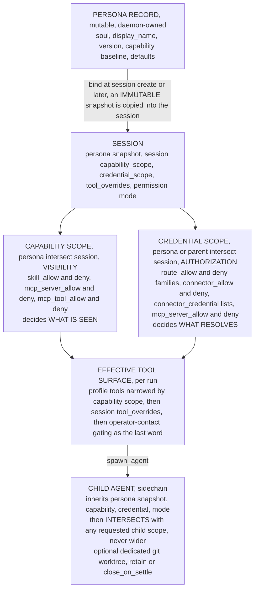
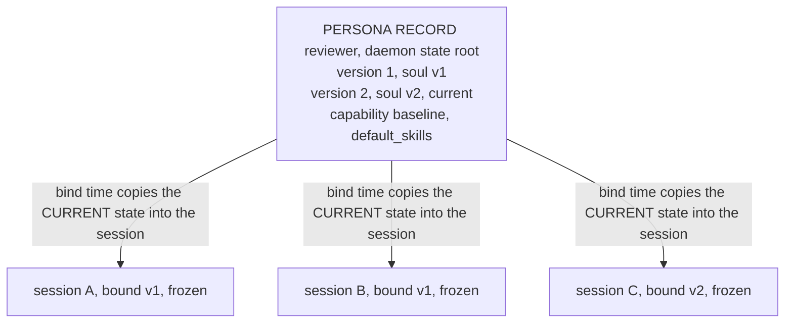
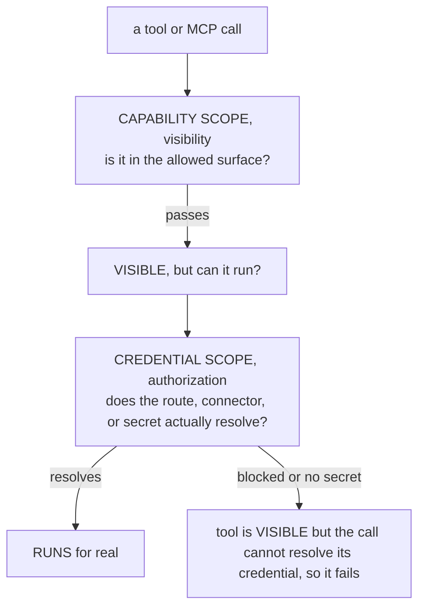
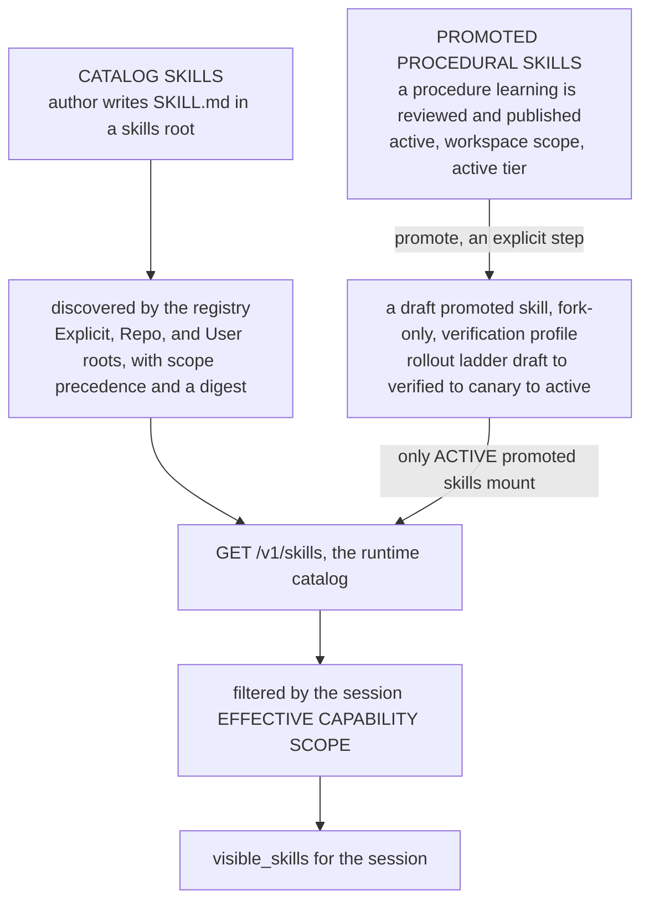
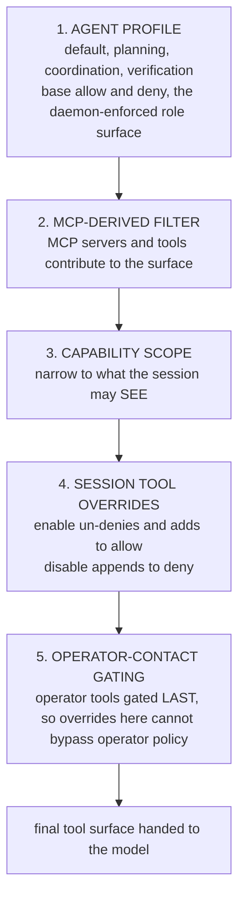
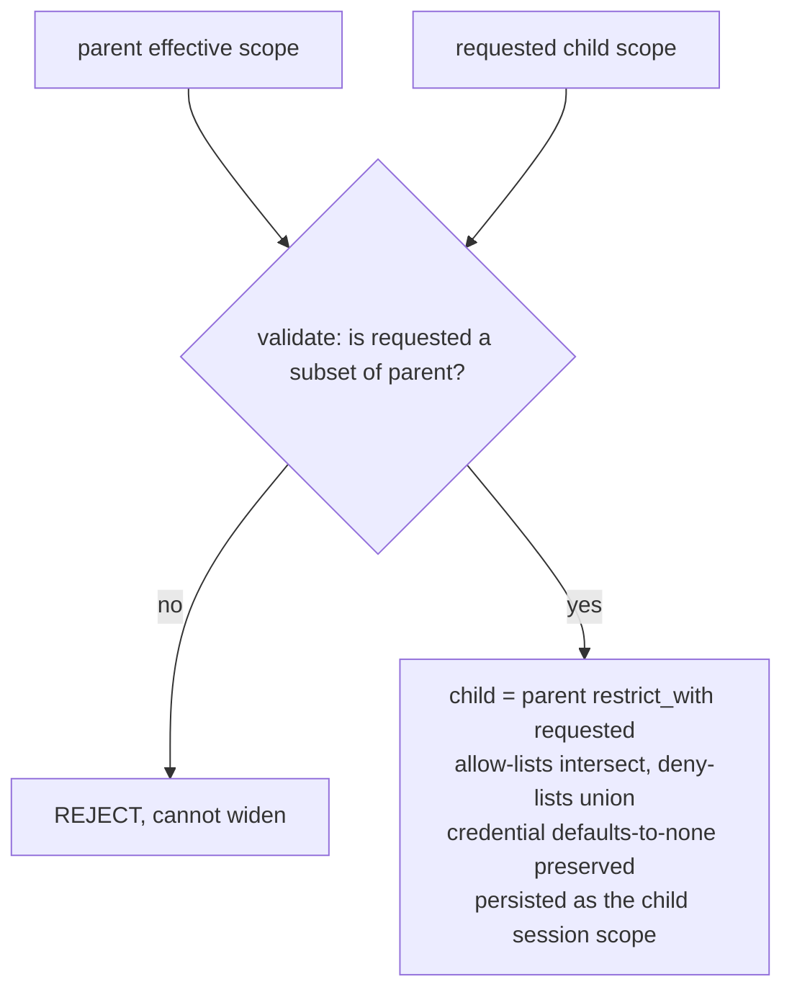

# Agents, personas, scopes, and skills

Kheish does not run "an assistant." It runs a **tree of governed agents**, and every agent in that tree is shaped by four different questions that are deliberately kept separate:

1. **Who am I?** — the *persona* (identity, voice, standing instructions).
2. **What can I see?** — the *capability scope* (which skills and MCP surfaces are visible).
3. **What am I allowed to use?** — the *credential scope* (which routes, connectors, and secrets resolve).
4. **What can I actually do?** — the *tool surface* (the concrete tools, after profile, scopes, and overrides).

Beginners tend to mash these together into one fuzzy idea of "permissions." That fuzziness is the source of almost every "why can't the agent do X" confusion. The reason Kheish splits them apart is that they answer genuinely different questions, they are enforced at different layers, and — critically — they can disagree. An agent can *see* a tool it is not *allowed to use*. An agent can *be* a reviewer persona while its session narrows what that persona may touch. Keep the four questions distinct and the system becomes legible.

This page is the map of that machinery — identity, scopes, skills, and the execution tree of subagents all live here. For how memory is scoped by these same boundaries, read [How Kheish remembers: the memory planes](./memory). For where all of this sits in the system, read [Architecture](./architecture), and for the operator posture, [The security model](../operations/security).

## The big picture

Here is the whole apparatus in one diagram. Read it top-down as "how an agent is assembled," and note that the two scope boxes are **parallel, independent gates** — one governs visibility, the other governs authorization.



Everything below is an expansion of one box in that diagram. We start at the top — identity — and work down to the leaves — child agents.

### The four questions, side by side

Before diving in, here is the whole model compressed into one table. Every row is a different question, owned by a different construct, enforced at a different layer, inspected through a different field. When something surprises you, find the row.

| Question | Construct | What it controls | Default when unset | Inspect via |
| --- | --- | --- | --- | --- |
| Who am I? | Persona binding | Standing instructions (`soul`), voice, defaults | Daemon-global identity, no persona section | `sessions get` → `persona` |
| What can I see? | Capability scope | Visible skills + MCP servers/tools | Everything visible (permissive) | `effective_capability_scope` |
| What may I use? | Credential scope | Routes, connectors, secrets, credentialed MCP | Routes open, connectors default-denied when constrained | `effective_credential_scope` |
| What can I do? | Tool surface | Concrete tools after profile + scopes + overrides | The agent profile's base surface | `memory-context` / tool list |

The four constructs are layered, not merged. The persona supplies a baseline; the session narrows it; the child narrows it again. Each narrowing is an intersection that can only ever *reduce* reach. There is no path in the system that lets a lower layer grant itself more than a higher layer allowed — and that single invariant is what makes delegation safe.

### Why four gates instead of one

It is fair to ask why Kheish does not just have "permissions" like most tools. The four-way split earns its keep for concrete governance reasons:

- **Visibility and authorization must be separable.** You often want an agent to *know a capability exists* without being able to *use it*, or the reverse — to hold a credential for a tool you have hidden. Collapsing them forces false choices. Keeping capability scope and credential scope apart lets you say "you may see the deploy tool so you understand the workflow, but you may not resolve the deploy credential."
- **Identity must outlive configuration.** A persona is a *reusable* identity that many sessions bind. If identity and per-session permissions were one object, you could not share an identity across sessions with different blast radii. The binding snapshot decouples "who" from "how much."
- **Least privilege by construction, not by discipline.** Because every layer intersects, the *safe* thing is also the *default* thing. A delegated child that asks for nothing gets a tight scope automatically. Operators do not have to remember to lock children down; the daemon does it.
- **Auditability.** Four narrow, typed constructs are far easier to inspect and reason about than one sprawling permission blob. When you read `effective_capability_scope` you are reading exactly the visibility decision — nothing else is tangled into it.

The rest of this page walks each construct in the order an agent is assembled: identity first, then the two scopes, then the concrete tool surface, then how all of it projects onto children.

### Persona vs session vs run input

One more framing before the details, because newcomers routinely put instructions in the wrong place. Kheish has three levels at which you can influence an agent, and they have different lifetimes:

- **Persona** — durable, reusable identity. Bind it when the same standing instructions should apply across many sessions. Lifetime: as long as the persona is bound (and the binding snapshot outlives record edits).
- **Session** — one conversation's configuration and history. Put here the settings that should hold for the life of *this* conversation: a capability override, a credential scope, tool overrides. Lifetime: the session.
- **Run input** — the actual task. Put here what you want *done right now*. Lifetime: one run.

A good rule: if you find yourself editing a persona `soul` to describe a one-off task, stop — that belongs in run input. If you find yourself repeating the same instruction in every run, that is a persona (or a skill). If you are toggling which tools a single conversation may touch, that is a session-level control.

## Personas: the identity layer

A **persona** is the durable identity that sits *above* individual sessions. Kheish is careful to separate two things that people usually conflate:

- a **mutable persona record**, owned by the daemon, and
- an **immutable session persona binding**, copied into each session that binds it.

That split is what makes personas safe in a daemon that restarts, queues runs, and spawns children. Change the record all you like; sessions that already bound an older version are untouched.

### What a persona carries

A persona record (stored under the daemon state root) carries:

- a stable `persona_id`,
- a user-visible `display_name`,
- one `soul` text body — the exact instruction body future sessions bind,
- a monotonically increasing `version`,
- an optional `capability_scope` **baseline**,
- optional `default_skills` assignments for inline skills,
- and optional metadata.

The `soul` is the standing instruction set — "you are a meticulous code reviewer; you never approve without reading the diff" — not a one-off task. Use personas for reusable identities: `reviewer`, `researcher`, `planner`, a support-style responder. Do **not** stuff task-specific instructions into a persona; that is what session and run input are for.

Two of those fields do more than carry prompt text, and they matter for the rest of this page:

- the `capability_scope` baseline **restricts what future bound sessions can see** (it is a visibility boundary), and
- the `default_skills` are the inline skill activations that **start enabled** for new bound sessions (they are a starting configuration, not a boundary).

If a persona defines no capability scope, a new bound session starts from the daemon-global skill and MCP inventory. If it does define one, that baseline is later intersected with any session-local override.

### The two-layer model

The critical design rule:

- persona records are **mutable**,
- session bindings are **immutable snapshots**.



Updating the record to v3 does NOT rewrite A, B, or C: A and B keep v1, C keeps v2, and only NEW sessions get v3.

When a session binds a persona, Kheish copies the *current* persona state into session metadata: `persona_id`, `persona_version`, `display_name`, the captured `soul`, the captured `capability_scope`, the resolved `default_inline_skills` snapshot, an instruction digest, and the bind timestamp. Consequences:

- updating a persona record does **not** rewrite existing sessions;
- future sessions see the latest version;
- existing sessions keep the snapshot they bound;
- default inline skills and capability restrictions are **frozen into the binding** — which is exactly why they survive a daemon restart even if the mutable record later changes.

### Binding, importing, and mutation rules

The lifecycle is simple: create or import a persona record; bind it at session creation (or later with `sessions set-persona`); run work; update the record when you want *future* sessions to use a new version. The CLI can import a persona straight from Markdown (the file content becomes the `soul`, the first heading becomes the display name unless overridden), and the HTTP API exposes persona create/update under `/v1/personas`.

Binding or clearing a persona is stricter than ordinary input. Kheish only allows a persona change while the session is **idle for topology mutation** — no active or queued run, no pending approvals or questions, no mailbox backlog, no waiting agent state, no live descendants. This idle guard keeps a persona change from rewriting the identity of already-queued or suspended execution. (You will see the same idle-guard pattern again for tool overrides and scope changes; it is Kheish's standard "do not mutate a session out from under running work" rule.)

### Prompt semantics and effective scope

When a session has a bound persona, the runtime injects it as a dedicated `persona` section in the system prompt. Two details:

- the persona is **restored after restart** because the binding lives in session metadata, not only in the mutable record;
- a daemon-level `override_prompt` **suppresses** the persona section, because that override replaces normal base-prompt assembly.

And the punchline that connects personas to the next section: the persona binding feeds not just prompt text but the session's **default inline skills** and its **capability baseline**. The session's effective visibility is:

> **effective capability scope = persona binding baseline, restricted by the session capability scope.**

That is why `sessions get` exposes both the persisted `capability_scope` and the derived `effective_capability_scope`. They can legitimately differ, and knowing which one you are looking at is half of debugging a visibility problem.

## Capability scopes: what an agent can *see*

A **capability scope** (`CapabilityScope`, in `crates/kheish-types/src/capabilities.rs`) is the compact visibility policy for **skills and MCP surfaces**. It is pure visibility — it decides what shows up in the catalog and the tool list, not whether a credential exists. It has six lists, all optional:

| List | Governs |
| --- | --- |
| `skill_allow` / `skill_deny` | which skills are visible |
| `mcp_server_allow` / `mcp_server_deny` | which MCP servers are visible |
| `mcp_tool_allow` / `mcp_tool_deny` | which qualified MCP tools (e.g. `mcp__tracker__delete_item`) are visible |

### Allow/deny semantics (learn these once)

The matching rules are small and worth memorizing, because they are the same for both scope types:

- An **empty allow-list is permissive** — no allow constraint means everything is eligible.
- `*` in an allow-list covers every concrete entry.
- **Deny is applied after allow, and deny always wins.** An entry is allowed only if the allow-list admits it *and* the deny-list does not match it.
- Matching is **exact or `*` wildcard only** — no globbing, no substring matching. `mcp__tracker__*` is not a pattern; only a literal `*` is.
- An MCP *tool* is visible only if **both** its server is allowed *and* the tool passes the tool allow/deny. (MCP helper tools like listing/reading resources check only the tool allow/deny.)

A normalized scope trims, drops empties, dedups, sorts, and collapses to `["*"]` if any entry is `*`. So `["review", "*", "docs"]` normalizes to `["*"]` — "allow one specific thing and also everything" is just "everything."

### Effective scope = persona ∩ session

When a persona baseline meets a session override, Kheish computes the **intersection** — a scope no wider than either input — via `restrict_with`:

```text
   EFFECTIVE CAPABILITY SCOPE = persona baseline ∩ session override

   PERSONA baseline           SESSION override            EFFECTIVE
   -----------------          ----------------            ---------
   skill_allow                skill_allow                 skill_allow
   [review, plan]      ∩      [review, ship]      =       [review]      (intersection)

   skill_allow                skill_allow
   [review, plan]      ∩      []  (permissive)    =       [review, plan] (other side wins)

   skill_allow                skill_allow
   [review]            ∩      [*]                 =       [review]      (* cannot widen)

   *_deny  (persona)          *_deny  (session)
   [ship]              ∪      [delete]            =       [ship, delete] (deny UNION)
```

Two properties are load-bearing:

- **Allow-lists intersect.** An empty side means "no constraint," so the other side wins; a `*` on one side yields the other side; otherwise it is set intersection. A child (or session) that asks for `*` **cannot widen** a concrete parent allow-list.
- **Deny-lists union.** Parent denies survive narrowing. A session can never *un-deny* something the persona denied.

There is one sharp edge operators must know about: if the persona allow-list and the session allow-list are **disjoint** (no overlap at all), the intersection would be empty — which, because "empty allow = permissive," would ironically *fail open* to "everything allowed." Kheish's stack validation warns about exactly this disjoint case (`validate_capability_intersections`) so you catch it before it becomes a silent widening. If you intend to lock a session down, make sure its allow-list is a **subset** of the persona's, not a disjoint set.

### What the capability scope actually filters

At the daemon-view layer, the effective scope filters the **visible skills** shown for a session. At the runtime layer, the same effective scope filters **visible MCP servers and tools** when a prompt is assembled. So a skill or MCP tool can exist and be perfectly functional daemon-wide and still be *invisible* to a given session because that session's effective capability scope does not admit it. Operators set the session-local override through `PUT /v1/sessions/{session_id}/capability-scope` (the Air console's session **Capabilities** card wraps this, with an "Edit skills" picker over `skill_allow`).

## Credential scopes: what an agent is *allowed to use*

A **credential scope** (`CredentialScope`, same file) is the *other* gate — the one that governs **authorization of auth-backed resources**, entirely separate from visibility. Its eight lists:

| List | Governs |
| --- | --- |
| `route_allow` / `route_deny` | which **route families** (model/provider routes) may be used |
| `connector_allow` / `connector_deny` | which connectors may be used |
| `connector_credential_allow` / `connector_credential_deny` | which connector secrets (`connector:ENV_KEY`) resolve |
| `mcp_server_allow` / `mcp_server_deny` | which credentialed MCP servers may be reached |

The matching machinery is identical to capability scopes (empty allow = permissive, `*` = all, deny wins, exact/`*` only). The differences are what the lists *mean*.

### Route families

A **route family** is a daemon route id — a model/provider route such as `openai`, `anthropic`, `google`, `openrouter`, or `google-images`. On a named-route daemon, the stored route policy keeps the configured route id, not merely the technical provider family, so a scope can allow "the reviewer route" specifically rather than "any Anthropic route." The route gate fires at the point of use: the auth broker's `authorize_route` refuses a blocked route (`credential scope blocks route {route_id}`), and image/audio/transcription generation and session ingress all consult `allows_route` before proceeding.

This is why the credential scope is the right place to say "this session may only talk to the cheap summarization route" — it is a spend and blast-radius control, enforced at resolution time, independent of whatever the model *wants* to call.

### The connector-credential default-denied rule

One rule here is easy to trip over and important to understand. If a scope constrains connectors at all (either `connector_allow` or `connector_deny` is non-empty) but says **nothing** about connector credentials, then concrete connector secrets **default to denied**. In other words, scoping *which connectors* are usable without also naming *which credentials* resolve is treated as "connectors are restricted, so do not hand out secrets by default." You must positively list the `connector:ENV_KEY` entries you want to resolve. This fails closed on purpose: narrowing connector access should never accidentally leave secrets wide open.

### Two independent gates, and why a tool can be visible but unusable

This is the single most important consequence of keeping visibility and authorization separate:



An agent can therefore *see* fewer tools than its nominal profile exposes (capability scope hid them) **and** be unable to resolve some credentials even when a tool remains visible (credential scope blocked the route/connector). When you debug "the agent has the tool but it keeps failing," you are almost always looking at a credential-scope block, not a visibility problem. Inspect both `credential_scope` and `effective_credential_scope`, not just the capability side.

### How children inherit credential scope

Credential scope inheritance mirrors capability scope (`restrict_with`: allow intersect, deny union), with one extra safeguard: the connector-credential intersection returns empty if *either* side defaults-to-none, so narrowing can never re-enable a hidden connector credential. And delegated children get a deliberately tight default: a child that does **not** request credential access is given `deny_delegated_non_route_credentials()` — connectors, connector credentials, and MCP servers all denied `["*"]`, but **routes left open** so an ordinary child can still call a model. The default child can think; it just cannot reach your connectors or secrets unless you explicitly grant them.

## Skills: catalog skills vs promoted procedural skills

"Skill" in Kheish means one of two things, and the difference matters:

- **catalog skills** — authored `SKILL.md` documents discovered from the filesystem, and
- **promoted procedural skills** — reviewed `procedure` learnings promoted into daemon-owned, governed skills (covered in depth in [the memory page](./memory)).

They meet in the same runtime catalog, but they are born very differently.



### Catalog skills: SKILL.md and the registry

A catalog skill lives in a directory containing a `SKILL.md` file. Its **frontmatter** (YAML between `---` fences) carries:

- `name` — optional; defaults to a namespaced path (a `review/pr` directory yields `review:pr`),
- `description` — required (falls back to the first Markdown line if omitted),
- `version` — optional,
- `when_to_use` — optional (the `when-to-use` spelling is also accepted).

Everything after the frontmatter becomes the skill's `instructions`. Optional **runtime configuration** lives beside the skill in `agents/kheish.yaml`:

- `allowed_tools` / `blocked_tools` — the tool surface for the skill,
- `context` — `inline` (default) or `fork`,
- `agent_profile`, `provider`, `model`, `fallback_model` — child-execution overrides.

`inline` vs `fork` is the key runtime distinction. An **inline** skill renders its instructions into the current agent's context — it is guidance folded into the running conversation. A **fork** skill executes in an isolated child agent. Crucially, the child-only overrides (`agent_profile`, `provider`, `model`, `fallback_model`) **require `context: fork`** — an inline skill that tries to declare them is rejected (`validate_inline_activation`). That rule exists because those overrides only make sense for a separate child; there is no separate model to switch to when you are just inlining text.

The **registry** discovers skills from a set of roots, in precedence order (`SkillScope`): `Explicit` roots first, then `Repo` roots (`skills/`, `.claude/skills/`, `.agents/skills/` walked up the workspace ancestors), then `User` roots (`~/skills`, `~/.claude/skills`, `~/.agents/skills`). Discovery is a bounded BFS (max depth 6, capped directories per root, dotfiles skipped) looking for `SKILL.md`. When two roots define the same skill name, the higher-precedence root wins and the loser produces a warning. Each loaded skill gets a `digest` (a SHA-256 over path, instructions, and runtime) so the daemon can detect drift. The catalog is rendered under a character budget (default 8000, per-entry cap 240 chars), and instructions support variable substitution — `${KHEISH_SKILL_ARGS}`, `${ARGUMENTS}`, `${KHEISH_SKILL_DIR}` — with arguments capped and wrapped as untrusted data.

For the authoring format in full, see the [skill format reference](../reference/skill-format).

### Promoted procedural skills (recap)

Promoted skills are the learning plane's output. They are **fork-only**, use the **verification** child-agent profile, and can only be promoted from a `procedure` learning that is `active`, `workspace`-scoped, and at the `active` publish tier. They ride a strict, evidence-bound rollout ladder — **draft → verified → canary → active** — and only `active` promoted skills mount into the catalog. The full lifecycle (fingerprints, canary evidence, revoke/rollback cascade) is documented in [How Kheish remembers](./memory#procedures-and-the-promotion-to-skills).

The one operational thing to keep straight is the **two endpoints**:

- `GET /v1/learning-skills` — the promoted-procedural-skill **governance** surface (draft/verified/canary/active/revoked, rollout results, revoke, rollback). This is the Air Memory **Skills** tab.
- `GET /v1/skills` — the general **runtime catalog** (catalog skills plus any *active* promoted skills), which the session capability picker and Library consume.

A promoted skill only appears in `/v1/skills` once it reaches `active`. Before that it lives only under `/v1/learning-skills`.

### Invoking a skill at runtime

Visibility is one half; invocation is the other. At runtime an agent discovers skills through `list_skills` and runs one through `use_skill` — and both surfaces are filtered by the same effective capability scope, so an agent cannot `use_skill` something its scope hides. When a skill is invoked, its `context` decides the shape of execution: an **inline** skill folds its rendered instructions into the current turn (subject to the catalog character budget and per-entry cap), while a **fork** skill spins up an isolated child agent using the skill's runtime config (`agent_profile`, `provider`, `model`, `fallback_model`, `allowed_tools`, `blocked_tools`). Skill instructions can interpolate `${KHEISH_SKILL_ARGS}` / `${ARGUMENTS}` (the caller's arguments, capped and wrapped as untrusted data) and `${KHEISH_SKILL_DIR}` (the skill's own directory), which is how a skill references its bundled files without hard-coding paths.

The `digest` matters here too: because it is computed over the skill's path, instructions, and runtime, the daemon can detect when a loaded catalog file has drifted from what it expects. For **promoted** skills this is enforced strictly — startup repair and `use_skill` reject or rewrite a catalog definition that no longer matches the durable active record, even if the file still lives under the daemon-owned skill root. A promoted skill's authority is its record, not the file on disk.

### The effective scope filters both

Whichever way a skill entered the catalog, the session's **effective capability scope** decides whether it is visible to that session. A promoted skill can be `active` and mounted daemon-wide, and still be hidden from a session whose `skill_allow` does not admit it. Visibility and existence are, once again, different things.

### Governance rationale: why promotion is workspace-only

It is worth pausing on *why* only `workspace`-scoped procedures may be promoted into the shared catalog. Promotion turns a piece of reviewed knowledge into an **executable capability that any admitting session can run**. That is the highest-trust operation in the whole system — higher than publishing a fact, because a fact only informs a prompt while a skill *acts*. So promotion demands the widest, most deliberately-managed scope. A `session`- or `persona`-scoped procedure is, by definition, local knowledge; letting it silently become a globally runnable skill would smuggle narrow context into broad reach. Requiring `workspace` scope, the `active` tier, an explicit promotion step, fork-only execution, the verification profile, and an evidence-bound rollout ladder is not bureaucracy for its own sake — it is the set of gates that make "a reviewed idea becomes a shared tool" a governed transition rather than an accident.

## Tool overrides per session

Sometimes you need to tweak one session's tool surface without rewriting its persona, its scopes, or the underlying profile. That is what **session tool overrides** are for (`SessionToolOverrides`): two lists, `enable` and `disable`.

- `enable` restores tools a profile retired (adds them to the surface).
- `disable` retires tools a profile allows (removes them from the surface).

The rules:

- A name in **both** `enable` and `disable` is rejected ("cannot be both enabled and disabled").
- Changes are only allowed **while the session is idle** (the same idle guard as persona binding) and take effect on the next run turn.
- **Operator-contact tools keep their own gating.** Enabling `notify_operator` / `ask_operator` through overrides never bypasses the session's operator config — the operator gate is applied *after* overrides and has the last word.

Where do overrides sit in the pipeline? Here is the full order the runtime uses to compute the **effective tool surface** for a run:



Read step 4 carefully: an `enable` removes a tool from the denylist and adds it to the allowlist (when the allowlist is non-empty), while a `disable` appends to the denylist. Because operator gating runs at step 5, you cannot use an `enable` to smuggle an operator-contact tool past operator policy — the gate simply re-applies afterward.

The API surface is a small CRUD: `GET`, `POST`/`PUT`, and `DELETE` on `/v1/sessions/{session_id}/tool-overrides` (DELETE clears them). Declarative stack sessions can also carry a `tool_overrides` field, validated the same way (no empty entries, no enable/disable conflict). Note that MCP-level enabled/disabled tools are a *separate*, per-server config — not the per-session override discussed here.

## Subagents and sidechains

The leaves of the tree are **child agents**, spawned as sidechains to isolate work, split responsibilities, or run under different constraints. This section covers both the execution mechanics — mailboxes, agent profiles, retention, visibility — and how the identity and scope machinery projects onto a child.

### The `spawn_agent` tool

A parent (or the control plane) launches a child with the `spawn_agent` tool. The request (`SpawnAgentToolRequest`) accepts, among others:

- **identity/workspace**: `name` (required), `description`, `nickname`, `cwd`, `team_name`, and `isolation` (`shared` — reuse the parent workspace root — or `worktree` — a dedicated one);
- **input** (at least one source required): legacy `prompt` text, `asset_ids`, or fully ordered multimodal `input_items`;
- **model/profile**: `agent_type`, `system_prompt`, `prompt_merge_mode`, `model`, `provider`, `fallback_model`, `generation`;
- **permission `mode`**: `default` / `acceptEdits` / `bypassPermissions` / `plan` / `dontAsk` — but a child request is **rejected if it is more permissive than the parent** (a `default` parent cannot spawn a `bypassPermissions` child);
- **tools**: `allowed_tools`, `blocked_tools`;
- **scopes**: `capability_scope` and `credential_scope`, applied *on top of* the inherited parent scope;
- **retention**: `retain` (default, keep the child alive) or `close_on_settle` (close once terminal);
- **waiting**: `wait`, `run_in_background` (default true), `timeout_ms`.

Use the richer multimodal `input_items` shape when the child must review or transform daemon-owned images or documents in a specific order.

### Scope intersection at spawn (never wider)

The child does not get a blank slate and it cannot escalate. At spawn, the daemon computes the child scope as **inherited parent scope, intersected with the requested child scope**, and validates that the request is a subset of the parent before applying it:



So a child can ask to be *narrower* than its parent, never wider. `validate_requested_capability_scope` and `validate_requested_credential_scope` enforce the subset rule; the connector-credential default-denied and delegated-deny rules from earlier still apply. The child's tool surface is intersected the same way. This is the mechanism behind "least privilege by delegation": you spawn a focused child with exactly the routes/skills/tools it needs and nothing more, and the daemon guarantees the child cannot climb back up.

### What a child inherits (and what it does not)

At spawn time a child inherits the parent session's **current** snapshot of several things:

- the **bound persona snapshot** — a spawn-time copy, not a live link to the parent's future persona changes;
- the **capability scope override** — the child starts from the same effective visibility boundary;
- the **credential scope** — but a child that does not request credential access keeps route access while losing connectors, connector credentials, and credentialed MCP by default;
- the **permission mode** and session-scoped permission updates — narrowable, never wideable.

And one thing it deliberately does **not** auto-inherit: the parent session's **route policy**. Child sessions do not auto-inherit route policy the way they inherit the persona snapshot. This asymmetry is intentional — identity should follow the child, but routing decisions are made fresh.

### Worktrees for children

When a child spawns with `isolation: worktree`, the daemon creates a **daemon-owned git worktree** under a reserved root inside the workspace (`.../<parent_id>/<spawn_receipt_key>`), capturing the source root and the current git HEAD as a `base_commit`. The path is validated to stay inside the daemon-owned root, git operations run under a timeout, and orphaned worktrees are garbage-collected on boot. Promoted procedural skills force worktree isolation into their own `.kheish-procedural-worktrees` path. Worktrees give a child a genuinely isolated filesystem to work in without disturbing the parent's tree — ideal for "try a risky change in a sandbox and report back."

### Agent profiles

Kheish enforces **profile-constrained tool surfaces** for common roles — default work, planning, coordination, verification — at the daemon layer, not by prompt convention. A profile is the *base* surface (step 1 of the tool-surface pipeline) before scopes and overrides narrow it. The roles exist so that a child spawned "to verify" cannot accidentally be handed the same broad surface as a child spawned "to build":

- **default** — general work; the broadest ordinary surface.
- **planning** — read, reason, and produce a plan; deliberately light on mutating tools.
- **coordination** — orchestrate other agents (mailbox traffic, delegation) rather than do the leaf work itself.
- **verification** — check that something is true against evidence; this is the profile promoted procedural skills are pinned to, precisely because verification should run in a constrained, side-effect-light surface.

But remember step 3 of the tool-surface pipeline: the profile surface is *still narrowed* by the child's effective capability scope, and auth-backed resources are still gated by its credential scope. A child can therefore see fewer tools than its nominal profile would expose, and still be unable to resolve some credentials even when a tool is visible. When a child is missing something, do not assume the profile is wrong — check the scopes first. The profile sets the ceiling; the scopes lower it.

### Mailboxes and coordination boundaries

Children and parents coordinate through **mailboxes** — typed, persisted, private message envelopes. Mailbox traffic is the control-plane primitive for parent-child signaling, deferred delivery of background work, and hand-back when a sidechain or hook needs to return control. It is durable runtime state, not a best-effort in-memory shortcut, which is why a background child's completion can reliably re-invoke the parent.

The governance point worth internalizing: **mailboxes are private; channels are public.** Side coordination between agents belongs in mailbox traffic; multi-member discussion that others should see belongs in a channel. One session can receive a public channel-delivery turn, act on it, and publish back through the channel while *also* using mailbox traffic privately for its own coordination. Keeping the two separate prevents private orchestration chatter from leaking into shared conversations. The channel API surface is documented in the [channels API reference](../reference/channels-api).

## Inspecting the machinery

When behavior looks wrong, you rarely need to guess — every construct on this page has an inspection surface. Keep this shortlist handy:

- `sessions get <session_id>` (or the session detail page) exposes the `persona` summary, the persisted `capability_scope` and derived `effective_capability_scope`, and the `credential_scope` and `effective_credential_scope`. This is your first stop for "who is this session and what can it see/use."
- `GET /v1/sessions/{session_id}/memory-context` shows the effective per-session projection — the visible learnings, recovered runs, and (in the payload) visible skills that the session's effective capability scope currently admits.
- `GET /v1/skills` lists the runtime catalog (catalog skills plus *active* promoted skills); `GET /v1/skills/{name}` shows one skill's runtime config and instructions.
- `GET /v1/learning-skills` lists promoted procedural skills across every rollout state, with their lifecycle audit trail.
- `GET /v1/sessions/{session_id}/tool-overrides` shows the session's `enable`/`disable` lists.
- The Air console's session **Capabilities** card renders the capability side directly, with an editor over `skill_allow`.

A disciplined debugging loop is: (1) read the persona — is identity what you expect? (2) read `effective_capability_scope` — is the thing even visible? (3) read `effective_credential_scope` — can the underlying route/connector resolve? (4) read the tool overrides and profile — did an override or the profile ceiling remove it? Ninety percent of "why can't it do X" questions fall out of those four reads, in that order.

## Worked scenarios

### A reviewer persona locked to a review surface

You want a `reviewer` identity that can read code and comment, but never ship. Author the persona with a `soul` describing the reviewing standard and a `capability_scope` baseline whose `skill_allow` lists only the review-oriented skills and whose `skill_deny` (or the absence from allow) keeps deploy skills out. Bind it at session creation. Every session bound to `reviewer` starts from that narrowed surface. If a particular review session should be even tighter (say, one MCP server only), set a session-local capability override whose `mcp_server_allow` is a **subset** of the persona's — the effective scope intersects to the tighter set, and the persona's denies still hold.

### A child that can see a tool but cannot use it

A parent spawns a child to draft a change and open a tracker item. You grant the child a capability scope that makes the tracker MCP tool *visible*, but you forget to grant the matching credential scope (or you left the delegated default in place, which denies connectors). The child sees the tool in its surface and calls it — and the call fails to resolve its credential, because the **credential scope** blocked the connector/secret. Nothing is "broken"; the two gates simply disagreed. The fix is to grant the child the specific `connector:ENV_KEY` (or route) it needs in `credential_scope`, keeping it a subset of the parent's.

### Promoting a team procedure into a reusable skill

A team keeps re-explaining the same release-checklist procedure. Capture it as a `procedure` learning, review and publish it `active` at **workspace** scope and the `active` tier. Then, from the Air Memory **Learnings** tab, use **Promote to skill** to create a draft promoted skill (fork-only, verification profile). Drive it up the ladder: record a **verification** rollout-result (a completed run whose output contains your expected marker) to reach `verified`, then a successful **canary** (with zero canary failures for the current fingerprint) to reach `active`. Now it mounts into `/v1/skills` and any session whose effective capability scope admits it can `use_skill` to run the checklist in an isolated child. If the procedure later changes, you revoke and re-promote — active promoted skills are immutable by design.

## Operator playbooks

### "A child is missing a skill or an MCP tool"

Before blaming the profile, inspect the child session's:

- persona summary,
- `capability_scope` and `effective_capability_scope`,
- `credential_scope` and `effective_credential_scope`.

A missing *skill or tool* is almost always a capability-scope narrowing (visibility). A tool that is present but *fails* is almost always a credential-scope block (authorization). The Air session page's **Capabilities** card shows the capability side directly.

### "Restrict a session to a single MCP server"

Set the session capability override's `mcp_server_allow` to just that server (as a subset of the persona baseline). Verify the effective scope actually collapsed — and watch for the disjoint-allow-list trap: if your session allow-list shares nothing with the persona allow-list, the intersection is empty and *fails open*. Keep the session allow-list a subset of the persona's.

### "Let a session use a tool its profile retired"

Add the tool name to the session's `tool_overrides.enable` (POST/PUT `/v1/sessions/{id}/tool-overrides`) while the session is idle. Remember it takes effect on the next turn and that operator-contact tools still obey operator policy regardless.

### "Give a delegated child access to one connector"

By default a delegated child that did not request credentials cannot reach connectors at all. Spawn it with an explicit `credential_scope` naming the connector in `connector_allow` and the specific secret in `connector_credential_allow` as `connector:ENV_KEY` — and keep both a subset of the parent's scope, or the spawn is rejected.

## Frequently asked questions

**What is the difference between capability scope and credential scope?**
Capability scope governs **visibility** — which skills and MCP surfaces show up. Credential scope governs **authorization** — which routes, connectors, and secrets actually resolve. They are independent gates: a tool can be visible but its credential blocked, or a route authorized but the tool hidden.

**Why does `effective_capability_scope` differ from `capability_scope`?**
`capability_scope` is the session's own override; `effective_capability_scope` is that override **intersected with the persona baseline**. They differ whenever a persona baseline further narrows the session, which is normal. Always debug against the effective one.

**If I update a persona, do my running sessions change?**
No. Bindings are immutable snapshots. Updating the record affects only *future* sessions; existing sessions keep the version they bound. That is why persona identity survives restarts.

**Can a child agent gain more access than its parent?**
No. Child scopes are the parent scope intersected with the request, and the request must be a subset of the parent. Permission modes cannot widen either. Delegation only ever narrows.

**My allow-list is empty — does that mean nothing is allowed?**
The opposite. An empty allow-list is **permissive** (no constraint). To lock something down you must list what is allowed (and/or deny the rest). Beware the disjoint-intersection trap where two allow-lists share nothing and collapse to permissive.

**Why can the agent see the connector tool but calls keep failing?**
Almost certainly a credential-scope block. Visibility (capability scope) let the tool appear; authorization (credential scope) refused to resolve the connector or its secret — often because of the connector-credential default-denied rule. Grant the specific `connector:ENV_KEY`.

**What is a "route family"?**
A daemon route id — a model/provider route such as `openai`, `anthropic`, `google`, or a named route on a multi-route daemon. `route_allow`/`route_deny` in the credential scope decide which routes a session (or child) may use, enforced at resolution time by the auth broker.

**Inline skill vs fork skill?**
Inline folds a skill's instructions into the current agent's context. Fork runs the skill in an isolated child agent. Only fork skills may declare child-execution overrides (`agent_profile`, `provider`, `model`, `fallback_model`); an inline skill declaring them is rejected. Promoted procedural skills are always fork.

**Difference between `/v1/skills` and `/v1/learning-skills`?**
`/v1/skills` is the runtime catalog (catalog skills plus *active* promoted skills). `/v1/learning-skills` is the promoted-procedural-skill governance surface across all rollout states. A promoted skill appears in `/v1/skills` only after it reaches `active`.

**Do tool overrides let me bypass operator approvals?**
No. Operator-contact tools are gated after overrides in the tool-surface pipeline, so enabling them via overrides does not bypass operator policy. The operator gate has the last word.

**Why can't I promote a session-scoped procedure into a skill?**
Because promotion creates a globally runnable capability, and that is the highest-trust operation in the system. It requires `workspace` scope (plus the active tier, fork execution, the verification profile, and evidence-bound rollout) so that "a reviewed idea becomes a shared tool" is a deliberate, governed transition rather than local context leaking into broad reach.

**What happens to a child when its parent's persona changes later?**
Nothing. A child inherits a *snapshot* of the parent's persona at spawn time, not a live link. Later edits to the parent session's persona (or to the underlying persona record) do not reach an already-spawned child.

**Do children inherit the parent's route policy?**
No — that is the one deliberate asymmetry. Children inherit the persona snapshot, capability scope, credential scope, and permission mode, but route policy is decided fresh rather than auto-inherited. Identity follows the child; routing does not.

**How do I make a session tighter than its persona without editing the persona?**
Set a session-local capability (and/or credential) override whose allow-lists are a **subset** of the persona baseline. The effective scope intersects to the tighter set, and the persona's denies still hold. Just avoid disjoint allow-lists, which collapse to permissive.

## Where to go next

- [How Kheish remembers: the memory planes](./memory) — how these same scopes decide which learnings and skills a session can see, and the procedural-skill rollout ladder in detail.
- [Sessions and runs](./sessions-and-runs) — effective scopes and sidechain inheritance in the session lifecycle.
- [Skill format](../reference/skill-format) — authoring `SKILL.md` and `agents/kheish.yaml`.
- [Tools and MCP](../automation/tools-and-mcp) — the tool and MCP surfaces the scopes filter.
- [The security model](../operations/security) — credential scopes, route policy, and the operator hardening posture.
- [Architecture](./architecture) — where identity, scopes, and skills sit in the whole system.
