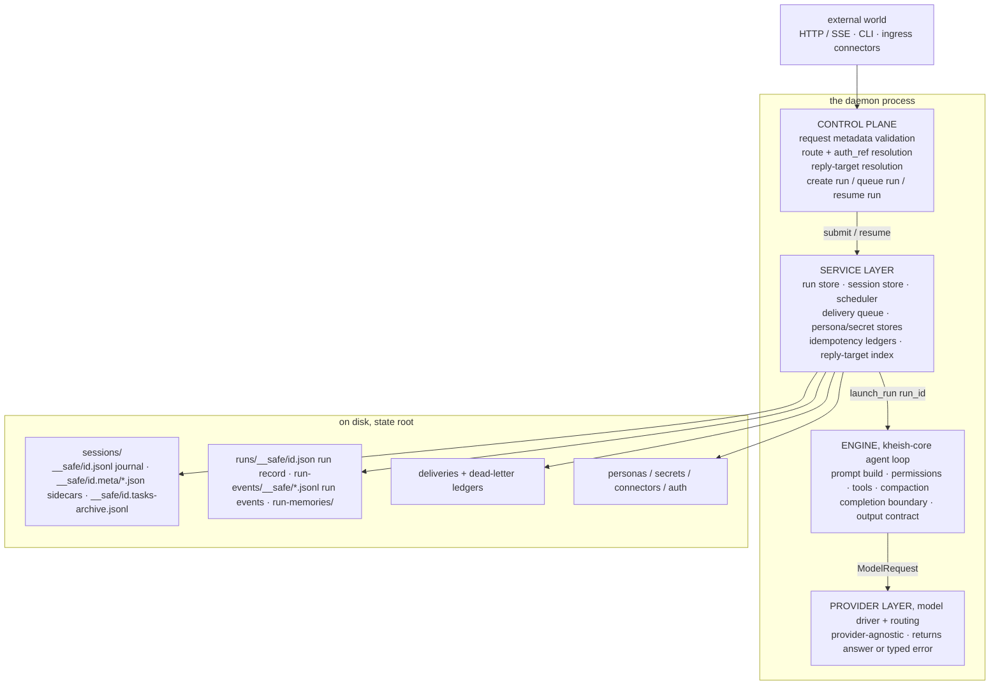
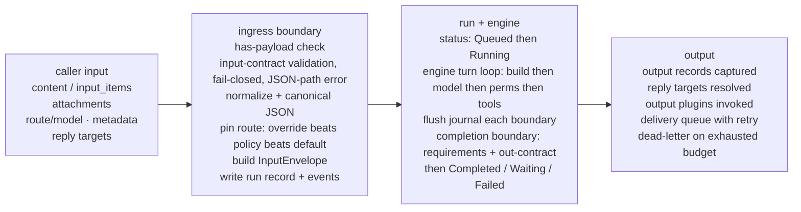
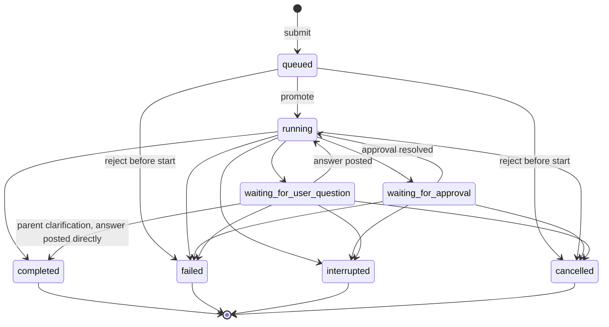
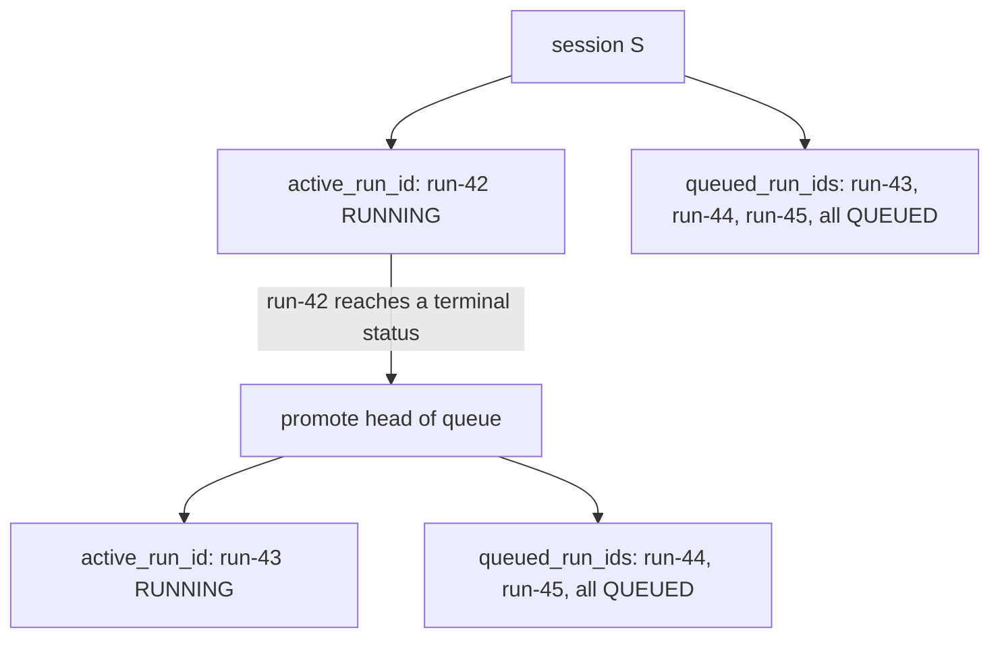
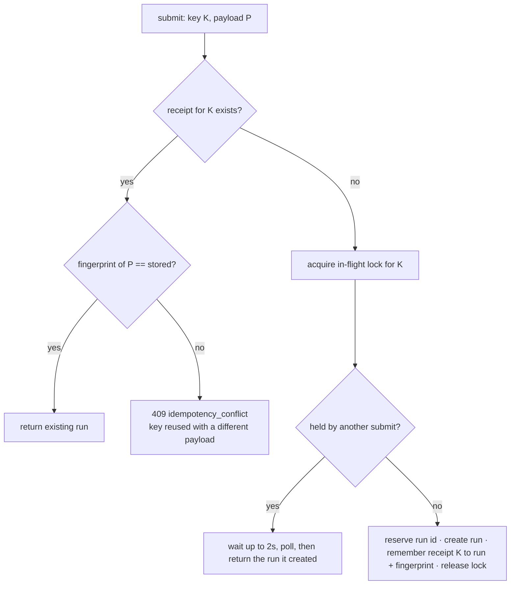
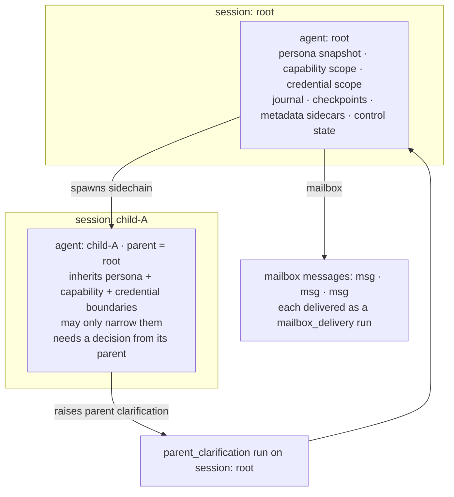
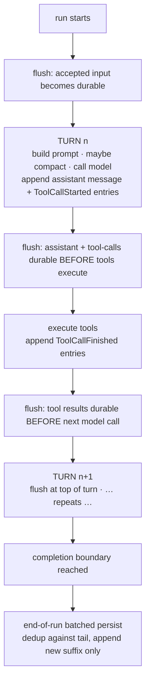
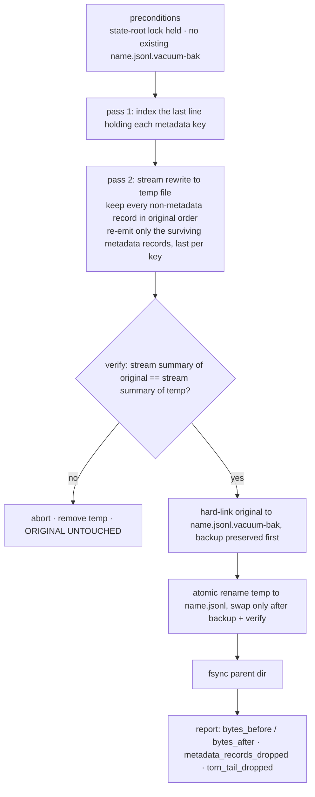

# Architecture and the run state machine

Kheish is a long-lived daemon, not a request/response wrapper around a model. That single design choice explains almost everything else in this page. A wrapper can afford to forget: it takes a prompt, streams an answer, and lets the caller keep the conversation in memory. A daemon that runs autonomous work for hours, pauses for a human decision, gets restarted for a deploy, and then has to pick up exactly where it left off cannot forget anything that matters. So the architecture is organized around one question asked over and over: *if the process died right now, what would we need on disk to continue correctly?*

This page walks through the layers of the daemon, follows a request from the moment it arrives to the moment its answer is delivered, and then documents the **run state machine** in full — every status, every legal transition, and the honest edge cases where the transitions are not symmetric. It closes with the durability machinery: the append-only journal, the per-key metadata sidecars, turn-boundary flushing, offline vacuuming, and the restart-recovery path that reassembles a running daemon from files.

If you only read one section, read [The run state machine](#the-run-state-machine). It is the contract that every client, connector, and operator tool ultimately depends on.

For the neighboring concepts this page keeps pointing at, see [Sessions, runs, and structured contracts](./sessions-and-runs), [Recovered run memory](./memory), [Agents, personas, and skills](./agents-personas-skills), [Schedules and automation](../automation/schedules), and [Security and operations](../operations/security). If you have never run the daemon, start with the [Quickstart](../welcome/quickstart) and come back — this page assumes you have at least submitted one input and watched it complete.

## Why a daemon, and why layers

A model call is stateless. Everything interesting about Kheish is the state *around* the call: the conversation so far, the permissions in force, the tools that are visible, the approvals still pending, the schedules waiting to fire, the outbound messages that have not yet reached their destination. The daemon owns all of that. It is the single source of truth for sessions, runs, approvals, route inventory, secret-slot bindings, and integration state. When you debug behavior, you prefer the daemon's CLI and HTTP API over poking at state files, because the daemon is the thing that knows how the files fit together.

The daemon is split into layers so that each layer can be reasoned about — and fail — independently:

- The **control plane** accepts input over HTTP/SSE, the CLI, and daemon-managed ingress connectors. It validates request metadata, resolves the route and `auth_ref`, resolves reply targets, and either creates a run or queues it.
- The **service layer** owns the durable stores and the coordination logic: the run store, the session store, the persona and secret stores, the delivery queue, the scheduler. Services are where "create a run" becomes "reserve a queue slot, write a run record, append an event, maybe promote the next queued run."
- The **engine** (the `kheish-core` agent loop) executes one run against one session's state. It builds the prompt, calls the model, evaluates permissions, runs tools, compacts context when it grows too large, and decides when a run is complete, waiting, or failed.
- The **provider layer** is the model driver and provider routing. It is deliberately thin and provider-agnostic: the engine hands it a request and gets back an answer or a typed error. Nothing above the provider layer should care which model family answered.

The layering is not just tidiness. It is what lets the daemon restart: the control plane and engine are reconstructed in memory from what the service layer persisted, and the provider layer is re-resolved against the current secret store so rotated credentials take effect without touching run payloads.



Read the boxes top to bottom for a request and bottom to top for durability: the service layer is the only layer that touches disk, and every other layer is either upstream of it (control plane) or downstream of it (engine, providers) but reconstructed *from* it after a restart.

## From input to delivery: the request pipeline

Before the state machine makes sense, it helps to see the whole path an ordinary input takes. Here is the lifecycle of a direct text submission, end to end.

1. An input arrives — through the HTTP API, the CLI, or an ingress connector. It carries content (plain text, attachments, or ordered multimodal `input_items`), optional route/model selection, optional metadata, and optional reply targets.
2. The control plane resolves the **agent** for the session, checks the request actually carries a payload, validates it, and normalizes it. If the session has a **structured input contract**, the payload is validated against the schema *here*, before anything else happens, and rejected outright if it does not conform (see [structured contracts](./sessions-and-runs)).
3. Route and model are **pinned** to the run at creation time. Effective precedence is: explicit run override, then the session's persisted route policy, then the daemon default. Once pinned, the run does not drift if the daemon defaults change later.
4. The input is turned into an **envelope** — a normalized record with stable asset references instead of caller-local file paths — and a run record is written with status `Queued`. An `Accepted` event and a `Queued` event are appended to the run's event log.
5. If the session has no active run, the queued run is **promoted** to `Running` and the engine is launched against the session's restored state. If a run is already active, the new run waits its turn: one run per session executes at a time.
6. The engine loops: build prompt → call model → evaluate permissions → execute tools → repeat, flushing journal entries to disk at each turn boundary. It exits when it produces a final answer (`Completed`), needs a human decision (`WaitingForApproval` / `WaitingForUserQuestion`), or hits an unrecoverable error (`Failed`).
7. On completion the daemon captures output records locally, then routes them through reply targets and output plugins. Outbound messages that must reach an external system go through the **delivery queue**, which retries and, if it exhausts its budget, **dead-letters** them for an operator to replay.



Where each stage fails or pauses:

- Rejected at the ingress boundary never creates a run.
- The run suspends at the engine for approvals or questions.
- Canonical JSON is delivered to webhooks (see below).

The important property of this pipeline is where it *fails closed*. A payload that violates the input contract is rejected at the ingress boundary and **no run is ever created** — you cannot end up with a half-formed run whose input was invalid. A final answer that violates the output contract does not get delivered as-is; the engine repairs it or fails the run. Delivery that cannot reach its destination is retried and then parked in a dead-letter ledger, never silently dropped. Each of these is a deliberate seam so that a problem shows up as an explicit, inspectable state rather than as a lost message.

## The run state machine

A **run** is one concrete execution request associated with a session. Sessions are durable conversation and control contexts that accumulate many runs over their lifetime; a run is the unit of work with its own lifecycle. The separation is what lets a caller submit work asynchronously, walk away, and inspect the result later — the run's status is the source of truth, not whatever the client happened to remember.

Every run has exactly one status at any moment, drawn from eight values. Four are **live** (the run still has background work pending) and four are **terminal** (the run is finished and will never move again).

| Status | Live/terminal | Meaning |
| --- | --- | --- |
| `queued` | live | Accepted and waiting behind another active run in the same session. |
| `running` | live | Actively executing in the session actor: prompting, calling tools, compacting. |
| `waiting_for_approval` | live | Paused until one or more tool calls are approved or denied under the active permission policy. |
| `waiting_for_user_question` | live | Paused until one or more structured user questions are answered (or declined). |
| `completed` | terminal | Produced a final assistant answer that satisfied every completion requirement and any output contract. |
| `failed` | terminal | Hit an unrecoverable error. The `error` field carries the reason. |
| `interrupted` | terminal | Was interrupted while active (for example, a shutdown or explicit interrupt caught it mid-flight). |
| `cancelled` | terminal | Was cancelled before it could complete. |

The transitions between these statuses are **explicitly enumerated** in the daemon, not implied. A run may always "transition" to its own status (an idempotent no-op), and beyond that only the following moves are legal:



The diagram is the exhaustive set of legal transitions; terminal states absorb (no outgoing edges). A run may also always "transition" to its own status as an idempotent no-op. Written out:

- `queued` → `running`, `failed`, `cancelled`
- `running` → `waiting_for_approval`, `waiting_for_user_question`, `completed`, `failed`, `interrupted`, `cancelled`
- `waiting_for_approval` → `running`, `failed`, `interrupted`, `cancelled`
- `waiting_for_user_question` → `running`, `completed`, `failed`, `interrupted`, `cancelled`
- `completed` / `failed` / `interrupted` / `cancelled` → terminal, nothing

Three details in that table are easy to miss and worth calling out, because they are where clients tend to make wrong assumptions.

**`queued` never jumps to a waiting state.** A run that has not started cannot be "waiting for approval." It can only start (`running`), or be rejected before it starts (`failed` / `cancelled`). Approvals and questions are things a *running* engine discovers, so a run must be `running` first. If you see a queued run and want to know whether it will need approval, the honest answer is: you cannot know until it runs.

**`waiting_for_approval` cannot go straight to `completed`.** An approval resolution puts the run back to `running`; the engine then resumes the suspended tool batch and keeps going. It might complete on that next turn, but the status path is `waiting_for_approval → running → completed`, never a direct jump. This matters if you are polling: after you resolve an approval, expect to see `running` before `completed`.

**`waiting_for_user_question` *can* go straight to `completed`.** This is the asymmetry. Most user-question resumes also go through `running`, but one kind of run — a **parent clarification**, where a child agent escalates a question to its parent — is *completed directly* by posting the answer, without a fresh engine turn on the waiting run itself. So the state machine allows `waiting_for_user_question → completed` even though the approval path does not have the mirror-image edge. If you are writing a generic client, do not assume the two waiting states behave identically.

### What backs a transition

Each transition is recorded as a durable **run event** in the run's append-only event log, separate from the run record itself. The event kinds are: `Accepted`, `Queued{position}`, `Started`, `WaitingForApproval{request_ids, requests}`, `ApprovalResolved{resolutions}`, `WaitingForUserQuestion{request_ids, requests}`, `UserQuestionResolved{resolution}`, `ParentClarificationResolved{…}`, `Output{output}`, `Completed`, `Failed{error}`, `Interrupted`, and `Cancelled`. The run record holds the *current* view (status, timestamps, pending approvals/questions, outputs, deliveries, error); the event log holds the *history*. Together they mean that after a restart the daemon can both know where a run is and reconstruct how it got there — which is exactly what the recovery path needs when it backfills, for example, the approval payloads for a run that was waiting when the process died.

### One active run per session

Runs belong to sessions, and a session executes **one run at a time**. The daemon keeps a per-session queue: an `active_run_id` (the single run currently `running` or waiting) plus an ordered list of `queued_run_ids`. When the active run reaches a terminal status, the next queued run is promoted.

This is not an arbitrary bottleneck; it is what keeps a session's conversation coherent. Two runs mutating the same journal concurrently would race on offsets, compaction, and control state. Serializing them means each run sees a consistent snapshot of the session and appends to it cleanly. If you need parallelism, you use multiple sessions (or sidechains, which are their own agents with their own sessions) — not multiple concurrent runs on one session.

The queue is itself rebuilt from persisted runs on restart. The rebuild is deterministic: for each session it scans the persisted run records, treats the first `running`/`waiting_for_approval`/`waiting_for_user_question` run it finds (ordered by persisted queue position, then submission time, then run id) as the active one, and pushes the rest into the queue in the same stable order. Persisted queue positions win over submission timestamps, so a queue order established before a crash survives it.



### Run kinds

The status answers *where a run is*; the **kind** answers *what a run is*. The daemon distinguishes several kinds, because they are created from different sources and some carry replay-specific payloads:

- `input` — an ordinary user or API input submitted to a session.
- `goal_continuation` — a daemon-owned continuation submitted to advance a long-running session goal when the session goes idle.
- `scheduled_input` — a scheduler-owned input dispatched at a later time (see [Schedules](../automation/schedules)).
- `observation_materialization` and `scheduled_observation_materialization` — a captured observation turned into a session run, immediately or on a schedule.
- `mailbox_delivery` — a batch of agent mailbox messages delivered to an agent in the background.
- `channel_delivery` — one public channel turn delivered to one session-backed member.
- `parent_clarification` — a child agent's question surfaced to its parent's session as a run.
- `approval_resume` and `user_question_resume` — a suspended run resumed after a human decision, replayable from a stored request payload.

Every kind is still "just a run": it has the same eight statuses and the same transition rules. The kind only changes *how the run was created* and *what payload the daemon stores so it can replay the request idempotently*. That uniformity is deliberate — a channel post, a scheduled job, a mailbox delivery, and a plain chat turn all reduce to the same lifecycle, so the tooling that inspects runs works the same way for all of them.

### Idempotency: submitting the same work twice

Networks retry. A connector redelivers. A client loses a response and re-sends. If "submit input" were not idempotent, every retry would spawn a duplicate run. So the daemon offers idempotency keys on the operations where duplication is most likely: input submission, approval resolution, and user-question resolution.

The mechanism is careful about a subtle failure: a retry that reuses a key but *changes the payload* is not the same request and must not be silently coalesced. So the daemon stores, per key, both a hash of the key and a **request fingerprint** — a versioned SHA-256 over the behaviorally relevant parts of the request. On a repeat:

- If a run already exists for this key and the fingerprint matches, the existing run is returned. No new run.
- If a submission for this key is currently in flight, the caller briefly waits (polling for up to two seconds) for it to land, then returns that run.
- If the key was reused with a *different* fingerprint, the daemon rejects the request with an idempotency conflict rather than guessing which payload the caller meant.



The same receipt-and-fingerprint pattern guards approval and question resolutions, so re-posting the same approval (because the first response was lost) resolves the run once and then returns the already-resolved run instead of erroring or double-resuming.

## Approvals and structured questions: pausing without losing your place

The two waiting statuses exist because sometimes a run should not proceed on its own. Either a tool call is risky enough that a human should review it, or the model genuinely needs a choice it should not invent. In both cases the run **suspends with enough state on disk to resume exactly where it stopped** — not restart from the top.

An **approval** is triggered when a tool call requires human review under the active permission policy. The run moves `running → waiting_for_approval`, and the pending approval — the tool call, its justification context, and a request id — is recorded on the run record and in a `WaitingForApproval` event. Resolving it (allow or deny, optionally with justification) transitions the run back to `running` via `resume_waiting_run`, which replays the suspended tool batch with the decisions applied. The engine picks up mid-batch; the model never re-derives the tool call.

A **structured user question** is used when the model needs explicit input rather than a guess: a multiple-choice answer, a constrained value, or an optional decline. The run moves `running → waiting_for_user_question`. This is deliberately *not* a normal chat turn — the daemon knows the run is blocked on an explicit input contract, so it can surface the exact blocking reason through the API and CLI, and another client (or the daemon after a restart) can answer it later.

### Atomic multi-question resolution

A single question *request* can contain several questions at once, and they are answered **together, atomically**. The pending request carries a list of questions and a stable `request_id`; the resolution carries the full set of `answers` (or a single `declined` flag for the whole request) keyed to that `request_id`. You do not answer question 2 of 3 and leave the run half-resolved. Either the resolution matches the pending request and resolves all of it, or it is rejected. This keeps the model's view consistent: it asked for N things in one breath and gets N answers (or a decline) in one breath, and the run resumes once.

Resolutions are matched by `request_id` against the run's pending questions. If the id does not match any pending request, the resolution is refused with a conflict rather than applied to the wrong question. And because the same idempotency machinery wraps question resolution, re-posting the same answer resolves once and returns the already-resolved run.

### Questions that expire

A structured question can carry an expiry. A background worker wakes on a short interval (and whenever a new pending question is registered), finds questions whose deadline has passed, and expires them. What "expire" means depends on the run kind: an ordinary waiting run is cancelled with an explanatory error; a parent-clarification run is *completed* by recording a declined resolution and notifying the child that its question timed out. Either way the run leaves the waiting state on its own, so a session is never wedged forever behind a question nobody answered. Read [Approvals and structured questions](../automation/tools-and-mcp) for the request/resolution shapes and the CLI surface.

## Sessions and agents: the topology a run executes inside

A run does not execute in a vacuum; it executes as an **agent** inside a **session**. The daemon restores, on startup, a root session and its agent mapping, and from there a tree of agents can grow. Understanding this topology explains where clarifications go, what a sidechain inherits, and why mailbox deliveries are their own run kind.

- Each **session** is a durable conversation and control context with its own journal, checkpoints, metadata sidecars, and control state.
- Each session maps to a primary **agent**. An agent has a conversation (which carries its `session_id`), an optional **parent** agent, and optional fork context (a pinned provider/generation captured when it was forked).
- **Sidechains** are child agents spawned to do delegated work. A sidechain inherits the parent's current persona snapshot and both the effective capability boundary and the effective credential boundary, then may narrow them further — never widen them.
- Agents have **mailboxes**. Messages posted to an agent are delivered in the background as `mailbox_delivery` runs, with per-agent slotting so one delivery is in flight at a time and expired messages are dead-lettered rather than delivered stale.
- A child that needs a decision from its parent raises a **parent clarification**, which the daemon materializes as a `parent_clarification` run on the *parent's* session. That is why questions can appear on a session that never "asked" anything directly — a descendant asked, and the daemon routed it up the tree.



The topology is persisted, not held only in memory. After a restart the daemon rebuilds the agent mapping, re-queues claimed work that still needs attention, and keeps existing persona bindings valid because the authoritative binding lives in session metadata rather than only in a compact in-memory index. For the full model of agents, personas, capability scopes, and how sidechains inherit them, see [Agents, personas, and skills](./agents-personas-skills).

## Durability: the append-only journal and its sidecars

Now the part that makes all of the above survive a crash. Session state is persisted as **append-only JSONL** — one record per line, only ever appended, never rewritten in place during normal operation. The journal stores the conversation events, the compaction checkpoints, the permission audit records, and the output records for a session. Each line is a versioned envelope (currently schema version 2) wrapping one record.

The conversation itself is a stream of **session events**, each carrying a monotonic offset and a timestamp. The event kinds are: `InputReceived` (an input envelope), `MessageAppended` (an assistant or user message), `ToolCallStarted`, `ToolCallFinished`, `UserQuestionRequested`, `UserQuestionResolved`, and `CompactionBoundary`. Replaying these offsets in order reconstructs the canonical conversation — which is precisely what the engine does on restore.

Append-only is wonderful for events and terrible for *last-wins* state. Session metadata — the control state, the route policy, the persona binding, the capability and credential scopes, the reply-target defaults, the structured contracts — is inherently "the latest value of key K wins." If that lived in the journal, every update would append a fresh copy and the file would grow without bound; a session driven by frequent control-state updates could reach gigabytes of superseded snapshots. So metadata does **not** go in the journal. Each key is written to its own **sidecar file** at `sessions/__safe/<name>.meta/<key>.json`, replaced atomically on every write.

```text
   ONE SESSION ON DISK

   sessions/__safe/
     <name>.jsonl                 ← append-only journal (events, checkpoints, audits, outputs)
     <name>.meta/                 ← per-key metadata sidecars (last-wins, atomically replaced)
        session_control_state.json
        session_route_policy.json
        session_persona_binding.json
        session_capability_scope.json
        session_credential_scope.json
        session_reply_targets.json
        session_input_contract.json
        session_output_contract.json
        ...
     <name>.tasks-archive.jsonl   ← terminal/deleted tasks lifted out of hot control state
```

This split has several consequences that are worth internalizing:

- **A metadata write is O(value), not O(journal).** Rewriting one key rewrites one small file; it never grows the transcript. Reads of a single key are O(1): open the sidecar.
- **Sidecars win over inline journal metadata.** Older builds wrote metadata inline in the journal. Those records are still read on load, but if a sidecar exists for the same key, the sidecar value takes precedence. This is how the format migrated without a flag day.
- **A metadata-first session is still visible.** A session can be configured (persona bound, contract set) before it ever runs. The journal file is created empty so the session lists, and the sidecars carry the state. Even if the empty journal is later removed, the sidecars keep the session visible.
- **Absent keys are cheap to prove absent.** When a lookup finds no sidecar and has to fall back to scanning a legacy journal, and the scan reaches the file start without a hit, the daemon *remembers* that miss. A subsequent lookup of the same absent key answers in O(1) from the scan-miss cache instead of re-parsing a multi-megabyte journal every time. A later write to that key clears the remembered miss, so the cache can never mask a real value.
- **Terminal tasks leave the hot state.** Completed, failed, cancelled, or deleted tasks are appended once to a per-session `tasks-archive.jsonl` and removed from the live control-state snapshot, so the system prompt and control state stay bounded by the work actually in flight. Archived tasks remain visible through task views but are immutable; a deletion leaves a tombstone so a stale run snapshot cannot resurrect it.

### Torn-line tolerance: the one corruption an appender can cause

If the process dies mid-append, the last line of a JSONL file can be a partial, unparseable fragment. That is the *only* corruption a correct appender can produce — every earlier line was completely written before the next began. So the readers tolerate exactly one torn line, and only at the tail:

- On load, a JSON syntax error on the **last non-empty line** is skipped with a warning and treated as "the append that was in flight when we crashed."
- The same error on **any earlier line** is real corruption and fails the load loudly. A torn line is never valid JSON, so a well-formed line that fails the envelope or migration check is genuine corruption, not a tear, and stays fatal everywhere.
- The restore cursor stops at the last *intact* line. When a later append heals the tear (a correct append always starts on a fresh line, so it never glues onto the fragment), the healed record is picked up incrementally.

The task archive uses the same rule, and so does the offline vacuum. This is a small, boring guarantee that pays off exactly once per unlucky crash — which is when you most need it.

## Incremental journaling at turn boundaries

The engine does not wait until a run finishes to persist. That would mean a run interrupted after an hour of work leaves nothing on disk. Instead, in-flight journal entries stream to the session file at **turn boundaries**, so each turn's durable footprint is written before the next model call builds on it.

The engine flushes to its journal sink at three points inside every turn:

1. **At the top of the turn** — the accepted input (on the first turn) and the previous turn's tail become durable before more model work is built on them.
2. **After the assistant message and its `ToolCallStarted` entries** — before any tool executes, so a crash mid-tool leaves a record of exactly what was in flight.
3. **After tool results** — before the next model call consumes them.

The sink tracks how much of the journal it has already flushed and only sends the new suffix each time, so a flush costs one durable write proportional to what that turn produced, not the whole transcript. At the end of the run a batched persist re-sends the run's entries; that persist **dedups against what is already on disk** by matching the incoming batch's prefix against the file's tail, appending only the genuinely new suffix. Reading just the tail keeps the end-of-run persist O(batch) rather than O(transcript), and duplicate event offsets are skipped on load because offsets are unique and monotonic per session. The net effect: incremental flushes make the run durable as it goes, and the final batch reconciles without duplicating anything.



Each `flush` node is a durability boundary (marked ▣ in the original): three fire per turn, at the top of the turn, after the assistant message and its `ToolCallStarted` entries, and after tool results.

### Why a chat client should echo optimistically

Here is the practical consequence for anyone building an interactive client. Because journal entries flush at turn boundaries and the run's status is what the daemon persists, a client that renders a conversation should **echo the user's input optimistically** — show it in the UI the instant it is submitted — rather than waiting for the daemon to confirm the input landed in the journal.

Two reasons. First, the input *is* durable early (it flushes at the top of the first turn), so the optimistic echo is almost never wrong; if the submission is accepted, the input is on its way to disk. Second, and more importantly, the run is asynchronous by design: it may queue behind another run, it may take minutes, it may suspend for approval. A client that blocks its UI until the journal confirms the input feels broken during exactly the cases the daemon is built for. Echo the input immediately, then subscribe to the run's status and outputs (over SSE or by polling the run) and reconcile — replacing the optimistic echo with the authoritative record when it arrives. If the submission is *rejected* (an input-contract violation, say), you get an error synchronously and can retract the echo. This is the same reconciliation pattern the daemon itself uses internally between the incremental flush and the end-of-run persist, applied at the UI layer.

## Vacuuming a journal: reclaiming dead metadata safely

Sidecars solve metadata growth going forward, but a journal written by an older build — or one that accumulated inline metadata before sidecars existed — can still carry gigabytes of superseded snapshots. **Vacuuming** is the offline operation that reclaims that space. It rewrites the journal keeping every non-metadata record in order and only the *final* value of each metadata key, dropping the superseded copies.

Vacuum is offline on purpose. The caller owns exclusivity — the CLI acquires the daemon state-root lock — so the vacuum never runs concurrently with an appending daemon. Within that guarantee, the rewrite is built to be impossible to get wrong in a way that loses data. The safety contract has several layers:

- **A backup is preserved before the swap.** The original journal is hard-linked to `<name>.jsonl.vacuum-bak` before the rewritten file replaces it. The backup and the live file share their bytes on disk until one diverges, so preserving it is cheap.
- **The rewrite is verified against the original.** Before the atomic rename, the vacuum computes a streaming summary of both files — an order-sensitive digest over every non-metadata line plus the last parsed value of every metadata key — and refuses to swap unless they match exactly. If verification fails, the original is left untouched and the temp file is removed.
- **It refuses to clobber an existing backup.** If a `.vacuum-bak` already exists (a previous vacuum that was not cleaned up), the operation aborts rather than overwrite it. You remove the stale backup deliberately before vacuuming again.
- **It tolerates a torn tail and rejects mid-file corruption**, exactly like the online readers: a partial final line is dropped, but corruption before valid records aborts the vacuum with the file untouched.



The reason the ordering is *backup, then verify, then swap* — and not any other order — is that at no point should the live journal be the only copy of correct data. Before the swap, the original is intact and the temp file is a candidate. The swap only happens after the candidate has been proven equivalent and the original has been preserved under a second name. If the machine loses power in the middle, you either have the original (rename not yet done) or the original-as-backup plus the vacuumed file (rename done). There is no window where the only copy is a half-written file.

The daemon also warns, during normal operation, when a single metadata value grows past a megabyte — that is usually a sign that something is stuffing unbounded state into one key, and it is better to hear about it early than to discover it as a giant sidecar later.

## Restart recovery: rebuilding a running daemon from files

Put the pieces together and the restart story is: **the daemon reconstructs its live state from what the service layer persisted, then re-resolves anything credential-dependent against the current secret store.** Concretely, on startup it rebuilds:

- the root session and agent mapping, and the session/agent topology beneath it;
- each session's journal (replayed by offset), checkpoints, and metadata sidecars;
- persisted session persona bindings, capability scope overrides, credential scope overrides, and reply-target defaults;
- the per-session run queues (deterministically, honoring persisted queue positions);
- pending approvals and structured questions — including backfilling approval payloads for runs that were waiting when the process died, by reading the durable `WaitingForApproval` events;
- active inline skills and control state;
- the run scheduler and the delivery queue, including retrying and dead-lettered deliveries;
- daemon-managed runtime connectors, restored from their own store and re-resolved against the current secrets so rotated slots take effect.

Two design choices make this robust. First, **the authoritative copy always lives in durable state, not only in a compact in-memory index.** Persona bindings, reply-target defaults, and pending questions all have a durable home (session metadata, run records, run events); the compact indexes the daemon keeps for speed are *derived* and can be repaired from the durable copy when they drift. Second, **derived state is rebuilt, not trusted.** Recovered run memory, for example, is not stored in the journal at all; it is reconstructed from daemon-owned run-memory records and a per-session index (see [Recovered run memory](./memory)).

### State root discipline

Operationally, the **state root** matters as much as the daemon binary. A large fraction of "the daemon is behaving strangely" reports turn out to be state-root mixups: a daemon pointed at the wrong directory, schema drift between two binaries sharing a root, or stale sessions created by an older build. Treat the active state root as part of the deployment identity. When you migrate or back up a daemon, move the whole thing together — session journals *and* sidecars, run store, delivery and dead-letter ledgers, persona store, secret slots, connector store, auth/broker state — because they reference each other. Backing up the journals but not the sidecars, or the runs but not the delivery ledgers, gives you a state root that loads but has lost its edges.

## Failure modes and honest limits

No architecture is free. Here are the sharp edges, stated plainly.

**One active run per session is a real serialization point.** If you submit ten inputs to one session, they run one after another. That is correct for conversational coherence but it is not throughput. If you need to fan work out, use multiple sessions or sidechains. A common mistake is to treat one session as a work queue and then wonder why the tenth input took a long time to start — it was `queued` the whole while, exactly as designed.

**A crash during a run is recoverable, but "recoverable" is not "invisible."** A run that was `running` when the process died leaves durable journal entries up to its last turn boundary, and the daemon can see where it was. Whatever the model was doing between the last flush and the crash is gone — that is the granularity of the durability boundary. This is why the flush points are placed where they are (before tools execute, after results land): they bound the loss to at most the work inside one partial turn, not the whole run.

**Idempotency protects submission, not effects.** An idempotency key stops a *retried submission* from creating a second run. It does not un-ring a bell that already rang: if a run already sent an email through a tool, resubmitting the same input under the same key returns the existing run rather than re-sending — but a run that partially completed side effects before failing has still done those side effects. Design tools that must not double-fire to be idempotent themselves, or gate them behind approvals.

**Vacuum requires exclusivity.** It is not an online operation. You take the state-root lock, which means the daemon is not appending while you vacuum. Plan it as maintenance, not as something to run against a live, busy daemon.

**Waiting runs wait indefinitely unless something resolves or expires them.** An approval with no expiry and no one to resolve it keeps its run `waiting_for_approval` forever, holding the session's single active slot. Questions can carry expiries; approvals rely on an operator (or a hook) to act. If a session seems wedged, check whether its active run is waiting on a decision nobody is making — that is the most common "stuck" case, and it is a policy gap, not a bug.

## Frequently asked questions

**Is a `queued` run guaranteed to run?** It runs when it reaches the head of its session's queue and the active run finishes — unless it is cancelled first, or rejected at start (which moves it to `failed`/`cancelled`). It will not skip ahead of an earlier run in the same session.

**Can I cancel a run in any state?** You can cancel from `queued`, `running`, `waiting_for_approval`, or `waiting_for_user_question`. Terminal runs (`completed`, `failed`, `interrupted`, `cancelled`) are done and cannot be cancelled — there is nothing left to stop.

**What is the difference between `interrupted` and `cancelled`?** `cancelled` is a deliberate stop requested for that run. `interrupted` is a run that was caught mid-execution by something broader — a shutdown or an interrupt that stopped active work. Both are terminal; the distinction is provenance, which matters when you are auditing why a run ended.

**Why did a question appear on a session that never asked anything?** Because a descendant agent — a sidechain, or a child several levels down — raised a parent clarification, and the daemon materialized it as a `parent_clarification` run on the ancestor's session. The question is real; it just originated below.

**If I restart the daemon mid-run, what happens to that run?** Its durable journal up to the last turn boundary is intact, its run record and events are on disk, and the daemon rebuilds the session, the queue, and any pending approvals/questions. A run that was actively `running` at the crash resumes from its persisted state rather than replaying from the first token.

**Where does the model's provider get chosen?** At run creation, and it is pinned for the life of the run: explicit override beats the session route policy beats the daemon default. Changing the daemon default later does not move an already-created run. See [Sessions, runs, and structured contracts](./sessions-and-runs) for the routing precedence in detail.

**Should my client wait for the input to be persisted before showing it?** No. Echo it optimistically and reconcile against the run's authoritative status and outputs. The input is durable early, the run is asynchronous, and blocking the UI defeats the point of a daemon that does long, suspendable work.

## Where to go next

- [Sessions, runs, and structured contracts](./sessions-and-runs) — the input and output contract model, canonical JSON delivery, reply targets, and dead letters, in depth.
- [Recovered run memory](./memory) — how terminal runs seed a bounded, policy-controlled memory layer for later runs in the same session.
- [Agents, personas, and skills](./agents-personas-skills) — the agent tree, persona snapshots, and capability/credential scopes that a run executes inside.
- [Schedules and automation](../automation/schedules) — scheduled inputs and observation materializations as run kinds.
- [Security and operations](../operations/security) — the auth layer, secret slots, and the operational discipline around the state root.
- [Quickstart](../welcome/quickstart) — if you want to submit a run and watch these transitions happen before reading the theory again.

### Evidence note

- Code verified: `crates/kheish-daemon/src/runs.rs` (run kinds, statuses, the explicit transition matrix, the session-queue rebuild), `crates/kheish-daemon/src/state/run_workflow.rs` (submission paths, idempotency, approval/question resumes, expiration), `crates/kheish-session/src/store.rs` (journal, per-key sidecars, torn-line tolerance, scan-miss cache, incremental append/dedup), `crates/kheish-session/src/vacuum.rs` (backup/verify/swap safety contract), `crates/kheish-core/src/engine.rs` (turn-boundary flushing, completion boundary), and `crates/kheish-types/src/session.rs` (session events, checkpoints, run metadata snapshot).
- CLI/API verified: run statuses and transitions are observable through the run inspection surfaces; session storage sizes and vacuum are exposed through the sessions CLI.
- Daemon live tested for this note: no; the transition matrix, torn-tail tolerance, dedup, and vacuum safety are covered by deterministic unit and restart tests in the crates above.
- Provider-specific tested for this note: no; every architectural claim here is provider-neutral.
