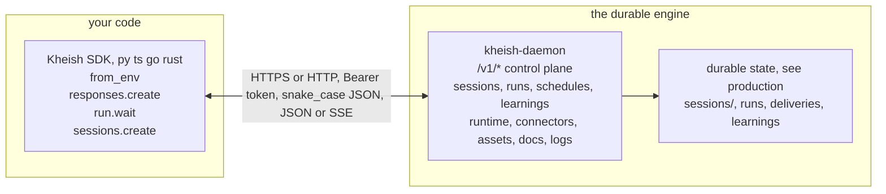
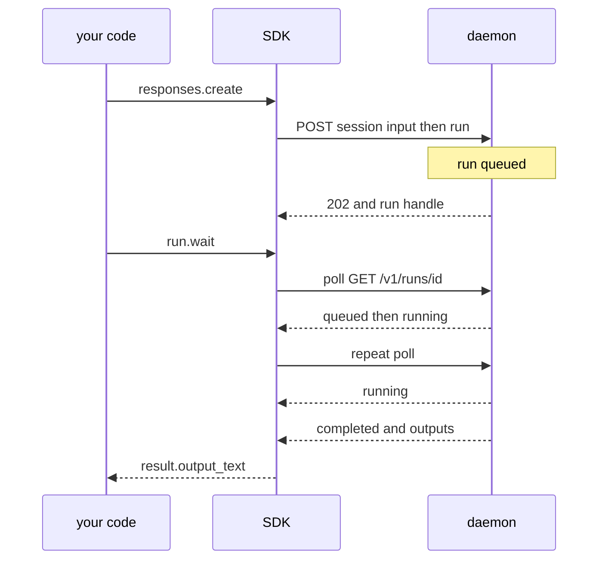
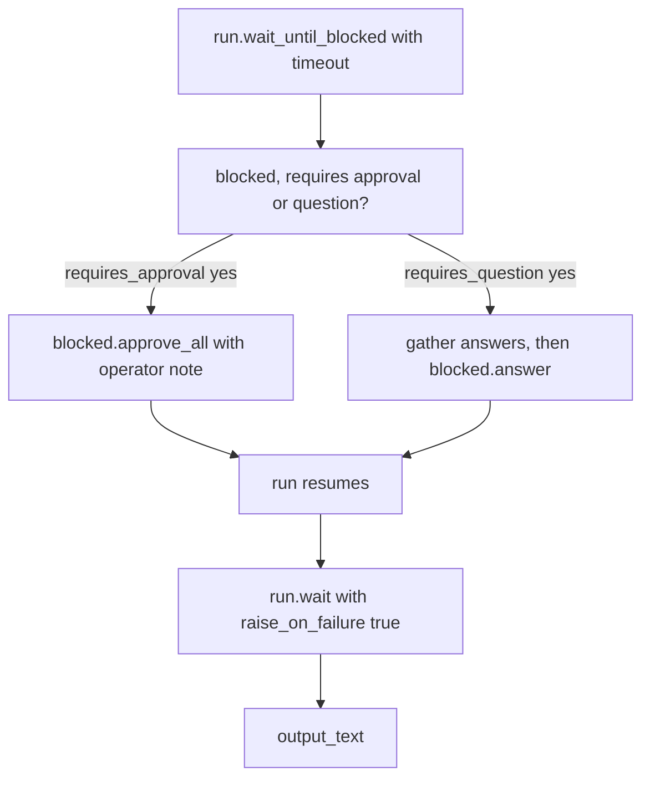
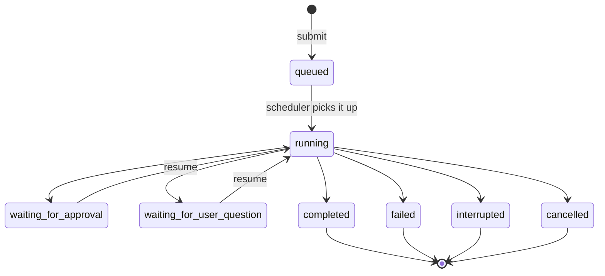
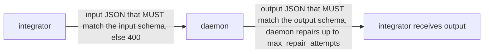
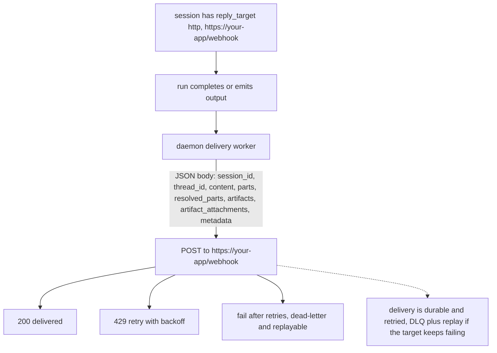
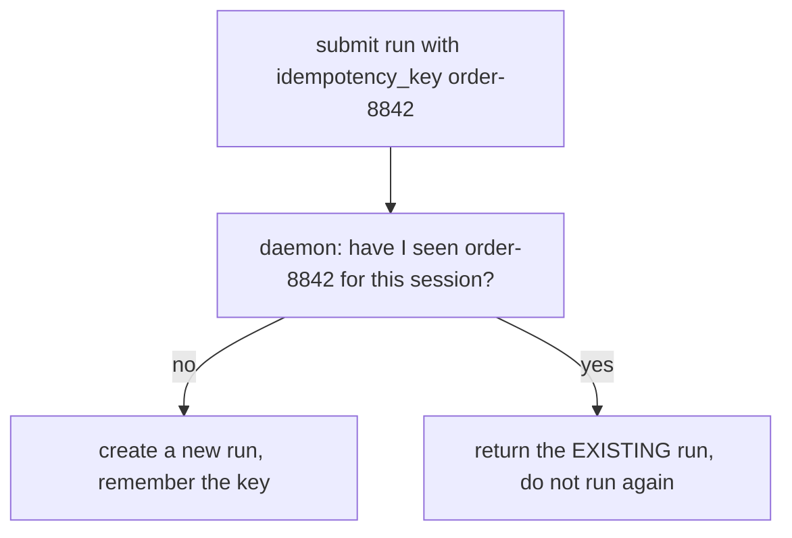
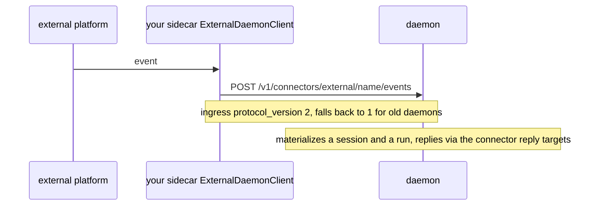
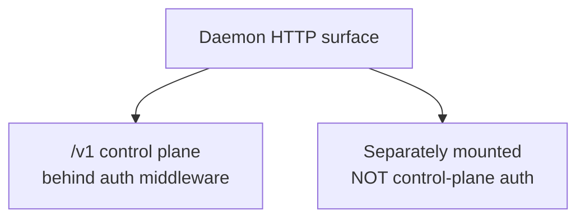
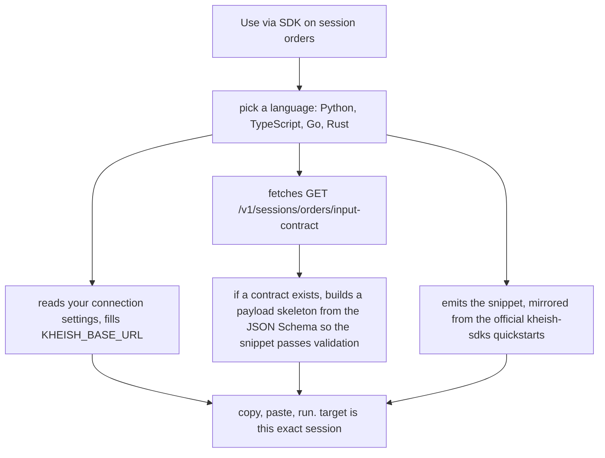

# SDKs and the control-plane API

This page is for people building **on top of** a Kheish daemon: application
backends, automation, internal tools, sidecars. If you run the daemon itself,
read [Running Kheish in production](../operations/production) — this page assumes
someone else owns the process and you have a base URL and (usually) a token.

The mental model is short and worth stating up front:

> The Kheish daemon is the durable orchestration engine. The SDKs are a thin
> integration layer over its HTTP control plane. Nothing an SDK does is magic —
> every call maps to a documented `/v1/...` endpoint, and everything an SDK
> "remembers" is actually durable state inside the daemon.

That has a practical consequence you will lean on constantly: **an SDK client is
disposable, a session is durable.** You can create a client in one process,
submit a run, lose the process, reconnect from a different process or a different
language entirely, and pick the same session and run back up by id. The daemon is
the source of truth; the SDK is a typed window onto it.



---

## Environment conventions

Every SDK reads the same two environment variables, and every SDK has a
`from_env` constructor that is the intended entrypoint:

- `KHEISH_BASE_URL` — the daemon control-plane URL. Defaults to
  `http://127.0.0.1:4000`.
- `KHEISH_TOKEN` — the bearer token. Optional: only needed when the daemon has
  control-plane auth enabled (which it should for anything non-loopback).

```bash
export KHEISH_BASE_URL="https://kheish.internal.example.com"
export KHEISH_TOKEN="…admin-or-readonly bearer token…"
```

The token you use decides what you can do. The daemon has an admin token and a
read-only token. Read-only can read `status` and inspect resources; it cannot
mutate. Sensitive read paths — raw asset bytes, run debug artifacts, brokered
runtime-auth subject/lease details — require the admin token when auth is
enabled. Give your integration the narrowest token that does its job.

There is no separate "API key" concept for the SDK: authentication to the daemon
is the bearer token; authentication *from* the daemon to model providers is
handled inside the daemon via `auth_ref` slots you never see over the wire.

A note on wire shape that saves debugging time: the daemon speaks **snake_case**
JSON, and the SDKs preserve it. The TypeScript SDK explicitly targets the
daemon's snake_case fields (`output_text`, `run_id`, `session_id`), so do not
expect camelCase in payloads even in the TS client.

---

## The four SDKs

All four wrap the same control plane. They differ in ergonomics, not in
capability, and each keeps a `raw`/`Raw()`/`RawClient` escape hatch for daemon
fields the typed surface has not wrapped yet. The quickstarts below are copied
faithfully from the official `kheish-sdks` READMEs.

### Python — `kheish-sdk`

The Python SDK exposes a resource-based client with both synchronous and
asynchronous variants. The high-level path is `client.responses.create(...)`.

```bash
pip install kheish-sdk
```

```python
from kheish import Kheish, Route

with Kheish.from_env() as client:
    run = client.responses.create(
        session="demo",
        prompt="Reply with one sentence about why typed SDKs help integrators.",
        route=Route.openai("gpt-5.4"),
    )
    result = run.wait(raise_on_failure=True)
    print(result.output_text)
```

The main resources on the Python client, so you know what is available without
dropping to `raw`:

- `client.responses` — high-level prompt/files/assets/boards facade
- `client.sessions` — durable session lifecycle, persona defaults, route policy,
  reply targets
- `client.runs` — run inspection, debug bundles, cancellation
- `client.approvals` and `client.questions` — the explicit human-loop control
  plane
- `client.tasks` — daemon task inspection and stop controls
- `client.assets` — upload, download, save
- `client.personas` — create, update, inspect
- `client.schedules` — create, trigger, pause, resume, cancel
- `client.agents` and `client.mailboxes` — sidechains, mailbox posting, nickname
  management
- `client.runtime`, `client.secrets`, `client.auth_accounts`, `client.connectors`
  — runtime admin
- `client.playbooks` and `client.flows` — playbook lifecycle and flow execution
- `client.learning` and `client.capture` — daemon learning state and capture
  provisioning
- `client.channels`, `client.projects`, `client.boards` — collaborative
  control-plane resources
- `client.observations` and `client.derivations` — durable input pipelines
- `client.events` and `client.raw` — global event stream and escape hatch
- `ExternalDaemonClient` — for Python sidecars using the external connector
  ingress contract

The package ships only the canonical resource-based API; legacy modules such as
`kheish.models` and `kheish.params` are no longer shipped.

### TypeScript — `@kheish/sdk`

A thin SDK for both browser and server runtimes, targeting Node 20+ and ESM.

```bash
npm install @kheish/sdk
```

```ts
import { Kheish, Route } from "@kheish/sdk";

const client = Kheish.fromEnv();

const run = await client.responses.create({
  session: "demo",
  prompt: "Reply with one sentence about typed SDKs.",
  route: Route.openai("gpt-5.4")
});

const result = await run.wait({ raiseOnFailure: true });
console.log(result.output_text);
```

The shape mirrors Python: `responses.create(...)` returns a run handle,
`run.wait({ raiseOnFailure: true })` blocks until terminal and returns a result
whose `output_text` is the assistant's text. Because it runs in browsers too, it
respects the daemon's loopback-only CORS policy — if you call the daemon directly
from a browser, the browser origin must be an exact loopback origin the daemon
accepts (for example `http://localhost:5173`), otherwise serve the UI
same-origin behind your gateway.

### Go

Idiomatic Go: every method takes a `context.Context`, common requests use small
fluent builders, and `Raw()` remains the escape hatch.

```bash
go get github.com/kheish/kheish-sdks/go
```

```go
package main

import (
	"context"
	"fmt"

	kheish "github.com/kheish/kheish-sdks/go"
)

func main() {
	client := kheish.NewFromEnv()
	health, err := client.Healthz(context.Background())
	if err != nil {
		panic(err)
	}
	fmt.Println(health)

	session, err := client.Sessions().Create(
		context.Background(),
		kheish.NewSession("demo").
			ThreadID("demo").
			Capability(kheish.NewCapabilityScope().AllowSkill("documents")).
			Credential(kheish.NewCredentialScope().AllowRoute("openai")),
	)
	if err != nil {
		panic(err)
	}
	fmt.Println(session)

	run, err := client.Sessions().SubmitRun(
		context.Background(),
		"demo",
		kheish.NewRunInput("Hello from Go.").
			Idempotency("demo-1").
			Route("openai").
			Source("sdk", "go", "readme").
			AddInputItem(kheish.TextInput("Keep the answer concise.")).
			WithGeneration(kheish.NewGeneration().WithModel("gpt-5.4").TemperatureValue(0.2)),
	)
	if err != nil {
		panic(err)
	}
	fmt.Println(run)
}
```

Environment variables: `KHEISH_BASE_URL` (default `http://127.0.0.1:4000`) and
`KHEISH_TOKEN` (optional bearer token). Note the `Idempotency(...)` builder — Go
and Rust favour the explicit session-first submit path with idempotency keys,
which is exactly what you want in a service that might retry.

### Rust

Async by default (`tokio`), with an optional `blocking` feature for synchronous
code.

```toml
[dependencies]
kheish = { path = "../rust" }
tokio = { version = "1", features = ["macros", "rt-multi-thread"] }
```

```rust
use kheish::{
    CapabilityScope, Client, CreateSessionRequest, CredentialScope, GenerationConfig,
    SubmitInputItem, SubmitRunRequest,
};

#[tokio::main]
async fn main() -> kheish::Result<()> {
    let client = Client::from_env();
    let health = client.healthz().await?;
    println!("{health}");

    let session = client
        .sessions()
        .create(
            CreateSessionRequest::new("demo")
                .thread_id("demo")
                .capability_scope(CapabilityScope::new().allow_skill("documents"))
                .credential_scope(CredentialScope::new().allow_route("openai")),
        )
        .await?;
    println!("session: {session}");

    let run = client
        .sessions()
        .submit_run(
            "demo",
            SubmitRunRequest::new("Hello from Rust.")
                .idempotency_key("demo-1")
                .route("openai")
                .source("sdk", "rust", "readme")
                .input_item(SubmitInputItem::text("Keep the answer concise."))
                .generation(GenerationConfig::new().model("gpt-5.4").temperature(0.2)),
        )
        .await?;
    println!("run: {run}");
    Ok(())
}
```

For synchronous code, enable `blocking`:

```toml
kheish = { path = "../rust", features = ["blocking"] }
```

```rust
fn main() -> kheish::Result<()> {
    let client = kheish::blocking::Client::from_env();
    println!("{}", client.healthz()?);
    println!("{}", client.sessions().create(kheish::CreateSessionRequest::new("demo"))?);
    Ok(())
}
```

Most common request payloads have small builders. `RawClient` and
`serde_json::Value` remain available for new daemon fields.

### Choosing an SDK

| If you are… | Reach for | Because |
| --- | --- | --- |
| Writing a Python service, notebook, or automation | Python | sync + async clients, the widest resource surface, `responses.create` facade |
| Building a browser UI or a Node backend | TypeScript | ESM, runs in browsers (respecting loopback CORS), same snake_case wire |
| Writing a Go service that retries | Go | context-first, fluent builders, explicit idempotency keys |
| Embedding in a Rust app or another daemon-adjacent tool | Rust | async by default, optional blocking, typed builders |
| Bridging an external connector sidecar | Python `ExternalDaemonClient` | implements the external connector ingress contract directly |

Whatever you pick, the daemon-side behaviour is identical. Pick the language your
service already lives in.

---

## The fire-and-wait pattern

The most common integration is "send one prompt, wait for one answer." That is
what `responses.create(...)` plus `run.wait(...)` is for. Under the hood,
`responses.create` submits input to a session and hands you a run handle; `wait`
polls (or streams) the run until it reaches a terminal status and then returns
the result.



Python:

```python
from kheish import Kheish, Route

with Kheish.from_env() as client:
    run = client.responses.create(
        session="demo",
        prompt="Reply with one sentence about why typed SDKs help integrators.",
        route=Route.openai("gpt-5.4"),
    )
    result = run.wait(raise_on_failure=True)
    print(result.output_text)
```

`raise_on_failure=True` (or `{ raiseOnFailure: true }` in TS) turns a `failed`
run into an exception instead of a result you have to inspect. Use it when a
failed run should abort your code path; omit it when you want to branch on the
outcome yourself.

Two things every fire-and-wait integration should set:

- **A route** — `Route.openai("gpt-5.4")` etc. If you omit it you get the
  daemon's default route, which is fine for demos but surprising in production
  when an operator changes the daemon default.
- **An idempotency key**, especially in a service that retries. The Go/Rust
  submit path takes one directly (`Idempotency("…")` / `.idempotency_key("…")`);
  the daemon uses it to collapse duplicate submissions instead of running twice.

---

## The session-first pattern

Fire-and-wait implicitly uses a session (the `session="demo"` argument). When you
want durable identity, a persona, a route policy, and reply-target defaults that
persist across many runs, create the session explicitly first, then submit runs
against it.

```python
from kheish import Kheish, ReplyTarget, Route

with Kheish.from_env() as client:
    persona = client.personas.create(
        {
            "display_name": "Support FR",
            "soul": "Reply in French, keep answers concise, and be operational.",
        }
    )
    session = client.sessions.create(
        "support-ticket-42",
        persona=persona.persona_id,
        route=Route.openai("gpt-5.4"),
        reply_targets=[ReplyTarget.raw("sdk", "stdout")],
    )
    run = session.responses.create(
        prompt="Réponds au ticket en 3 phrases maximum."
    )
    print(run.wait(raise_on_failure=True).output_text)
```

Why this matters:

- **Personas are snapshotted at bind time.** The session captures the persona as
  it was when bound. Updating the persona record later does **not** retroactively
  change an already-bound session. This is deliberate — it keeps a long-running
  session stable — but it means "I updated the persona and nothing changed" is
  expected, not a bug. Rebinding a persona is a session mutation and only allowed
  while the session is idle (a rebind on a busy session returns `409`).
- **Route policy persists.** The session's route becomes the default for its
  runs, so you set it once instead of on every call.
- **Reply targets persist.** Set the session's reply-target defaults once and
  every run's output routes there (see [webhooks](#webhooks-as-reply-targets)).
  Reply-target edits are prospective — a run snapshots its reply targets at
  submission, so changing the session default does not re-route an in-flight run.
- **Capability and credential scopes** live on the session. The Go/Rust
  quickstarts show `AllowSkill(...)` / `allow_route(...)` — these narrow what the
  session's runs can reach, fail-closed.

Session identity is durable and cross-language. A Python service can create the
session; a Go worker can submit runs to it by id later. That is the whole point
of separating the disposable client from the durable session.

---

## Human in the loop

Agent runs can pause to ask the operator a structured question or to request
approval before a risky action. An integration that ignores these will see runs
that "hang" — they are not hung, they are **waiting for you**. The SDKs expose an
explicit human-loop control plane so you can detect the wait, resolve it, and let
the run continue.



```python
from kheish import Kheish

with Kheish.from_env() as client:
    run = client.responses.create(
        session="ops-demo",
        prompt="Ask questions if context is missing, and request approval before risky actions.",
    )
    blocked = run.wait_until_blocked(timeout=120)

    if blocked.requires_approval:
        blocked.approve_all("approved by operator")

    if blocked.requires_question:
        answers = {}
        for question in blocked.get().pending_questions[0].questions:
            if question.options:
                answers[question.id] = [question.options[0].id]
            else:
                answers[question.id] = "No extra input from the operator."
        blocked.answer(answers)

    print(run.wait(raise_on_failure=True).output_text)
```

Notes for a production integration:

- **Questions can be multiple-choice or free-text.** The loop above answers
  option-bearing questions with an option id list and free-text questions with a
  string. Real integrations surface these to a human UI instead of auto-answering.
- **Approvals and questions are durable.** They survive a daemon restart — the
  run stays in `waiting_for_approval` / `waiting_for_user_question` and resumes
  when you resolve it. Your integration can crash and reconnect and the pending
  work is still there.
- **A shell-heavy run may need more than one approval wave.** Do not assume a
  single `approve_all` unblocks everything; loop until the run reaches a terminal
  status.
- **Timeouts are yours to own.** `wait_until_blocked(timeout=…)` bounds how long
  you wait for the run to reach a blocked-or-terminal state; it does not put a
  deadline on the human.

The same mechanism is available at the API level:
`GET /v1/sessions/{id}/approvals`, `GET /v1/sessions/{id}/questions`, and the
matching resolve endpoints (see
[Questions and approvals API](../reference/questions-and-approvals-api)).

---

## The run wait/poll lifecycle

Because integrators live and die by run states, here is the full state machine
the daemon enforces. `run.wait(...)` and `wait_until_blocked(...)` are convenience
wrappers over this; if you poll `GET /v1/runs/{run_id}` yourself, this is what you
are watching.



The statuses, verbatim from the run model:

- `queued` — submitted, waiting for a slot
- `running` — executing
- `waiting_for_approval` — paused on a pending approval
- `waiting_for_user_question` — paused on a pending structured question
- `completed` — finished successfully; `outputs` populated
- `failed` — finished with an error string
- `interrupted` — interrupted (for example, a normal input run displaced during
  restart repair, or an explicit `sessions interrupt`)
- `cancelled` — cancelled via `runs cancel`

Rules an integrator must respect:

- **The lifecycle only moves forward.** Normal execution goes
  `queued → running`, then `running →` one of the waiting or terminal states, and
  waiting runs resume to `running` or settle terminally. `running → queued` is
  reserved for daemon restart recovery of replayable daemon-owned work. An
  ordinary API mutation that tries to rewind lifecycle state returns `409`
  `application/problem+json` with domain `runs` and code `run_state_conflict`.
  Do not try to force a run backwards.
- **`GET /v1/runs/{run_id}` is the source of truth for the route and model
  actually used.** `RunView.request` (a compact `RunRequestSummary`) exposes the
  resolved `provider` (route selector) and `model`. Do not infer the model from
  what you *requested*; read what the run *used*.
- **One session runs one thing at a time.** Submitting `/input` while a run is
  active or queued returns `409` with domain `sessions`, code `session_busy`. Use
  the detached `/runs` submission (what Go/Rust `SubmitRun` does) when you want
  work to queue behind existing work instead of being rejected.

### Poll vs. stream

You have two ways to watch a run. Poll when you want simplicity; stream when you
want a live operator view without a polling loop.

```text
   POLL:   loop { GET /v1/runs/{id}; sleep; } until terminal
           simple, stateless, fine for short runs and batch jobs.

   STREAM: GET /v1/runs/{id}/stream  (Server-Sent Events)
           live events: started, output, waiting_for_*, completed, failed…
           reconnect with Last-Event-ID or ?cursor=<event_id>.
```

SSE reconnection details that matter for a robust integrator:

- Data events carry monotone decimal-string ids. Typed `heartbeat` keepalives are
  id-less and do **not** advance the reconnect cursor — do not treat a heartbeat
  as progress.
- Reconnect with `Last-Event-ID` or `?cursor=<event_id>`; if both are present the
  larger numeric cursor wins.
- The daemon emits typed `stream_gap` notices when your cursor is older than the
  bounded replay window, predates the current event-id epoch after a restart, or
  you fell behind as a slow consumer. Gap payloads carry `skipped`, `reason`,
  `scope`, `skipped_is_estimate`, and an optional `resume_after_id`. Handle gaps
  by reconciling with a `GET` list/get rather than assuming you saw every event.
- The CLI streaming commands abort if one SSE frame exceeds 1 MiB; use list/get
  endpoints for bulk output reconciliation.

For run inspection at the API level, `GET /v1/runs` supports `session_id`,
`limit` (clamped to 100), and `priority_active` (sorts active/pending work
first). See
[Sessions and runs API](../reference/sessions-and-runs-api#run-inspection).

---

## Structured input and output contracts

Free-text prompts are fine for conversational work. For machine-to-machine
integration you often want a **guaranteed shape** in both directions: a strict
input schema the daemon validates before running, and a strict output schema the
daemon repairs the model output toward. Kheish supports both as per-session
contracts.

The contract is set once per session as a JSON Schema (a strict daemon-supported
subset), and then every run through that session is validated (input) or coerced
(output) against it.

Set the contract once per session with a schema PUT:

```text
PUT /v1/sessions/{id}/input-contract    { "schema": { …JSON Schema… } }
PUT /v1/sessions/{id}/output-contract   { "schema": { …JSON Schema… },
                                          "max_repair_attempts": N }
```

Then, per run, canonical JSON flows both ways:



### Setting a contract

The schema goes in via `POST`/`PUT` to the contract endpoint. The daemon parses
your JSON Schema into its strict internal `StructuredFieldSchema`. If your schema
uses a feature outside the supported subset, you get `400` with domain
`sessions` and code `output_contract_schema_unsupported` (or the input analogue)
— fix the schema, do not retry blindly.

```bash
# input contract: the daemon rejects any run whose payload does not match
curl -X PUT http://127.0.0.1:4000/v1/sessions/orders/input-contract \
  -H "Authorization: Bearer $KHEISH_TOKEN" -H "Content-Type: application/json" \
  -d '{"schema":{"type":"object","properties":{"order_id":{"type":"string"},"amount":{"type":"number"}},"required":["order_id","amount"]}}'

# output contract: the daemon coerces the model output toward this shape,
# retrying repair up to max_repair_attempts
curl -X PUT http://127.0.0.1:4000/v1/sessions/orders/output-contract \
  -H "Authorization: Bearer $KHEISH_TOKEN" -H "Content-Type: application/json" \
  -d '{"schema":{"type":"object","properties":{"status":{"type":"string"},"note":{"type":"string"}},"required":["status"]},"max_repair_attempts":2}'
```

Manage the lifecycle with the standard verbs: `GET` reads the current contract,
`POST`/`PUT` sets or replaces it, `DELETE` clears it.

### Running against a contract

Once an **input** contract is set, the run payload must match the schema or the
daemon rejects the run — so you send canonical JSON instead of free prose. Once
an **output** contract is set, the daemon returns canonical JSON matching the
output schema, repairing the model's output up to `max_repair_attempts` times
before failing. This gives you a genuine typed boundary: you send structured
input, you get structured output, and the daemon enforces both.

This is exactly what the Kheish Air "Use via SDK" snippet does when a session has
an input contract — it fetches the schema and generates a payload skeleton so the
snippet passes validation instead of sending free text. See
[the Use via SDK button](#use-via-sdk-in-kheish-air).

For provider-neutral input beyond a single prompt string, use `input_items` —
the preferred input surface — with `text`, `asset_reference`, `board_reference`,
and `inline_asset` variants. See
[Sessions and runs API](../reference/sessions-and-runs-api#generic-inputoutput-schema).

---

## Webhooks as reply targets

An integration often wants the daemon to **push** results to it rather than
polling. Reply targets are how: attach an HTTP reply target to a session (or a
run, or a connector), and the daemon `POST`s the assistant output there as real
JSON when the run produces output.



The JSON body the daemon delivers to an HTTP reply target contains real,
structured output — this is not an opaque blob:

- `session_id` and `thread_id`
- `content` — the plain-text fallback
- `parts` — the structured output parts (text, attachment, …)
- `resolved_parts` — parts with attachments resolved
- `artifacts` and `artifact_attachments` — daemon-owned artifact references
  emitted with the output
- `metadata`

Set a reply target on a session (Python):

```python
from kheish import Kheish, ReplyTarget

with Kheish.from_env() as client:
    client.sessions.set_reply_targets(
        "orders",
        reply_targets=[ReplyTarget.http("https://your-app.example.com/kheish-webhook",
                                        headers={"x-source": "kheish"})],
    )
```

What makes this production-grade rather than a fire-and-forget POST:

- **Delivery is durable and retried.** A reply target that returns `429` is
  retried with backoff (the daemon honours `Retry-After`). Repeated failure
  dead-letters the delivery, which you can inspect and replay
  (`GET /v1/deliveries/dead-letter`, `POST /v1/deliveries/{id}/replay`).
- **Reply targets snapshot at run/task creation.** Editing the session default is
  prospective — an already-submitted run keeps the targets it captured. So a
  webhook change does not retroactively re-route in-flight work.
- **Operator delivery views are redacted.** `GET /v1/deliveries` exposes the
  plugin, a target digest, attempts, safe error codes, timestamps, counts, and
  the `run_id` — but not raw reply addresses or payload metadata. Your webhook
  URL does not leak through the operator delivery API.

Reply targets are not only HTTP. Telegram and Slack reply routes name a connector
and channel/chat coordinates; the daemon keeps the transport address, so the
model never receives or chooses where output goes. See
[Connectors and reply targets](../automation/connectors).

---

## Assets and multimodal input

Many integrations need to send the agent a file — a document to review, a
screenshot to describe, a spreadsheet to parse — and get file output back. Kheish
models these as daemon-owned **assets**, and the SDKs expose an assets resource
plus multimodal input items so you rarely hand-roll the wire format.

There are two ways to get a file into a run:

- **Inline** — embed the bytes in the run payload as an `inline_asset` item (or a
  legacy `attachments` entry). The daemon materializes an asset from it. Inline
  assets require both a non-empty `file_name` and non-empty `content_base64`.
- **Reference** — upload the asset once via `POST /v1/assets`, get an `asset_id`,
  and reference it from many runs with an `asset_reference` item. Upload once,
  reuse many times.

```text
   UPLOAD ONCE:
   POST /v1/assets  { file_name, media_type, content_base64 }  ->  { asset_id }

   REFERENCE FROM A RUN (preferred, provider-neutral input_items):
   input_items: [
     { type: "text",            text: "Summarize the attached spec." },
     { type: "asset_reference", asset_id: "asset-123" },
     { type: "inline_asset",    file_name: "note.txt",
                                media_type: "text/plain",
                                content_base64: "…" },
     { type: "board_reference", board_id: "board-1", revision_id: "rev-1" }
   ]

   READ OUTPUT ARTIFACTS BACK:
   run output -> parts / artifacts (asset ids) -> GET /v1/assets/{id}/raw (admin)
```

`input_items` is the preferred input surface precisely because it is
provider-neutral and ordered — you control exactly how text and files interleave.
The four item variants are `text`, `asset_reference`, `board_reference`, and
`inline_asset`.

On the output side, assistant output is stored as daemon output records whose
`parts` can include `attachment` parts and whose `artifacts` list references
daemon-owned assets by id. The built-in `emit_output` tool is how a run emits
explicit structured output with artifacts; a normal assistant message becomes a
daemon output automatically. To pull an artifact's bytes back down, fetch
`GET /v1/assets/{asset_id}/raw` (a raw-bytes endpoint that needs the admin token
when auth is enabled). See [Assets API](../reference/assets-api) for the upload
payload, reference counting, and garbage-collection endpoints.

---

## Scheduling recurring work

A large class of integrations is "run this agent on a schedule" — a nightly
triage, an hourly digest, a periodic sync. You do not build a cron loop in your
service; you create a durable **schedule** and the daemon fires it.

```bash
curl -X POST http://127.0.0.1:4000/v1/schedules \
  -H "Authorization: Bearer $KHEISH_TOKEN" -H "Content-Type: application/json" \
  -d '{
        "session_id": "daily-digest",
        "recurrence": { "type": "cron", "expression": "0 8 * * *", "timezone": "UTC" },
        "payload": { "type": "request", "request": { "content": "Produce the daily digest." } }
      }'
```

A schedule declares exactly one payload:

- `request` — a full session input request fired at each occurrence.
- `observation_materialization` — materialize captured observations on a cadence.
- `flow_start` — start a referenced Playbook Flow at each fire; the daemon records
  the root run as scheduled work.

Semantics worth knowing before you automate:

- **Cron timezone defaults to `UTC`.** Set it explicitly if you mean local time.
- **Recurring `flow_start` schedules derive a unique `flow_id` and
  `idempotency_key` per fire.** Explicit identifiers are only accepted on
  one-shot schedules; a one-shot with neither derives both, and supplying one
  preserves it without synthesizing the other.
- **When a nested schedule request uses only `input_items`, `content` can be
  omitted.**

Manage the lifecycle with `GET /v1/schedules/{id}`, and the `pause`, `resume`,
`cancel`, and `trigger` sub-routes (the Python SDK mirrors these as
`client.schedules.create / trigger / pause / resume / cancel`). `trigger` fires a
schedule now without waiting for its next occurrence — handy for testing an
automation without waiting a day. See
[Tasks, schedules, and agents API](../reference/tasks-schedules-agents-api).

---

## Idempotency, retries, and duplicate submissions

A service that submits runs will, eventually, submit the same run twice — a
retry after a timeout, a redelivered message, a double-click. The daemon gives
you a clean at-most-once story through **idempotency keys**, and every SDK's
submit path takes one.



- Python/TypeScript `responses.create` accepts an idempotency key; Go's
  `NewRunInput(...).Idempotency("order-8842")` and Rust's
  `SubmitRunRequest::new(...).idempotency_key("order-8842")` set it explicitly.
- Derive the key from something stable in your domain — an order id, a message id,
  a webhook delivery id — not from a random value, or retries will not collapse.
- Idempotency composes with the run state machine: a retry that lands after the
  original completed returns the completed run, so your `wait` sees the real
  result rather than starting a duplicate.

Retry guidance by failure class:

| Symptom | Retry? | How |
| --- | --- | --- |
| Network error / 5xx before a response | yes | same idempotency key; the daemon collapses duplicates |
| `409 session_busy` | yes, later | the session is running; use detached `/runs` to queue, or wait for idle |
| `409 run_state_conflict` / revision conflict | re-read then retry | your view is stale; fetch current state first |
| `400` bad payload / unsupported contract schema | no | fix the request; a retry fails identically |
| `404` unknown id | no | wrong id or wrong state root; do not spin |
| Run reached `failed` | maybe | it is a real failure with an error string; decide in domain logic, then resubmit with a *new* key if appropriate |

The rule of thumb: retry transport and `409` conflicts with the **same** key;
never retry a `400`/`404`; treat a `failed` run as a domain decision.

---

## Sidechains, agents, and mailboxes

Beyond one session answering one prompt, the daemon supports multi-agent
patterns. Integrators reach for these when a run needs a specialist to do a
bounded sub-task, or when several sessions collaborate.

- **Agents / sidechains** (`client.agents`) let a run spawn a bounded child agent
  for a sub-task and get a structured result back — a reviewer, a researcher, a
  checker — without the parent losing its own context. Spawns are bounded by a
  daemon-owned spawn-policy quota (recorded in `spawn-policy-ledger.json`), so a
  runaway fan-out cannot exhaust the daemon.
- **Mailboxes** (`client.mailboxes`) are how sessions post messages to each other
  and manage nicknames. A mailbox post is accepted (`202`) and delivered as a
  `mailbox_delivery` run in the target session.
- **Channels and projects** (`client.channels`, `client.projects`) are the
  collaborative surfaces: public conversations with turn leases and thread-work,
  and daemon-owned projects with members, linked channels, and project tasks.

These are documented under
[Tasks, schedules, and agents API](../reference/tasks-schedules-agents-api),
[Channels API](../reference/channels-api), and
[Projects API](../reference/projects-api). Most single-purpose integrations never
need them; reach for them when one agent is not enough.

---

## Bridging an external connector sidecar

Sometimes your integration is not a *client* of the daemon but a *transport into*
it — a bridge that turns platform events (a webhook from some SaaS, a chat
message, a domain event) into daemon sessions and runs. That is the external
connector ingress contract, and the Python SDK ships `ExternalDaemonClient` for
exactly this.



Key facts for building one:

- The ingress routes (`POST /v1/connectors/external/{name}/events` and
  `/events/batch`) sit **outside** the control-plane auth middleware — they are
  authenticated by the connector's own `shared_token`, not the admin token. If no
  shared token is configured, `allow_unauthenticated_ingress=true` must be
  explicit.
- A connector that creates sessions dynamically must opt in with
  `session_policy={"create_if_missing": true}` in its runtime connector config;
  otherwise it can only route to existing sessions.
- The bundled Python sidecar helpers submit ingress `protocol_version = 2` by
  default and fall back to `1` when talking to an older daemon, so you do not
  hand-manage the protocol version.
- `remote_http` external connectors reject loopback, private, link-local, and
  metadata-network targets by default (SSRF hardening); set
  `allow_private_network=true` only for trusted local sidecars, and note the
  daemon never follows redirects and re-validates resolved addresses on every
  fetch.

See [External connectors protocol](../reference/external-connectors-protocol) and
[Connectors API](../reference/connectors-api) for the manifest shape, batch
submission, and delivery compatibility rules.

---

## A guided tour of the control-plane API

The SDKs cover the common paths; the full per-endpoint reference lives under
[Control plane API](../reference/control-plane-api) and its per-domain pages.
This section is a **map**, not a spec: it tells you which domain owns which job so
you know where to look (or which `raw` path to call). Everything under `/v1/` is
control plane and sits behind the auth middleware; connector ingress and
observation upload ingress are mounted separately, on purpose.



Control plane `/v1` (behind auth middleware):

- `sessions` — durable containers: create, input, route policy, capability/credential scope, reply targets, persona binding, input/output contracts, memory context/search
- `runs` — execution attempts: list, get (source of truth for route+model used), cancel, debug bundles, external actions
- `questions & approvals` — the human-loop control plane
- `tasks` — background daemon tasks: list, output, stop
- `schedules` — durable schedules + wakeups: create, trigger, pause, resume, cancel
- `learnings & memory` — learning-candidates, learnings, revoke-matching, learning-skills (promoted procedural skills)
- `runtime` — `/v1/status`, `/v1/capabilities`, `/v1/runtime`, learning-policy, secrets, auth subjects/leases, hooks, debug-level, connectors/external/metrics, routes overlay
- `connectors` — runtime connectors + ingress definitions (http/slack/telegram/external)
- `assets` — daemon-owned assets and documents (upload/download/raw)
- `boards` — immutable visual revisions
- `personas` — persona records + session persona binding
- `channels` — public conversations, members, messages, leases, stimuli, thread-work
- `projects` — projects, members, linked channels, project tasks
- `playbooks & flows` — playbook lifecycle + Flow execution/streaming
- `observations & derivations` — observation sources, observations, materializations and durable derivations
- `docs` — `GET /v1/docs` — the daemon's own documentation manifest
- `logs` — `GET /v1/logs` — bounded ring of daemon tracing events
- `streams` — SSE: events, sessions/{id}, runs/{id}, flows/{id}

Separately mounted (NOT control-plane auth):

- connector ingress — `/v1/connectors/{http,slack,telegram}/{name}`, `/v1/connectors/external/{name}/events[/batch]`, `/v1/connectors/external/{name}/credentials/{key}`
- observation upload — `/v1/observation-sources/{id}/observations` (source-scoped bearer token, not the admin token)

A few domain-specific pointers integrators reach for most:

- **Sessions and runs** — the core. Create sessions, submit input or detached
  runs, inspect run status/route/model, fetch debug bundles, read the derived
  memory-context view. Reference:
  [Sessions and runs API](../reference/sessions-and-runs-api).
- **Schedules** — recurring or one-shot work: `request`,
  `observation_materialization`, or `flow_start` payloads. Recurring schedules
  derive a per-fire id and idempotency key. Reference:
  [Tasks, schedules, and agents API](../reference/tasks-schedules-agents-api).
- **Learnings and memory** — the daemon's durable learning store and promoted
  procedural skills, plus the automatic learning policy. Reference:
  [Learnings API](../reference/learnings-api).
- **Runtime** — the operator surface: status, capabilities, route/model,
  secrets, brokered auth subjects/leases, hooks, debug level. Reference:
  [Runtime API](../reference/runtime-api).
- **Connectors** — transports the daemon owns and the ingress the daemon accepts.
  Reference: [Connectors API](../reference/connectors-api).
- **Assets** — the daemon-owned asset model behind attachments and outputs.
  Reference: [Assets API](../reference/assets-api).
- **Docs and logs** — `GET /v1/docs` returns the daemon's documentation
  manifest; `GET /v1/logs?limit=N` returns the bounded ring buffer of daemon
  tracing events (default 1,000, ring capacity 5,000) that powers the Kheish Air
  logs explorer.

Do not treat this map as the endpoint spec — parameters, request/response bodies,
and status codes live in the per-domain reference pages. Use the map to find the
right page fast.

### Status codes you will actually handle

The API returns concrete views, not a generic envelope. The status codes worth
building around:

| Code | Meaning | What to do |
| --- | --- | --- |
| `200` | read or in-place mutation succeeded | proceed |
| `201` | resource created (persona, session, schedule) | keep the returned id |
| `202` | detached run submitted / mailbox post accepted | poll or stream the run |
| `400` | invalid payload, malformed multimodal input, bad route combo, unsupported contract schema | fix the request; do not retry unchanged |
| `404` | unknown session/run/persona/asset/observation/connector | check the id and the state root you are talking to |
| `409` | state conflict: rebinding while a session is not idle, `session_busy`, `run_state_conflict`, runtime revision conflict, duplicate persona id | back off, re-read state, retry when idle |

A `409` is almost always "you are racing the daemon's state machine" — read the
`application/problem+json` body's domain and code, wait for the right state, and
retry. It is not a transient network error to blindly retry.

---

## Use via SDK in Kheish Air

Kheish Air (the web console) has a **"Use via SDK"** action on every session page
and on the playground bench. It answers the question every integrator asks —
"how do I talk to *this* agent from my code?" — by generating a ready-to-paste
snippet.



What the generated snippet gives you:

- **The right install line and env vars** for the chosen language
  (`pip install kheish-sdk`, `npm install @kheish/sdk`,
  `go get github.com/kheish/kheish-sdks/go`, `cargo add kheish`), with
  `KHEISH_BASE_URL` prefilled from your console connection settings and a
  reminder that `KHEISH_TOKEN` is only needed when the daemon requires auth.
- **The idiomatic call for that language** — Python/TypeScript use
  `responses.create` + `wait`, Go and Rust use the session-first `SubmitRun` path
  with an idempotency key — all targeting the exact session you clicked from.
- **Contract-aware payloads.** If the session enforces a structured input
  contract, the snippet includes a payload skeleton derived from the schema
  (numbers become `1`, booleans `true`, strings `"<field>"`, arrays `[]`, nested
  objects recurse) plus a comment warning that the payload must match the schema
  or the daemon rejects the run. If there is no contract, it sends a plain
  example prompt.

The snippets are mirrored from the official `kheish-sdks` READMEs, so the code
the console hands you is the same code documented on this page — copy it, replace
the placeholders, and it runs against the session you were looking at.

---

## FAQ

**Do I need a token?**
Only when the daemon has control-plane auth enabled — which it should for
anything reachable beyond loopback. Set `KHEISH_TOKEN`. On a purely loopback
daemon it can be omitted. Use the read-only token for read-only integrations;
sensitive reads (raw assets, debug artifacts, auth subject/lease details) need
the admin token.

**Why is my run "hanging"?**
It is probably `waiting_for_approval` or `waiting_for_user_question`, not hung.
Use `wait_until_blocked` (or read the run status) and resolve the approval or
question. Approvals and questions are durable across restarts, so the wait
persists until you answer.

**I submitted input and got a 409 `session_busy`.**
A session runs one thing at a time; `/input` is rejected while a run is active or
queued. Use the detached `/runs` submission (Go/Rust `SubmitRun`) to queue work
behind the active run instead.

**I updated a persona and the session did not change.**
Expected. The session snapshotted the persona at bind time. Rebind the persona
(only while the session is idle) if you want the new version.

**The model I requested is not the model that ran.**
Read `GET /v1/runs/{run_id}` — `RunView.request` reports the `provider` (route)
and `model` actually resolved for that execution. The daemon default route can
differ from what you passed if you did not pin a route.

**Which input surface should I use — `prompt`, `content`, or `input_items`?**
`input_items` is the preferred provider-neutral surface (text, asset/board
references, inline assets). `prompt`/`content` are the simple text path.
`reply_plugin`/`reply_address` are compatibility fields — prefer `reply_targets`.

**How do I get results pushed to me instead of polling?**
Attach an HTTP reply target to the session; the daemon POSTs structured JSON
(`session_id`, `content`, `parts`, `artifacts`, …) to your webhook when output is
produced, with durable retries and a replayable dead-letter queue.

**How do I stream instead of poll?**
`GET /v1/runs/{run_id}/stream` (SSE). Reconnect with `Last-Event-ID` or
`?cursor=`, ignore id-less heartbeats for progress, and handle `stream_gap`
frames by reconciling with a `GET`.

**Is there an escape hatch for endpoints the SDK hasn't wrapped?**
Yes — `client.raw` (Python), `Raw()` (Go), `RawClient` (Rust), and the daemon's
snake_case JSON. The typed builders cover the common paths; `raw` covers the
rest.

---

## Related reading

- [Running Kheish in production](../operations/production) — the operator side of
  the same daemon: state root, backups, upgrades, observability.
- [Sessions and runs](../concepts/sessions-and-runs) — the execution model your
  calls drive.
- [Architecture](../concepts/architecture) — how the daemon, SDKs, and connectors
  fit together.
- [Security](../operations/security) — trust zones, tokens, and CORS boundaries.
- [Quickstart](../welcome/quickstart) — from zero to a first run.
- Reference: [Control plane API](../reference/control-plane-api),
  [Sessions and runs API](../reference/sessions-and-runs-api),
  [Runtime API](../reference/runtime-api),
  [Questions and approvals API](../reference/questions-and-approvals-api),
  [Connectors API](../reference/connectors-api),
  [Learnings API](../reference/learnings-api),
  [Tasks, schedules, and agents API](../reference/tasks-schedules-agents-api),
  [Assets API](../reference/assets-api).
